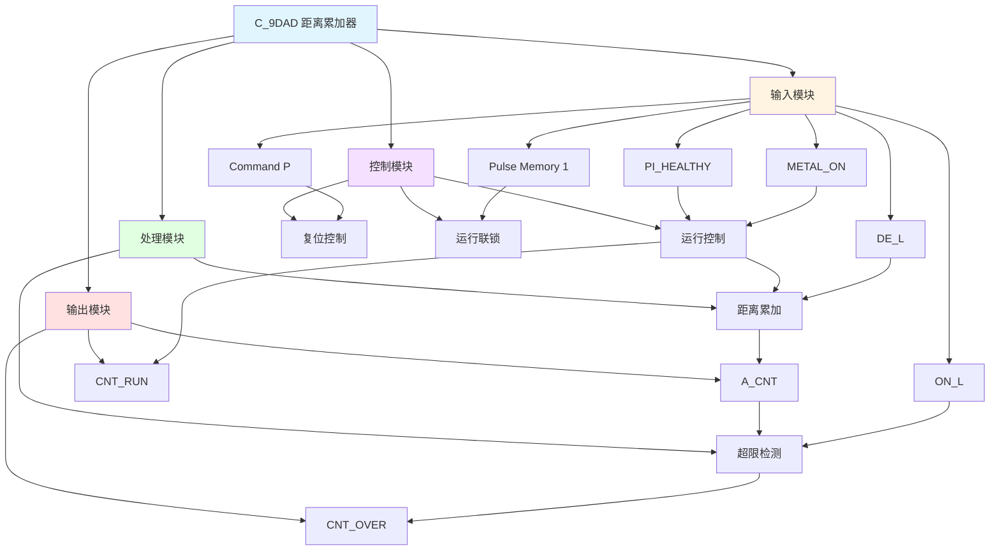

# C_9DAD 功能块分析报告

## 基本信息

| 项目 | 内容 |
|------|------|
| 功能块名称 | C_9DAD |
| 功能描述 | Distance Accumulator by Adding Deviations（通过添加偏差累加距离） |
| 最后修改 | 2016.01.06 |
| 作者 | Gao Weidi |
| 页数 | 2页 |

## 功能概述

C_9DAD 是一个距离累加器功能块，用于在材料检测过程中累加距离偏差值。该功能块通过累加每个扫描周期的距离偏差来计算总的累积距离，并支持超限检测功能。

## 思维导图

## 流程路径描述

### 距离累加路径：
开始 → 传感器健康 → 材料检测 → 累加器运行 → 选择距离偏差 → 累加距离 → 输出累加距离
**功能**: 累加材料检测过程中的距离偏差

### 复位路径：
开始 → 命令脉冲 → 计数器复位 → 清零累加距离
**功能**: 复位距离累加器

### 超限检测路径：
开始 → 累加距离 → 比较超限值 → 超限检测信号
**功能**: 检测累积距离是否超过设定值

## 逐帧功能分析

### Rung 7-8: 复位逻辑

**功能描述**: 检测启动命令的上升沿，产生复位和启动信号

**输入条件**:
| 信号名称 | 信号描述 | 信号类型 | 触发值 |
|----------|----------|----------|--------|
| Command P | 启动脉冲命令 | BOOL | 上升沿 |

**输出功能**:
| 信号名称 | 信号描述 | 信号类型 |
|----------|----------|----------|
| CNT_RST | 计数器复位 | BOOL |
| CNT_START | 累加器启动 | BOOL |

**触发逻辑**:
- IF Command P 上升沿 THEN CNT_RST = TRUE
- IF Command P 上升沿 THEN CNT_START = TRUE

**功能实现**: 
使用RTRIG（上升沿触发）功能块检测Command P信号的上升沿，当检测到上升沿时，产生CNT_RST和CNT_START信号，用于复位累加器和启动累加过程。

### Rung 8: 运行联锁

**功能描述**: 检测脉冲记忆的上升沿，产生运行联锁信号

**输入条件**:
| 信号名称 | 信号描述 | 信号类型 | 触发值 |
|----------|----------|----------|--------|
| Pulse Memory 1 | 脉冲记忆1 | BOOL | 上升沿 |

**输出功能**:
| 信号名称 | 信号描述 | 信号类型 |
|----------|----------|----------|
| CNT_IL | 运行联锁 | BOOL |

**触发逻辑**:
- IF Pulse Memory 1 上升沿 THEN CNT_IL = TRUE

**功能实现**: 
使用RTRIG功能块检测Pulse Memory 1信号的上升沿，产生运行联锁信号CNT_IL，用于控制累加器的运行状态。

### Rung 8: 累加器运行控制

**功能描述**: 根据传感器健康状态和材料检测状态控制累加器运行

**输入条件**:
| 信号名称 | 信号描述 | 信号类型 | 触发值 |
|----------|----------|----------|--------|
| PI_HEALTHY | 传感器健康 | BOOL | TRUE |
| METAL_ON | 材料检测 | BOOL | TRUE |

**输出功能**:
| 信号名称 | 信号描述 | 信号类型 |
|----------|----------|----------|
| CNT_RUN | 累加器运行 | BOOL |

**触发逻辑**:
- IF PI_HEALTHY = TRUE AND METAL_ON = TRUE THEN CNT_RUN = TRUE
- ELSE CNT_RUN = FALSE

**功能实现**: 
当传感器健康且检测到材料时，累加器运行信号CNT_RUN为TRUE，允许距离累加。这是累加器的主要控制条件。

### Rung 8: 累加距离复位

**功能描述**: 当复位信号有效时，清零累加距离

**输入条件**:
| 信号名称 | 信号描述 | 信号类型 | 触发值 |
|----------|----------|----------|--------|
| CNT_RST | 计数器复位 | BOOL | TRUE |

**输出功能**:
| 信号名称 | 信号描述 | 信号类型 |
|----------|----------|----------|
| A_CNT | 累加距离（mm） | REAL |

**触发逻辑**:
- IF CNT_RST = TRUE THEN A_CNT = 0.0

**功能实现**: 
使用MOVE功能块，当CNT_RST为TRUE时，将A_CNT重置为0.0，实现累加距离的清零。

### Rung 9: 距离累加

**功能描述**: 累加每个扫描周期的距离偏差值

**输入条件**:
| 信号名称 | 信号描述 | 信号类型 | 触发值 |
|----------|----------|----------|--------|
| DE_L | 每扫描距离偏差（mm） | REAL | 数值 |
| CNT_RUN | 累加器运行 | BOOL | TRUE/FALSE |
| A_CNT | 累加距离（mm） | REAL | 当前值 |

**输出功能**:
| 信号名称 | 信号描述 | 信号类型 |
|----------|----------|----------|
| A_CNT | 累加距离（mm） | REAL |

**触发逻辑**:
- IF CNT_RUN = TRUE THEN A_CNT = A_CNT + DE_L
- IF CNT_RUN = FALSE THEN A_CNT保持不变

**功能实现**: 
调用C_NSWR（数值切换开关）功能块，根据CNT_RUN信号选择输入值：
- 当CNT_RUN = TRUE时，输出DE_L
- 当CNT_RUN = FALSE时，输出0.0
然后使用ADD功能块将选择的值加到A_CNT上，实现距离累加。

### Rung 10: 超限检测

**功能描述**: 检测累加距离是否超过设定值

**输入条件**:
| 信号名称 | 信号描述 | 信号类型 | 触发值 |
|----------|----------|----------|--------|
| A_CNT | 累加距离（mm） | REAL | 数值 |
| ON_L | 距离超限检测值（mm） | REAL | 设定值 |
| CNT_RUN | 累加器运行 | BOOL | TRUE |

**输出功能**:
| 信号名称 | 信号描述 | 信号类型 |
|----------|----------|----------|
| CNT_OVER | 距离超限检测 | BOOL |

**触发逻辑**:
- IF CNT_RUN = TRUE AND A_CNT >= ON_L THEN CNT_OVER = TRUE
- ELSE CNT_OVER = FALSE

**功能实现**: 
使用GE（大于等于）比较器，当累加器运行且累加距离A_CNT大于等于设定值ON_L时，产生超限检测信号CNT_OVER。

## 触发条件总结

### 控制条件
- **启动条件**: Command P上升沿
- **运行条件**: PI_HEALTHY = TRUE AND METAL_ON = TRUE
- **复位条件**: CNT_RST = TRUE

### 检测条件
- **传感器健康**: PI_HEALTHY = TRUE
- **材料检测**: METAL_ON = TRUE

### 超限条件
- **超限检测**: A_CNT >= ON_L AND CNT_RUN = TRUE

## 实现功能总结

### 主要功能
1. **距离累加**: 累加材料检测过程中的距离偏差值
2. **复位控制**: 支持累加距离的复位清零
3. **运行控制**: 根据传感器状态控制累加过程
4. **超限检测**: 检测累积距离是否超过设定值

### 辅助功能
1. **运行联锁**: 提供运行联锁信号
2. **启动控制**: 提供启动脉冲信号

## 关键信号说明

| 信号名称 | 信号描述 | 信号类型 | 用途 |
|----------|----------|----------|------|
| Command P | 启动脉冲命令 | BOOL | 启动累加器 |
| PI_HEALTHY | 传感器健康 | BOOL | 传感器状态检测 |
| METAL_ON | 材料检测 | BOOL | 材料存在检测 |
| DE_L | 每扫描距离偏差 | REAL | 每次扫描的距离增量 |
| ON_L | 距离超限检测值 | REAL | 超限阈值 |
| A_CNT | 累加距离 | REAL | 累积距离输出 |
| CNT_RUN | 累加器运行 | BOOL | 累加器运行状态 |
| CNT_OVER | 距离超限检测 | BOOL | 超限报警 |
| CNT_RST | 计数器复位 | BOOL | 复位信号 |

## 调试技巧

### 调试步骤
1. 检查PI_HEALTHY信号，确认传感器状态正常
2. 检查METAL_ON信号，确认材料检测功能正常
3. 监控A_CNT值，观察距离累加过程
4. 检查DE_L值，确认距离偏差输入正常
5. 测试CNT_OVER信号，验证超限检测功能

### 常见问题
1. **累加器不运行**: 检查PI_HEALTHY和METAL_ON信号是否都为TRUE
2. **累加距离不准确**: 检查DE_L值是否正确
3. **超限检测不工作**: 检查ON_L值设置是否合理
4. **复位不生效**: 检查Command P信号是否产生上升沿

### 调试工具
1. 在线监控A_CNT值，观察累加过程
2. 监控CNT_RUN信号，确认运行状态
3. 监控CNT_OVER信号，确认超限检测
4. 使用断点调试，检查各个Rung的执行情况

### 监控信号列表
- A_CNT（累加距离）
- CNT_RUN（累加器运行）
- CNT_OVER（超限检测）
- PI_HEALTHY（传感器健康）
- METAL_ON（材料检测）
- DE_L（距离偏差）
