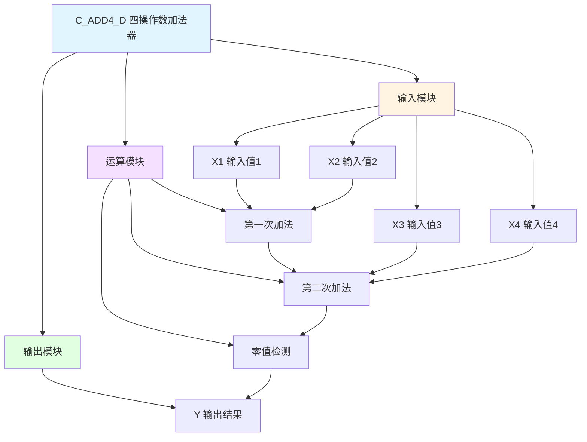

# C_ADD4_D 功能块分析报告

## 基本信息

| 项目 | 内容 |
|------|------|
| 功能块名称 | C_ADD4_D |
| 功能描述 | Adder(4 Addend, DINT type)（四操作数加法器-DINT类型） |
| 最后修改 | 2015.12.18 |
| 作者 | ShiChunLiang |
| 页数 | 1页（1个程序段） |

> **注意**：源代码文件中的功能名称注释为"C_ADD4"，文件名为C_ADD4_D，表示DINT类型的四操作数加法器。

## 功能概述

C_ADD4_D是一个四操作数加法器功能块，用于将四个DINT（双整数）类型的输入值相加，并输出累加结果。当结果为零时，强制输出为零。

### 应用场景
- **多值累加**：将多个数值累加求和
- **速度参考复合**：复合多个速度参考值
- **位置偏差计算**：累加多个位置偏差值
- **数据汇总**：汇总多个数据源

### 功能特点
1. **四操作数加法**：支持四个输入值相加
2. **DINT类型**：支持双整数类型运算
3. **零值处理**：结果为零时强制输出零

## 思维导图



## 流程路径描述

### 加法运算路径：
开始 → X1+X2 → 中间结果+X3 → 中间结果+X4 → 零值检测 → 输出Y
**功能**: 将四个输入值累加并输出结果

## 逐帧功能分析

### Rung 1: 四操作数加法

**功能描述**: 将四个输入值相加并输出结果

**输入条件**:
| 信号名称 | 信号描述 | 信号类型 | 触发值 |
|----------|----------|----------|--------|
| X1 | 输入值1 | DINT | 数值 |
| X2 | 输入值2 | DINT | 数值 |
| X3 | 输入值3 | DINT | 数值 |
| X4 | 输入值4 | DINT | 数值 |

**输出功能**:
| 信号名称 | 信号描述 | 信号类型 |
|----------|----------|----------|
| Y | 输出结果 | DINT |

**触发逻辑**:
- Y = X1 + X2 + X3 + X4
- IF Y = 0 THEN Y = 0（强制）

**功能实现**: 
1. 使用ADD_DINT计算X1 + X2得到中间结果
2. 使用ADD_DINT将中间结果与X3 + X4相加
3. 使用EQ_DINT检测结果是否为零
4. 如果为零，使用MOVE_DINT强制输出零

### 运算步骤说明

**步骤1**: 计算X1 + X2
```
中间结果1 = X1 + X2
```

**步骤2**: 计算X3 + X4
```
中间结果2 = X3 + X4
```

**步骤3**: 计算最终结果
```
Y = 中间结果1 + 中间结果2
```

**步骤4**: 零值处理
```
IF Y = 0 THEN Y = 0
```

## 触发条件总结

### 运算条件
- **正常运算**: 每个扫描周期执行一次
- **零值输出**: 当计算结果为零时

### 输出条件
- **Y输出**: 四个输入值的累加和

## 实现功能总结

### 主要功能
1. **四值累加**: 将四个DINT值相加
2. **零值处理**: 结果为零时强制输出零

### 与其他加法器对比
| 功能块 | 数据类型 | 操作数数量 | 特殊处理 |
|--------|----------|------------|----------|
| C_ADD4 | REAL | 4 | 无 |
| **C_ADD4_D** | **DINT** | **4** | **零值处理** |

### 计算公式
```
Y = X1 + X2 + X3 + X4
```

## 关键信号说明

| 信号名称 | 信号描述 | 信号类型 | 用途 |
|----------|----------|----------|------|
| X1 | 输入值1 | DINT | 第1个加数 |
| X2 | 输入值2 | DINT | 第2个加数 |
| X3 | 输入值3 | DINT | 第3个加数 |
| X4 | 输入值4 | DINT | 第4个加数 |
| Y | 输出结果 | DINT | 累加和 |

## 调试技巧

### 调试步骤
1. 检查各输入值是否正确
2. 监控中间计算结果
3. 验证最终输出是否正确
4. 测试零值情况

### 常见问题
1. **结果溢出**: 检查输入值范围
2. **结果不正确**: 检查各输入值
3. **零值处理异常**: 检查零值检测逻辑

### 监控信号列表
- X1/X2/X3/X4（输入值）
- Y（输出结果）
