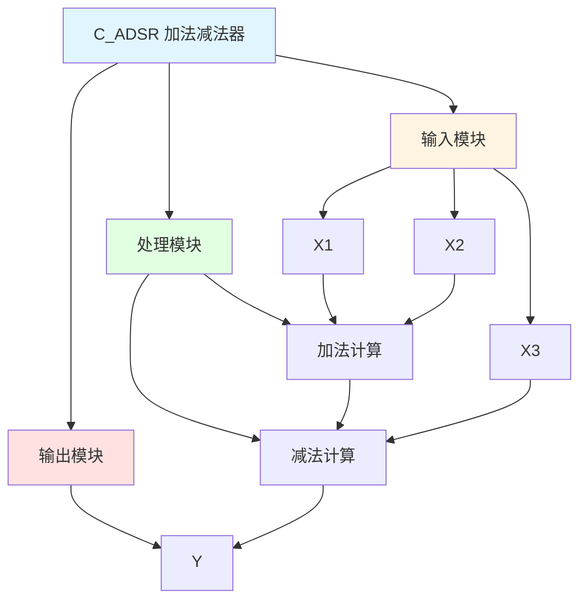

# C_ADSR 功能块分析报告

## 基本信息

| 项目 | 内容 |
|------|------|
| 功能块名称 | C_ADSR |
| 功能描述 | Adder and Subtractor(REAL type)（加法器和减法器，实数类型） |
| 最后修改 | 2015.12.17 |
| 作者 | Shi Chun Liang |
| 页数 | 1页 |

## 功能概述

C_ADSR 是一个加法器和减法器功能块，用于计算三个实数类型输入值的加减组合。该功能块计算Y = X1 + X2 - X3。

## 思维导图

## 流程路径描述

### 加减法计算路径：
开始 → X1 + X2 → 中间结果 → 中间结果 - X3 → 输出Y
**功能**: 计算X1 + X2 - X3

## 逐帧功能分析

### Rung 7: 加减法计算

**功能描述**: 计算X1 + X2 - X3

**输入条件**:
| 信号名称 | 信号描述 | 信号类型 | 触发值 |
|----------|----------|----------|--------|
| X1 | 输入1 | REAL | 数值 |
| X2 | 输入2 | REAL | 数值 |
| X3 | 输入3 | REAL | 数值 |

**输出功能**:
| 信号名称 | 信号描述 | 信号类型 |
|----------|----------|----------|
| Y | 输出 | REAL |

**触发逻辑**:
- Y = X1 + X2 - X3
- IF Y = 0.0 THEN Y = 0.0

**功能实现**: 
使用ADD和SUB功能块计算X1 + X2 - X3，当结果为0时确保输出为0.0。

## 触发条件总结

### 计算条件
- **加减法计算**: 所有输入值都有值

## 实现功能总结

### 主要功能
1. **加法计算**: 计算X1 + X2
2. **减法计算**: 计算中间结果 - X3

## 关键信号说明

| 信号名称 | 信号描述 | 信号类型 | 用途 |
|----------|----------|----------|------|
| X1 | 输入1 | REAL | 输入值1 |
| X2 | 输入2 | REAL | 输入值2 |
| X3 | 输入3 | REAL | 输入值3 |
| Y | 输出 | REAL | 加减法结果 |

## 调试技巧

### 调试步骤
1. 检查X1、X2、X3值，确认输入正常
2. 监控Y值，观察加减法结果

### 常见问题
1. **结果不正确**: 检查X1、X2、X3值是否正确

### 监控信号列表
- X1、X2、X3（输入值）
- Y（输出）
