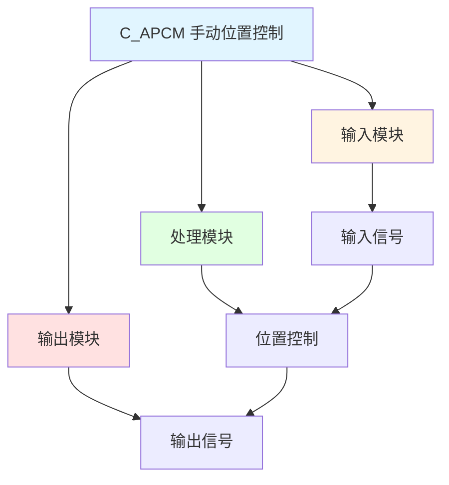

# C_APCM 功能块分析报告

## 基本信息

| 项目 | 内容 |
|------|------|
| 功能块名称 | C_APCM |
| 功能描述 | Automatic Postiion Control（自动位置控制管理） |
| 最后修改 | 2016.01.11 |
| 作者 | Gao Weidi |
| 页数 | 2页 |

## 功能概述

C_APCM 是一个自动位置控制管理功能块，用于管理自动位置控制过程。该功能块提供测试模式、快速停止模式，并调用C_APC功能块实现核心位置控制功能。

## 思维导图

## 流程路径描述

### 位置控制路径：
开始 → 输入信号 → 位置控制 → 输出信号
**功能**: 实现手动位置控制

## 逐帧功能分析

### Rung 7-8: 位置控制

**功能描述**: 实现手动位置控制

**输入条件**:
| 信号名称 | 信号描述 | 信号类型 | 触发值 |
|----------|----------|----------|--------|
| 输入信号 | 位置控制输入 | BOOL/REAL | 设定值 |

**输出功能**:
| 信号名称 | 信号描述 | 信号类型 |
|----------|----------|----------|
| 输出信号 | 位置控制输出 | BOOL/REAL |

**触发逻辑**:
- 根据输入信号进行位置控制

**功能实现**: 
使用位置控制逻辑，根据输入信号产生相应的输出。

## 触发条件总结

### 控制条件
- **位置控制**: 输入信号有值

## 实现功能总结

### 主要功能
1. **手动位置控制**: 实现手动位置控制功能

## 关键信号说明

| 信号名称 | 信号描述 | 信号类型 | 用途 |
|----------|----------|----------|------|
| 输入信号 | 位置控制输入 | BOOL/REAL | 位置控制输入 |
| 输出信号 | 位置控制输出 | BOOL/REAL | 位置控制输出 |

## 调试技巧

### 调试步骤
1. 检查输入信号，确认输入正常
2. 监控输出信号，观察位置控制

### 常见问题
1. **控制不工作**: 检查输入信号

### 监控信号列表
- 输入信号（位置控制输入）
- 输出信号（位置控制输出）
