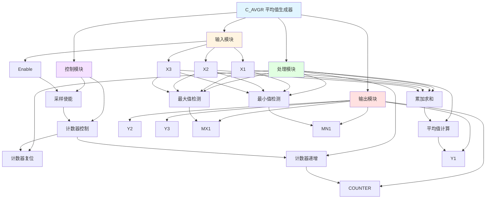

# C_AVGR 功能块分析报告

## 基本信息

| 项目 | 内容 |
|------|------|
| 功能块名称 | C_AVGR |
| 功能描述 | Average Value Generator (REAL type)（平均值生成器，实数类型） |
| 最后修改 | 2020.05.22 |
| 作者 | gyj |
| 页数 | 2页 |

## 功能概述

C_AVGR 是一个平均值计算功能块，用于计算输入信号的平均值、最大值和最小值。该功能块通过累加采样值并计数，最后计算平均值，同时记录采样过程中的最大值和最小值。该功能块只有一个输入X1，每次Enable上升沿时进行采样。

## 思维导图

## 流程路径描述

### 采样计数路径：
开始 → 使能信号 → 上升沿检测 → 计数器递增 → 输出计数值
**功能**: 记录采样次数

### 累加求和路径：
开始 → 使能信号 → 选择输入值 → 累加求和 → 输出累加和
**功能**: 累加所有采样值

### 平均值计算路径：
开始 → 累加和 ÷ 计数器值 → 输出平均值
**功能**: 计算采样平均值

### 最大值检测路径：
开始 → 使能信号 → 比较输入值 → 更新最大值 → 输出最大值
**功能**: 检测采样最大值

### 最小值检测路径：
开始 → 使能信号 → 比较输入值 → 更新最小值 → 输出最小值
**功能**: 检测采样最小值

## 逐帧功能分析

### Rung 5: 采样使能检测

**功能描述**: 检测使能信号的上升沿，产生采样脉冲

**输入条件**:
| 信号名称 | 信号描述 | 信号类型 | 触发值 |
|----------|----------|----------|--------|
| Enable | 平均采样计算使能 | BOOL | 上升沿 |

**输出功能**:
| 信号名称 | 信号描述 | 信号类型 |
|----------|----------|----------|
| EN_PLS | 使能脉冲 | BOOL |

**触发逻辑**:
- IF Enable 上升沿 THEN EN_PLS = TRUE

**功能实现**: 
使用RTRIG（上升沿触发）功能块检测Enable信号的上升沿，当检测到上升沿时，产生EN_PLS脉冲信号，用于触发采样过程。

### Rung 6: 计数器复位

**功能描述**: 当使能信号为FALSE时，复位计数器

**输入条件**:
| 信号名称 | 信号描述 | 信号类型 | 触发值 |
|----------|----------|----------|--------|
| Enable | 平均采样计算使能 | BOOL | FALSE |

**输出功能**:
| 信号名称 | 信号描述 | 信号类型 |
|----------|----------|----------|
| COUNTER | 计数器 | DINT |

**触发逻辑**:
- IF Enable = FALSE THEN COUNTER = 0

**功能实现**: 
调用C_NSWR（数值切换开关）功能块，根据Enable信号选择输入值：
- 当Enable = TRUE时，输出当前COUNTER值
- 当Enable = FALSE时，输出0.0
然后使用MOVE功能块更新COUNTER，实现计数器复位。

### Rung 6: 计数器递增

**功能描述**: 当使能脉冲有效时，计数器加1

**输入条件**:
| 信号名称 | 信号描述 | 信号类型 | 触发值 |
|----------|----------|----------|--------|
| EN_PLS | 使能脉冲 | BOOL | TRUE |
| COUNTER | 计数器 | DINT | 当前值 |

**输出功能**:
| 信号名称 | 信号描述 | 信号类型 |
|----------|----------|----------|
| COUNTER | 计数器 | DINT |

**触发逻辑**:
- IF EN_PLS = TRUE THEN COUNTER = COUNTER + 1

**功能实现**: 
调用C_NSWR功能块，根据EN_PLS信号选择输入值：
- 当EN_PLS = TRUE时，输出1.0
- 当EN_PLS = FALSE时，输出0.0
然后使用ADD功能块将选择的值加到COUNTER上，实现计数器递增。

### Rung 7: 累加求和

**功能描述**: 累加输入值到总和

**输入条件**:
| 信号名称 | 信号描述 | 信号类型 | 触发值 |
|----------|----------|----------|--------|
| X1 | 输入值1 | REAL | 数值 |
| X2 | 输入值2 | REAL | 数值 |
| Enable | 平均采样计算使能 | BOOL | TRUE/FALSE |
| SUM | 累加和 | REAL | 当前值 |

**输出功能**:
| 信号名称 | 信号描述 | 信号类型 |
|----------|----------|----------|
| SUM | 累加和 | REAL |

**触发逻辑**:
- IF Enable = TRUE THEN SUM = SUM + X1 + X2
- IF Enable = FALSE THEN SUM保持不变

**功能实现**: 
调用C_NSWR功能块，根据Enable信号选择输入值：
- 当Enable = TRUE时，输出X1 + X2
- 当Enable = FALSE时，输出0.0
然后使用ADD功能块将选择的值加到SUM上，实现累加求和。

### Rung 8: 平均值计算

**功能描述**: 计算累加和除以计数器的平均值

**输入条件**:
| 信号名称 | 信号描述 | 信号类型 | 触发值 |
|----------|----------|----------|--------|
| SUM | 累加和 | REAL | 数值 |
| COUNTER | 计数器 | DINT | 数值 |

**输出功能**:
| 信号名称 | 信号描述 | 信号类型 |
|----------|----------|----------|
| Y1 | 输出值（平均值） | REAL |

**触发逻辑**:
- Y1 = SUM / COUNTER

**功能实现**: 
使用DIV（除法）功能块，将SUM除以COUNTER，计算平均值并输出到Y1。

### Rung 9: 最大值检测

**功能描述**: 检测输入值的最大值

**输入条件**:
| 信号名称 | 信号描述 | 信号类型 | 触发值 |
|----------|----------|----------|--------|
| X1 | 输入值1 | REAL | 数值 |
| X2 | 输入值2 | REAL | 数值 |
| X3 | 输入值3 | REAL | 数值 |
| EN_PLS | 使能脉冲 | BOOL | TRUE |

**输出功能**:
| 信号名称 | 信号描述 | 信号类型 |
|----------|----------|----------|
| MX1 | 采样值1最大值 | REAL |

**触发逻辑**:
- IF EN_PLS = TRUE THEN MX1 = MAX(X1, X2, X3)

**功能实现**: 
调用C_MAX（最大值）功能块，比较X1、X2、X3三个输入值，找出最大值并输出到MX1。

### Rung 10: 最小值检测

**功能描述**: 检测输入值的最小值

**输入条件**:
| 信号名称 | 信号描述 | 信号类型 | 触发值 |
|----------|----------|----------|--------|
| X1 | 输入值1 | REAL | 数值 |
| X2 | 输入值2 | REAL | 数值 |
| X3 | 输入值3 | REAL | 数值 |
| EN_PLS | 使能脉冲 | BOOL | TRUE |

**输出功能**:
| 信号名称 | 信号描述 | 信号类型 |
|----------|----------|----------|
| MN1 | 采样值1最小值 | REAL |

**触发逻辑**:
- IF EN_PLS = TRUE THEN MN1 = MIN(X1, X2, X3)

**功能实现**: 
调用C_MIN（最小值）功能块，比较X1、X2、X3三个输入值，找出最小值并输出到MN1。

## 触发条件总结

### 控制条件
- **使能条件**: Enable = TRUE
- **复位条件**: Enable = FALSE

### 采样条件
- **采样触发**: Enable上升沿
- **采样执行**: EN_PLS = TRUE

### 计算条件
- **平均值计算**: SUM和COUNTER都有值
- **最大值检测**: EN_PLS = TRUE
- **最小值检测**: EN_PLS = TRUE

## 实现功能总结

### 主要功能
1. **采样计数**: 记录采样次数
2. **累加求和**: 累加所有采样值
3. **平均值计算**: 计算采样值的平均值
4. **最大值检测**: 检测采样过程中的最大值
5. **最小值检测**: 检测采样过程中的最小值

### 辅助功能
1. **使能控制**: 控制采样过程的启动和停止
2. **复位功能**: 当使能信号为FALSE时复位所有数据

## 关键信号说明

| 信号名称 | 信号描述 | 信号类型 | 用途 |
|----------|----------|----------|------|
| Enable | 平均采样计算使能 | BOOL | 控制采样过程 |
| X1 | 输入值1 | REAL | 采样输入1 |
| X2 | 输入值2 | REAL | 采样输入2 |
| X3 | 输入值3 | REAL | 采样输入3 |
| EN_PLS | 使能脉冲 | BOOL | 采样触发脉冲 |
| COUNTER | 计数器 | DINT | 采样次数计数 |
| SUM | 累加和 | REAL | 采样值累加和 |
| Y1 | 输出值（平均值） | REAL | 平均值输出 |
| MX1 | 采样值1最大值 | REAL | 最大值输出 |
| MN1 | 采样值1最小值 | REAL | 最小值输出 |

## 调试技巧

### 调试步骤
1. 检查Enable信号，确认使能状态
2. 监控COUNTER值，观察采样计数过程
3. 监控SUM值，观察累加求和过程
4. 检查Y1值，确认平均值计算正确
5. 检查MX1和MN1值，确认最大值和最小值检测正确

### 常见问题
1. **计数器不递增**: 检查EN_PLS信号是否产生
2. **平均值不更新**: 检查SUM和COUNTER值是否正确
3. **最大值/最小值不更新**: 检查EN_PLS信号和输入值
4. **复位不生效**: 检查Enable信号是否为FALSE

### 调试工具
1. 在线监控COUNTER值，观察计数过程
2. 监控SUM值，观察累加过程
3. 监控Y1、MX1、MN1值，确认输出正确
4. 使用断点调试，检查各个Rung的执行情况

### 监控信号列表
- Enable（使能信号）
- EN_PLS（使能脉冲）
- COUNTER（计数器）
- SUM（累加和）
- Y1（平均值）
- MX1（最大值）
- MN1（最小值）
- X1、X2、X3（输入值）
