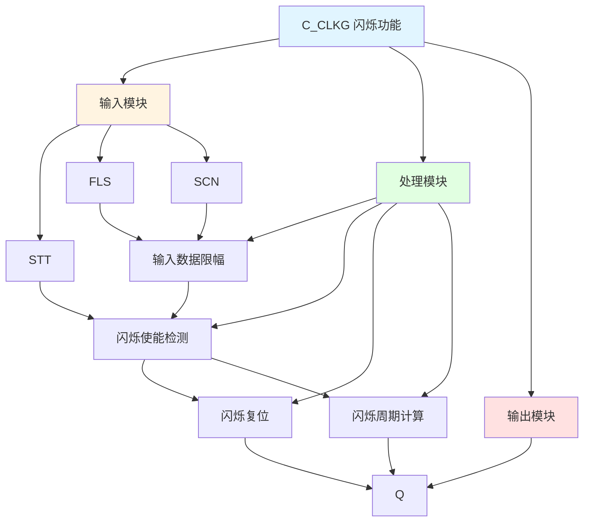

# C_CLKG 功能块分析报告

## 基本信息

| 项目 | 内容 |
|------|------|
| 功能块名称 | C_CLKG |
| 功能描述 | Flash Function(BOOL type)（闪烁功能，布尔类型） |
| 最后修改 | 2015.11.26 |
| 作者 | Shi Chun Liang |
| 页数 | 1页 |

## 功能概述

C_CLKG 是一个闪烁功能块，用于产生周期性的闪烁信号。该功能块根据设定的闪烁周期和扫描时间，产生ON/OFF交替的输出信号。

## 思维导图

## 流程路径描述

### 闪烁使能路径：
开始 → STT信号 AND FLS > 0 → 闪烁使能
**功能**: 检测闪烁使能条件

### 闪烁周期路径：
开始 → 定时器累加 → 达到闪烁周期 → 输出切换
**功能**: 产生闪烁输出

## 逐帧功能分析

### Rung 7: 输入数据限幅

**功能描述**: 对扫描时间和闪烁次数进行限幅

**输入条件**:
| 信号名称 | 信号描述 | 信号类型 | 触发值 |
|----------|----------|----------|--------|
| SCN | 扫描时间 | INT | 设定值 |
| FLS | 闪烁次数 | DINT | 设定值 |

**输出功能**:
| 信号名称 | 信号描述 | 信号类型 |
|----------|----------|----------|
| ScanTm | 扫描时间 | DINT |
| FlsDur | 闪烁周期 | DINT |

**触发逻辑**:
- ScanTm = LIMIT(SCN, 1, 150)
- FlsDur = FLS * ScanTm (限制在ScanTm~86400000之间)

**功能实现**: 
对扫描时间和闪烁次数进行限幅处理，计算闪烁周期。

### Rung 8: 闪烁使能检测

**功能描述**: 检测闪烁使能条件

**输入条件**:
| 信号名称 | 信号描述 | 信号类型 | 触发值 |
|----------|----------|----------|--------|
| STT | 启动信号 | BOOL | TRUE |
| FLS | 闪烁次数 | DINT | > 0 |

**输出功能**:
| 信号名称 | 信号描述 | 信号类型 |
|----------|----------|----------|
| 闪烁使能 | - | BOOL |

**触发逻辑**:
- IF STT = TRUE AND FLS > 0 THEN 闪烁使能

**功能实现**: 
当启动信号有效且闪烁次数大于0时，使能闪烁功能。

### Rung 9: 闪烁复位

**功能描述**: 复位闪烁功能

**输入条件**:
| 信号名称 | 信号描述 | 信号类型 | 触发值 |
|----------|----------|----------|--------|
| STT | 启动信号 | BOOL | FALSE |

**输出功能**:
| 信号名称 | 信号描述 | 信号类型 |
|----------|----------|----------|
| Q | 输出 | BOOL |
| TMR0 | 定时器0 | DINT |
| TMR1 | 定时器1 | DINT |

**触发逻辑**:
- IF STT = FALSE THEN Q = FALSE, TMR0 = 0, TMR1 = 0

**功能实现**: 
当启动信号无效时，复位闪烁功能。

### Rung 10-14: 闪烁周期计算

**功能描述**: 计算闪烁周期并切换输出

**输入条件**:
| 信号名称 | 信号描述 | 信号类型 | 触发值 |
|----------|----------|----------|--------|
| TMR0 | 定时器0 | DINT | 数值 |
| TMR1 | 定时器1 | DINT | 数值 |
| FlsDur | 闪烁周期 | DINT | 设定值 |
| ScanTm | 扫描时间 | DINT | 设定值 |

**输出功能**:
| 信号名称 | 信号描述 | 信号类型 |
|----------|----------|----------|
| Q | 输出 | BOOL |

**触发逻辑**:
- TMR0累加，当TMR0 >= FlsDur时，Q = FALSE，TMR1开始累加
- TMR1累加，当TMR1 >= FlsDur时，Q = TRUE，TMR0开始累加

**功能实现**: 
通过两个定时器交替累加，实现ON/OFF交替的闪烁输出。

## 触发条件总结

### 控制条件
- **闪烁使能**: STT = TRUE AND FLS > 0
- **闪烁复位**: STT = FALSE

## 实现功能总结

### 主要功能
1. **闪烁输出**: 产生周期性的闪烁信号
2. **周期可调**: 支持设置闪烁周期

## 关键信号说明

| 信号名称 | 信号描述 | 信号类型 | 用途 |
|----------|----------|----------|------|
| STT | 启动信号 | BOOL | 启动闪烁 |
| FLS | 闪烁次数 | DINT | 闪烁周期设置 |
| SCN | 扫描时间 | INT | 扫描时间设定 |
| Q | 输出 | BOOL | 闪烁输出 |

## 调试技巧

### 调试步骤
1. 检查STT信号，确认启动信号正常
2. 检查FLS值，确认闪烁周期设置
3. 检查SCN值，确认扫描时间设置
4. 监控Q信号，观察闪烁输出

### 常见问题
1. **闪烁不工作**: 检查STT信号和FLS值
2. **闪烁周期不正确**: 检查FLS和SCN值设置

### 监控信号列表
- STT（启动信号）
- FLS、SCN（闪烁参数）
- Q（闪烁输出）
