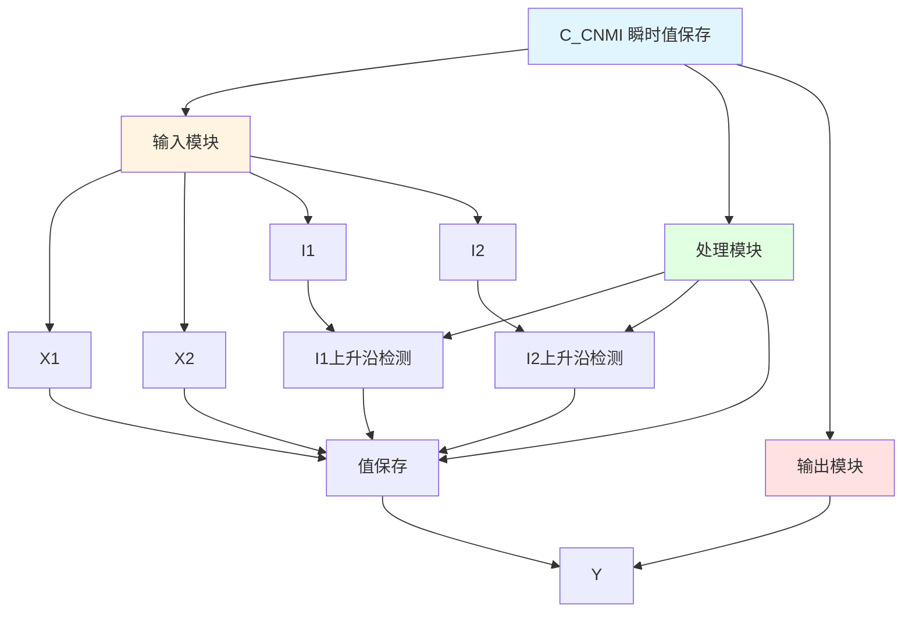

# C_CNMI 功能块分析报告

## 基本信息

| 项目 | 内容 |
|------|------|
| 功能块名称 | C_CNMI |
| 功能描述 | Save an Instantaneous Input(Selectable) Value(INT type)（保存瞬时输入值，可选，INT类型） |
| 最后修改 | 2016.03.14 |
| 作者 | Shi Chun Liang |
| 页数 | 1页 |

## 功能概述

C_CNMI 是一个瞬时值保存功能块，用于在输入信号上升沿时保存对应的输入值。该功能块支持两个可选输入，根据输入信号的选择保存对应的值。

## 思维导图

## 流程路径描述

### I1选择路径：
开始 → I1上升沿 → 保存X1 → 输出Y
**功能**: 保存X1值

### I2选择路径：
开始 → I2上升沿 → 保存X2 → 输出Y
**功能**: 保存X2值

## 逐帧功能分析

### Rung 7: I2选择保存

**功能描述**: 检测I2上升沿并保存X2

**输入条件**:
| 信号名称 | 信号描述 | 信号类型 | 触发值 |
|----------|----------|----------|--------|
| I2 | 输入选择2 | BOOL | 上升沿 |
| X2 | 输入值2 | INT | 数值 |

**输出功能**:
| 信号名称 | 信号描述 | 信号类型 |
|----------|----------|----------|
| Y | 输出 | INT |

**触发逻辑**:
- IF I2上升沿 THEN Y = X2

**功能实现**: 
使用RTRIG检测I2信号的上升沿，当检测到上升沿时，保存X2值到Y。

### Rung 8: I1选择保存

**功能描述**: 检测I1上升沿并保存X1

**输入条件**:
| 信号名称 | 信号描述 | 信号类型 | 触发值 |
|----------|----------|----------|--------|
| I1 | 输入选择1 | BOOL | 上升沿 |
| X1 | 输入值1 | INT | 数值 |

**输出功能**:
| 信号名称 | 信号描述 | 信号类型 |
|----------|----------|----------|
| Y | 输出 | INT |

**触发逻辑**:
- IF I1上升沿 THEN Y = X1

**功能实现**: 
使用RTRIG检测I1信号的上升沿，当检测到上升沿时，保存X1值到Y。

## 触发条件总结

### 保存条件
- **I1选择**: I1上升沿
- **I2选择**: I2上升沿

## 实现功能总结

### 主要功能
1. **瞬时值保存**: 在输入信号上升沿时保存对应的输入值
2. **可选输入**: 支持两个可选输入

## 关键信号说明

| 信号名称 | 信号描述 | 信号类型 | 用途 |
|----------|----------|----------|------|
| X1 | 输入值1 | INT | 输入值1 |
| X2 | 输入值2 | INT | 输入值2 |
| I1 | 输入选择1 | BOOL | 选择输入1 |
| I2 | 输入选择2 | BOOL | 选择输入2 |
| Y | 输出 | INT | 保存的值 |

## 调试技巧

### 调试步骤
1. 检查I1、I2信号，确认选择信号正常
2. 检查X1、X2值，确认输入值正常
3. 监控Y值，观察保存结果

### 常见问题
1. **值不保存**: 检查I1、I2信号是否有上升沿
2. **保存值不正确**: 检查X1、X2值

### 监控信号列表
- I1、I2（选择信号）
- X1、X2（输入值）
- Y（输出）
