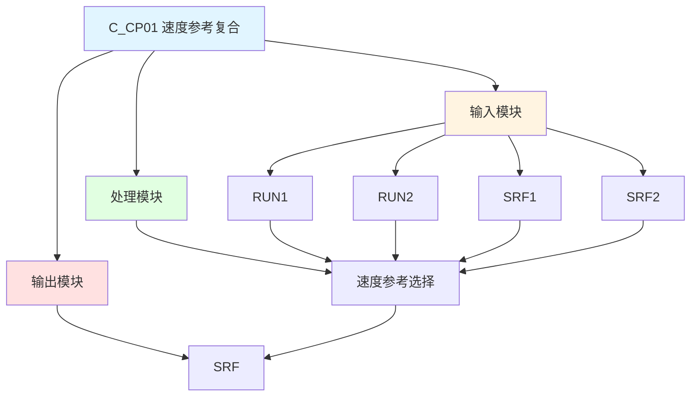

# C_CP01 功能块分析报告

## 基本信息

| 项目 | 内容 |
|------|------|
| 功能块名称 | C_CP01 |
| 功能描述 | Speed Reference Compound(2 Part)（速度参考复合，2部分） |
| 最后修改 | 2016.01.04 |
| 作者 | Shi Chun Liang |
| 页数 | 1页 |

## 功能概述

C_CP01 是一个速度参考复合功能块，用于根据运行状态选择两个速度参考值之一。

## 思维导图

## 流程路径描述

### 速度参考选择路径：
开始 → RUN1/RUN2 → 选择SRF1/SRF2 → 输出SRF
**功能**: 根据运行状态选择速度参考

## 逐帧功能分析

### Rung 7-8: 运行状态

**功能描述**: 检测运行1和运行2状态

**输入条件**:
| 信号名称 | 信号描述 | 信号类型 | 触发值 |
|----------|----------|----------|--------|
| RUN1 | 运行1 | BOOL | TRUE/FALSE |
| RUN2 | 运行2 | BOOL | TRUE/FALSE |

**输出功能**:
| 信号名称 | 信号描述 | 信号类型 |
|----------|----------|----------|
| - | 运行状态 | BOOL |

**触发逻辑**:
- IF RUN1 = TRUE THEN 运行1
- IF RUN2 = TRUE THEN 运行2

**功能实现**: 
检测RUN1和RUN2的运行状态。

### Rung 10: 速度参考选择

**功能描述**: 根据运行状态选择速度参考

**输入条件**:
| 信号名称 | 信号描述 | 信号类型 | 触发值 |
|----------|----------|----------|--------|
| SRF1 | 速度参考1 | REAL | 数值 |
| SRF2 | 速度参考2 | REAL | 数值 |
| RUN1 | 运行1 | BOOL | TRUE/FALSE |
| RUN2 | 运行2 | BOOL | TRUE/FALSE |

**输出功能**:
| 信号名称 | 信号描述 | 信号类型 |
|----------|----------|----------|
| SRF | 速度参考 | REAL |

**触发逻辑**:
- IF RUN1 = TRUE THEN SRF = SRF1
- IF RUN2 = TRUE THEN SRF = SRF2

**功能实现**: 
使用C_NSWR功能块，根据RUN1和RUN2状态选择SRF1或SRF2，输出到SRF。

## 触发条件总结

### 选择条件
- **速度参考1**: RUN1 = TRUE
- **速度参考2**: RUN2 = TRUE

## 实现功能总结

### 主要功能
1. **速度参考选择**: 根据运行状态选择速度参考值

## 关键信号说明

| 信号名称 | 信号描述 | 信号类型 | 用途 |
|----------|----------|----------|------|
| RUN1 | 运行1 | BOOL | 运行状态1 |
| RUN2 | 运行2 | BOOL | 运行状态2 |
| SRF1 | 速度参考1 | REAL | 速度参考值1 |
| SRF2 | 速度参考2 | REAL | 速度参考值2 |
| SRF | 速度参考 | REAL | 速度参考输出 |

## 调试技巧

### 调试步骤
1. 检查RUN1和RUN2信号，确认运行状态
2. 检查SRF1和SRF2值，确认速度参考值
3. 监控SRF值，观察选择输出

### 常见问题
1. **选择不正确**: 检查RUN1和RUN2信号
2. **输出不正确**: 检查SRF1和SRF2值

### 监控信号列表
- RUN1、RUN2（运行状态）
- SRF1、SRF2（速度参考）
- SRF（输出）
