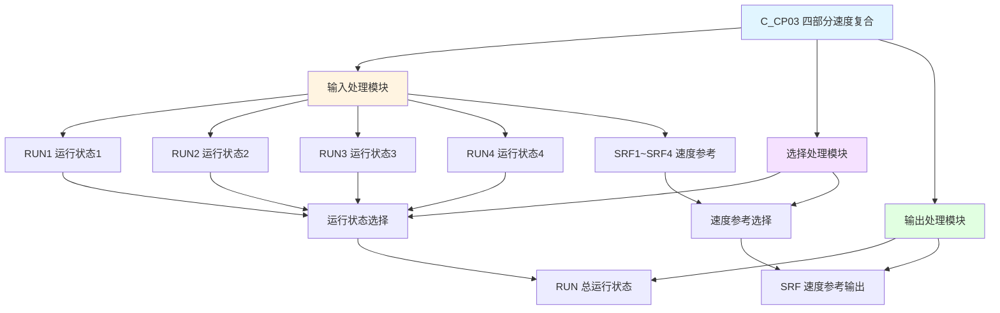

# C_CP03 功能块分析报告

## 基本信息

| 项目 | 内容 |
|------|------|
| 功能块名称 | C_CP03 |
| 功能描述 | Speed Reference Compound(4 Part)（四部分速度参考复合） |
| 最后修改 | 2016.01.05 |
| 作者 | ShiChunLiang |
| 页数 | 1页（2个程序段） |

## 功能概述

C_CP03是一个速度参考复合功能块，用于将四个独立的速度参考源复合为一个输出。该功能块不需要选择信号(SEL)，仅根据运行状态(RUN)进行速度参考的切换。

### 应用场景
- **四速驱动控制**：需要在四个速度设定值之间切换的场合
- **多电机同步**：多个电机的速度参考复合
- **复杂工艺控制**：多段速度的复杂工艺流程

### 功能特点
1. **四部分复合**：支持四个独立的速度参考输入
2. **运行状态控制**：根据运行状态自动选择速度参考
3. **速度累加**：支持多个速度值的累加输出

## 思维导图

## 流程路径描述

### 运行状态复合路径：
开始 → 检测RUN1~RUN4 → 输出RUN
**功能**: 将四个运行状态复合为总运行状态

### 速度参考选择路径：
开始 → 选择SRF1~SRF4 → 累加处理 → 输出SRF
**功能**: 根据运行状态选择并累加速度参考值

## 逐帧功能分析

### Rung 1: 运行状态复合

**功能描述**: 将四个运行状态复合为总运行状态

**输入条件**:
| 信号名称 | 信号描述 | 信号类型 | 触发值 |
|----------|----------|----------|--------|
| RUN1 | 运行状态1 | BOOL | TRUE |
| RUN2 | 运行状态2 | BOOL | TRUE |
| RUN3 | 运行状态3 | BOOL | TRUE |
| RUN4 | 运行状态4 | BOOL | TRUE |

**输出功能**:
| 信号名称 | 信号描述 | 信号类型 |
|----------|----------|----------|
| RUN | 总运行状态 | BOOL |

**触发逻辑**:
- IF RUN1 OR RUN2 OR RUN3 OR RUN4 THEN RUN = TRUE
- ELSE RUN = FALSE

**功能实现**: 
四个运行状态信号并联，任一为ON时输出RUN为TRUE。

### Rung 2: 速度参考选择

**功能描述**: 根据运行状态选择速度参考值并累加

**输入条件**:
| 信号名称 | 信号描述 | 信号类型 | 触发值 |
|----------|----------|----------|--------|
| SRF1~SRF4 | 速度参考值1~4 | REAL | 数值 |
| RUN1~RUN4 | 运行状态 | BOOL | TRUE/FALSE |

**输出功能**:
| 信号名称 | 信号描述 | 信号类型 |
|----------|----------|----------|
| SRF | 速度参考输出 | REAL |

**触发逻辑**:
- 调用C_NSWR选择各部分速度参考值
- 调用C_ADD4进行四值加法运算
- 根据RUN状态选择最终输出

**功能实现**: 
1. 调用C_NSWR功能块分别选择SRF1~SRF4
2. 调用C_ADD4功能块进行速度值累加
3. 调用C_NSWR根据RUN状态选择最终输出

## 触发条件总结

### 运行状态条件
- **第n部分运行**: RUNn = TRUE (n=1~4)

### 输出条件
- **运行状态输出**: 任一部分运行时RUN = TRUE
- **速度输出**: 根据运行状态累加输出速度参考值

## 实现功能总结

### 主要功能
1. **运行状态复合**: 将四个部分的运行状态复合为总运行状态
2. **速度参考选择**: 根据运行状态选择速度参考值
3. **速度值累加**: 支持多个速度值的累加输出

### CP系列功能对比
| 功能块 | 部分数 | 选择信号 | 复合方式 |
|--------|--------|----------|----------|
| C_CP02 | 3部分 | 无 | 运行状态直接复合 |
| **C_CP03** | **4部分** | **无** | **运行状态直接复合** |
| C_CP13 | 4部分 | 有(SEL) | 选择信号控制 |

## 关键信号说明

| 信号名称 | 信号描述 | 信号类型 | 用途 |
|----------|----------|----------|------|
| RUN1~RUN4 | 运行状态1~4 | BOOL | 各部分运行状态 |
| SRF1~SRF4 | 速度参考值1~4 | REAL | 各部分速度设定 |
| RUN | 总运行状态 | BOOL | 输出运行状态 |
| SRF | 速度参考输出 | REAL | 输出速度参考值 |

## 调试技巧

### 调试步骤
1. 检查各部分的RUN信号状态
2. 监控RUN输出是否正确
3. 检查各SRF设定值
4. 验证SRF输出是否正确

### 常见问题
1. **运行状态不正确**: 检查各RUN输入信号
2. **速度输出异常**: 检查各SRF设定值
3. **累加不正确**: 检查C_ADD4调用

### 监控信号列表
- RUN（总运行状态）
- SRF（速度参考输出）
- RUN1~RUN4（各部分运行状态）
- SRF1~SRF4（各部分速度参考）
