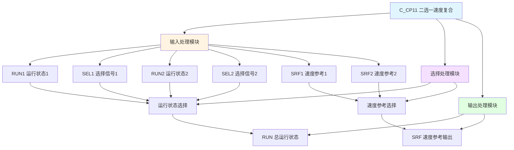

# C_CP11 功能块分析报告

## 基本信息

| 项目 | 内容 |
|------|------|
| 功能块名称 | C_CP11 |
| 功能描述 | Speed Reference Compound at Select(2 Part)（二选一速度参考复合） |
| 最后修改 | 2016.01.04 |
| 作者 | ShiChunLiang |
| 页数 | 1页（2个程序段） |

## 功能概述

C_CP11是一个速度参考复合功能块，用于在两个速度参考源之间进行选择和切换。该功能块支持两个独立的速度参考输入，根据选择信号自动切换输出对应的速度参考值，并输出对应的运行状态。

### 应用场景
- **双速驱动控制**：需要在两个速度设定值之间切换的场合
- **主备速度控制**：主速度和备用速度之间的切换
- **工艺速度选择**：不同工艺段需要不同速度的控制

## 思维导图

## 流程路径描述

### 运行状态选择路径：
开始 → 检测RUN1和SEL1 → 检测RUN2和SEL2 → 输出RUN状态
**功能**: 根据各部分的选择信号输出总运行状态

### 速度参考选择路径：
开始 → 选择SRF1 → 选择SRF2 → 根据运行状态选择输出 → 输出SRF
**功能**: 根据运行状态选择对应的速度参考值输出

## 逐帧功能分析

### Rung 1: 运行状态选择

**功能描述**: 根据各部分的选择信号确定总运行状态

**输入条件**:
| 信号名称 | 信号描述 | 信号类型 | 触发值 |
|----------|----------|----------|--------|
| RUN1 | 运行状态1 | BOOL | TRUE/FALSE |
| SEL1 | 选择信号1 | BOOL | TRUE |
| RUN2 | 运行状态2 | BOOL | TRUE/FALSE |
| SEL2 | 选择信号2 | BOOL | TRUE |

**输出功能**:
| 信号名称 | 信号描述 | 信号类型 |
|----------|----------|----------|
| RUN | 总运行状态 | BOOL |

**触发逻辑**:
- IF (RUN1 AND SEL1) OR (RUN2 AND SEL2) THEN RUN = TRUE
- ELSE RUN = FALSE

**功能实现**: 
当RUN1与SEL1同时为ON，或RUN2与SEL2同时为ON时，输出RUN为TRUE。表示至少有一个部分处于运行选中状态。

### Rung 2: 速度参考选择

**功能描述**: 根据运行状态选择对应的速度参考值输出

**输入条件**:
| 信号名称 | 信号描述 | 信号类型 | 触发值 |
|----------|----------|----------|--------|
| SRF1 | 速度参考值1 | REAL | 数值 |
| SRF2 | 速度参考值2 | REAL | 数值 |
| RUN1 | 运行状态1 | BOOL | TRUE/FALSE |
| SEL1 | 选择信号1 | BOOL | TRUE/FALSE |
| RUN2 | 运行状态2 | BOOL | TRUE/FALSE |
| SEL2 | 选择信号2 | BOOL | TRUE/FALSE |

**输出功能**:
| 信号名称 | 信号描述 | 信号类型 |
|----------|----------|----------|
| SRF | 速度参考输出 | REAL |

**触发逻辑**:
- IF RUN1 AND SEL1 THEN SRF = SRF1
- IF RUN2 AND SEL2 THEN SRF = SRF2 + (前一部分输出)
- 使用C_NSWR进行数值选择

**功能实现**: 
1. 调用C_NSWR功能块选择SRF1（当RUN1和SEL1有效时）
2. 调用ADD_REAL进行速度值累加
3. 调用C_NSWR根据RUN状态选择最终输出

## 触发条件总结

### 选择条件
- **第1部分选中**: RUN1 = TRUE AND SEL1 = TRUE
- **第2部分选中**: RUN2 = TRUE AND SEL2 = TRUE

### 输出条件
- **运行状态输出**: 任一部分选中时RUN = TRUE
- **速度输出**: 根据选中部分输出对应速度参考值

## 实现功能总结

### 主要功能
1. **运行状态复合**: 将两个部分的运行状态复合为总运行状态
2. **速度参考选择**: 根据选择信号切换速度参考值
3. **速度值累加**: 支持多个速度值的累加输出

### 辅助功能
1. **选择逻辑**: 提供灵活的选择控制方式

## 关键信号说明

| 信号名称 | 信号描述 | 信号类型 | 用途 |
|----------|----------|----------|------|
| RUN1 | 运行状态1 | BOOL | 第1部分运行状态 |
| SEL1 | 选择信号1 | BOOL | 第1部分选择控制 |
| RUN2 | 运行状态2 | BOOL | 第2部分运行状态 |
| SEL2 | 选择信号2 | BOOL | 第2部分选择控制 |
| SRF1 | 速度参考值1 | REAL | 第1部分速度设定 |
| SRF2 | 速度参考值2 | REAL | 第2部分速度设定 |
| RUN | 总运行状态 | BOOL | 输出运行状态 |
| SRF | 速度参考输出 | REAL | 输出速度参考值 |

## 调试技巧

### 调试步骤
1. 检查RUN1和SEL1信号，确认第1部分选择逻辑正常
2. 检查RUN2和SEL2信号，确认第2部分选择逻辑正常
3. 监控RUN输出，确认运行状态复合正确
4. 监控SRF输出，确认速度参考选择正确

### 常见问题
1. **运行状态不正确**: 检查SEL选择信号是否正确
2. **速度输出异常**: 检查SRF1和SRF2设定值是否正确
3. **切换不正常**: 检查选择信号的优先级逻辑

### 监控信号列表
- RUN（总运行状态）
- SRF（速度参考输出）
- RUN1/RUN2（各部分运行状态）
- SEL1/SEL2（选择信号）
