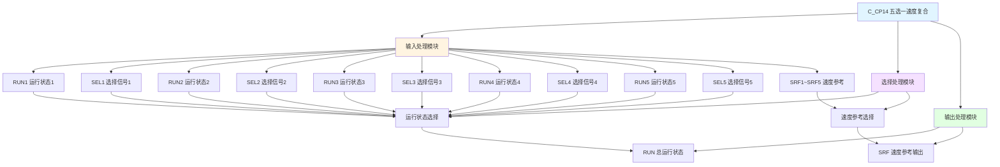

# C_CP14 功能块分析报告

## 基本信息

| 项目 | 内容 |
|------|------|
| 功能块名称 | C_CP14 |
| 功能描述 | Speed Reference Compound at Select(5 Part)（五选一速度参考复合） |
| 最后修改 | 2016.01.05 |
| 作者 | ShiChunLiang |
| 页数 | 1页（2个程序段） |

## 功能概述

C_CP14是一个速度参考复合功能块，用于在五个速度参考源之间进行选择和切换。该功能块支持五个独立的速度参考输入，根据选择信号自动切换输出对应的速度参考值，并输出对应的运行状态。这是CP系列中支持最多速度参考输入的功能块。

### 应用场景
- **五速驱动控制**：需要在五个速度设定值之间切换的场合
- **多工位多速度控制**：复杂的多工位生产流程
- **精细速度调节**：需要多档位精细速度控制的场合

## 思维导图

## 流程路径描述

### 运行状态选择路径：
开始 → 检测五个部分的RUN和SEL信号 → 输出RUN状态
**功能**: 根据各部分的选择信号输出总运行状态

### 速度参考选择路径：
开始 → 选择各部分SRF → 累加处理 → 输出SRF
**功能**: 根据运行状态选择对应的速度参考值输出

## 逐帧功能分析

### Rung 1: 运行状态选择

**功能描述**: 根据五个部分的选择信号确定总运行状态

**输入条件**:
| 信号名称 | 信号描述 | 信号类型 | 触发值 |
|----------|----------|----------|--------|
| RUN1~RUN5 | 运行状态1~5 | BOOL | TRUE/FALSE |
| SEL1~SEL5 | 选择信号1~5 | BOOL | TRUE |

**输出功能**:
| 信号名称 | 信号描述 | 信号类型 |
|----------|----------|----------|
| RUN | 总运行状态 | BOOL |

**触发逻辑**:
- IF 任一(RUNn AND SELn) = TRUE THEN RUN = TRUE
- ELSE RUN = FALSE

**功能实现**: 
五个部分的选择逻辑并联，任一部分被选中时输出RUN为TRUE。

### Rung 2: 速度参考选择

**功能描述**: 根据运行状态选择对应的速度参考值输出

**输入条件**:
| 信号名称 | 信号描述 | 信号类型 | 触发值 |
|----------|----------|----------|--------|
| SRF1~SRF5 | 速度参考值1~5 | REAL | 数值 |
| RUN1~RUN5 | 运行状态 | BOOL | TRUE/FALSE |
| SEL1~SEL5 | 选择信号 | BOOL | TRUE/FALSE |

**输出功能**:
| 信号名称 | 信号描述 | 信号类型 |
|----------|----------|----------|
| SRF | 速度参考输出 | REAL |

**触发逻辑**:
- 调用C_NSWR选择各部分速度参考值
- 调用C_ADD4进行四值加法运算
- 调用ADD_REAL进行额外加法运算
- 根据RUN状态选择最终输出

**功能实现**: 
1. 调用C_NSWR功能块分别选择SRF1~SRF5
2. 调用C_ADD4功能块进行前四个速度值累加
3. 调用ADD_REAL进行第五个速度值累加
4. 调用C_NSWR根据RUN状态选择最终输出

## 触发条件总结

### 选择条件
- **第n部分选中**: RUNn = TRUE AND SELn = TRUE (n=1~5)

### 输出条件
- **运行状态输出**: 任一部分选中时RUN = TRUE
- **速度输出**: 根据选中部分输出对应速度参考值

## 实现功能总结

### 主要功能
1. **运行状态复合**: 将五个部分的运行状态复合为总运行状态
2. **速度参考选择**: 根据选择信号切换速度参考值
3. **速度值累加**: 支持多个速度值的累加输出

### CP系列功能对比表
| 功能块 | 部分数 | 加法功能块 | 适用场景 |
|--------|--------|------------|----------|
| C_CP11 | 2部分 | ADD_REAL | 双速控制 |
| C_CP12 | 3部分 | C_ADD4 | 三速控制 |
| C_CP13 | 4部分 | C_ADD4 | 四速控制 |
| **C_CP14** | **5部分** | **C_ADD4 + ADD_REAL** | **五速控制** |

## 关键信号说明

| 信号名称 | 信号描述 | 信号类型 | 用途 |
|----------|----------|----------|------|
| RUN1~RUN5 | 运行状态1~5 | BOOL | 各部分运行状态 |
| SEL1~SEL5 | 选择信号1~5 | BOOL | 各部分选择控制 |
| SRF1~SRF5 | 速度参考值1~5 | REAL | 各部分速度设定 |
| RUN | 总运行状态 | BOOL | 输出运行状态 |
| SRF | 速度参考输出 | REAL | 输出速度参考值 |

## 调试技巧

### 调试步骤
1. 检查各部分的RUN和SEL信号组合
2. 监控RUN输出，确认运行状态复合正确
3. 监控SRF输出，确认速度参考选择正确
4. 验证各部分切换时的平滑性
5. 特别注意第五部分的加法运算

### 常见问题
1. **运行状态不正确**: 检查各SEL选择信号
2. **速度输出异常**: 检查各SRF设定值
3. **切换冲突**: 确认同一时间只有一个部分被选中
4. **第五部分不工作**: 检查额外的ADD_REAL运算

### 监控信号列表
- RUN（总运行状态）
- SRF（速度参考输出）
- RUN1~RUN5（各部分运行状态）
- SEL1~SEL5（选择信号）
