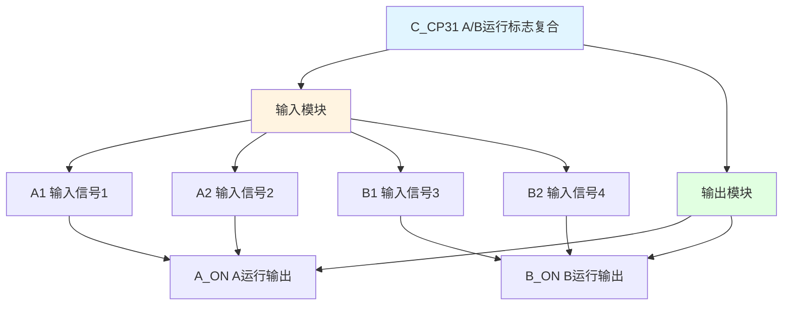

# C_CP31 功能块分析报告

## 基本信息

| 项目 | 内容 |
|------|------|
| 功能块名称 | C_CP31 |
| 功能描述 | A/B Running Flag Compound(2 Part)（A/B运行标志复合-2部分） |
| 最后修改 | 2016.01.05 |
| 作者 | ShiChunLiang |
| 页数 | 1页（2个程序段） |

## 功能概述

C_CP31是一个运行标志复合功能块，用于将两个独立的运行状态信号复合为A_ON和B_ON两个输出信号。该功能块结构简单，主要用于信号的传递和隔离。

### 应用场景
- **双设备状态监控**：监控两个独立设备的运行状态
- **A/B方向状态指示**：指示A方向和B方向的运行状态
- **状态信号隔离**：将输入状态信号隔离后输出

## 思维导图

## 流程路径描述

### A运行状态路径：
开始 → 检测A1 → 检测A2 → 输出A_ON
**功能**: 将A1或A2信号复合为A_ON输出

### B运行状态路径：
开始 → 检测B1 → 检测B2 → 输出B_ON
**功能**: 将B1或B2信号复合为B_ON输出

## 逐帧功能分析

### Rung 1: A运行状态输出

**功能描述**: 将A1和A2信号复合输出为A_ON

**输入条件**:
| 信号名称 | 信号描述 | 信号类型 | 触发值 |
|----------|----------|----------|--------|
| A1 | 输入信号1 | BOOL | TRUE |
| A2 | 输入信号2 | BOOL | TRUE |

**输出功能**:
| 信号名称 | 信号描述 | 信号类型 |
|----------|----------|----------|
| A_ON | A运行输出 | BOOL |

**触发逻辑**:
- IF A1 = TRUE OR A2 = TRUE THEN A_ON = TRUE
- ELSE A_ON = FALSE

**功能实现**: 
A1和A2两个输入信号并联，任一为ON时输出A_ON为TRUE。

### Rung 2: B运行状态输出

**功能描述**: 将B1和B2信号复合输出为B_ON

**输入条件**:
| 信号名称 | 信号描述 | 信号类型 | 触发值 |
|----------|----------|----------|--------|
| B1 | 输入信号3 | BOOL | TRUE |
| B2 | 输入信号4 | BOOL | TRUE |

**输出功能**:
| 信号名称 | 信号描述 | 信号类型 |
|----------|----------|----------|
| B_ON | B运行输出 | BOOL |

**触发逻辑**:
- IF B1 = TRUE OR B2 = TRUE THEN B_ON = TRUE
- ELSE B_ON = FALSE

**功能实现**: 
B1和B2两个输入信号并联，任一为ON时输出B_ON为TRUE。

## 触发条件总结

### A_ON输出条件
- **A1为ON**: A_ON = TRUE
- **A2为ON**: A_ON = TRUE

### B_ON输出条件
- **B1为ON**: B_ON = TRUE
- **B2为ON**: B_ON = TRUE

## 实现功能总结

### 主要功能
1. **信号复合**: 将两个输入信号复合为一个输出
2. **状态指示**: 提供A和B两个方向的运行状态指示
3. **信号隔离**: 实现输入输出信号的隔离

### 功能特点
- 结构简单，逻辑清晰
- 双通道独立输出
- OR逻辑复合

## 关键信号说明

| 信号名称 | 信号描述 | 信号类型 | 用途 |
|----------|----------|----------|------|
| A1 | 输入信号1 | BOOL | A组输入1 |
| A2 | 输入信号2 | BOOL | A组输入2 |
| B1 | 输入信号3 | BOOL | B组输入1 |
| B2 | 输入信号4 | BOOL | B组输入2 |
| A_ON | A运行输出 | BOOL | A组运行状态 |
| B_ON | B运行输出 | BOOL | B组运行状态 |

## 调试技巧

### 调试步骤
1. 检查A1和A2输入信号状态
2. 检查B1和B2输入信号状态
3. 监控A_ON和B_ON输出是否正确

### 常见问题
1. **输出始终为OFF**: 检查输入信号是否正常
2. **输出始终为ON**: 检查输入信号是否卡死

### 监控信号列表
- A_ON（A运行输出）
- B_ON（B运行输出）
- A1/A2（A组输入）
- B1/B2（B组输入）
