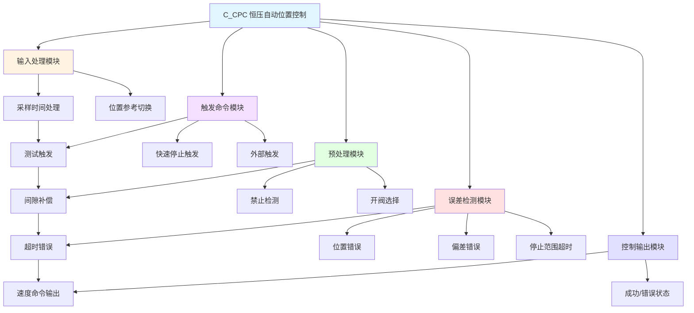

# C_CPC 功能块分析报告

## 基本信息

| 项目 | 内容 |
|------|------|
| 功能块名称 | C_CPC |
| 功能描述 | Constant Voltage Automatic Position Control（恒压自动位置控制） |
| 最后修改 | 2015.12.29 |
| 作者 | ShiChunLiang |
| 页数 | 约10页（40+个程序段） |

## 功能概述

C_CPC是一个恒压自动位置控制功能块，用于实现高精度的位置闭环控制。该功能块集成了位置参考切换、间隙补偿、误差检测、速度控制输出等完整的位置控制功能，适用于需要精确位置控制的场合。

### 应用场景
- **液压伺服控制**：液压缸的位置精确控制
- **阀门定位控制**：调节阀的精确开度控制
- **轧机压下控制**：轧辊间隙的精确控制
- **张力控制**：通过位置控制实现张力调节

### 功能特点
1. **多种位置参考源**：支持测试参考、外部参考、快速停止参考
2. **间隙补偿**：自动计算和补偿机械间隙
3. **多级速度控制**：根据位置偏差自动切换速度档位
4. **完善错误检测**：超时错误、位置错误、偏差错误等
5. **开阀控制**：支持开阀选择功能

## 思维导图

## 流程路径描述

### 主控制流程：
开始 → 采样时间处理 → 触发命令检测 → 位置参考切换 → 间隙补偿 → 位置控制 → 速度输出 → 结束检测
**功能**: 完整的位置闭环控制流程

### 错误检测流程：
开始 → 运行监控 → 超时检测 → 位置检测 → 偏差检测 → 错误输出
**功能**: 多重错误检测保护

### 开阀控制流程：
开始 → 开阀选择检测 → 开阀命令输出 → 开阀限位检测 → 开阀超时检测
**功能**: 开阀功能控制

## 逐帧功能分析

### Rung 1: 采样时间处理

**功能描述**: 将扫描次数转换为采样时间并限幅

**输入条件**:
| 信号名称 | 信号描述 | 信号类型 | 触发值 |
|----------|----------|----------|--------|
| SCN | 扫描次数 | INT | 数值 |

**输出功能**:
| 信号名称 | 信号描述 | 信号类型 |
|----------|----------|----------|
| Ts | 采样时间 | REAL |

**触发逻辑**:
- Ts = SCN / 1000.0
- Ts = LIMIT(Ts, 0.001, 0.15)

**功能实现**: 
将扫描次数转换为秒，并限制在0.001~0.15秒范围内。

### Rung 2-4: 触发命令检测

**功能描述**: 检测测试命令、快速停止命令和外部触发命令

**输入条件**:
| 信号名称 | 信号描述 | 信号类型 | 触发值 |
|----------|----------|----------|--------|
| REM1 | 测试命令触发 | BOOL | 上升沿 |
| REM2 | 快速停止触发 | BOOL | 上升沿 |
| PAD | 外部触发 | BOOL | TRUE |
| QST | 快速停止信号 | BOOL | FALSE |

**输出功能**:
| 信号名称 | 信号描述 | 信号类型 |
|----------|----------|----------|
| TesPad | 测试触发标志 | BOOL |
| QStpPad | 快速停止触发 | BOOL |
| ExtPad | 外部触发标志 | BOOL |

**触发逻辑**:
- R_TRIG检测REM1上升沿 → TesPad
- R_TRIG检测REM2上升沿 → QStpPad
- PAD AND NOT QST → ExtPad

### Rung 5: 位置参考切换

**功能描述**: 根据触发类型选择位置参考值

**输入条件**:
| 信号名称 | 信号描述 | 信号类型 | 触发值 |
|----------|----------|----------|--------|
| TesPad | 测试触发 | BOOL | TRUE |
| ExtPad | 外部触发 | BOOL | TRUE |
| QStpPad | 快速停止触发 | BOOL | TRUE |
| TesRef | 测试参考值 | REAL | 数值 |
| REF | 外部参考值 | REAL | 数值 |
| QRE | 快速停止参考 | REAL | 数值 |

**输出功能**:
| 信号名称 | 信号描述 | 信号类型 |
|----------|----------|----------|
| PosRef | 位置参考值 | REAL |
| CPcPad | CPC触发标志 | BOOL |

**触发逻辑**:
- TesPad → PosRef = TesRef
- ExtPad → PosRef = REF
- QStpPad → PosRef = QRE

### Rung 6-7: 间隙补偿

**功能描述**: 计算间隙补偿值并检测间隙状态

**输入条件**:
| 信号名称 | 信号描述 | 信号类型 | 触发值 |
|----------|----------|----------|--------|
| UDT.BckDirChg | 间隙方向变化 | REAL | 数值 |
| UDT.BckRshVal | 间隙值 | REAL | 数值 |

**输出功能**:
| 信号名称 | 信号描述 | 信号类型 |
|----------|----------|----------|
| BckRshON | 间隙有效标志 | BOOL |

**触发逻辑**:
- BckRsh = UDT.BckDirChg * UDT.BckRshVal
- IF BckRsh ≠ 0 THEN BckRshON = TRUE

### Rung 8: 禁止检测

**功能描述**: 检测是否进入禁止区域

**输入条件**:
| 信号名称 | 信号描述 | 信号类型 | 触发值 |
|----------|----------|----------|--------|
| PosRef | 位置参考值 | REAL | 数值 |
| FBK | 位置反馈值 | REAL | 数值 |
| UDT.SucAcrRng | 成功精度范围 | REAL | 设定值 |
| UDT.InhSucRng | 禁止成功范围 | INT | 1 |

**输出功能**:
| 信号名称 | 信号描述 | 信号类型 |
|----------|----------|----------|
| CPcInh | CPC禁止标志 | BOOL |

**触发逻辑**:
- IF |PosRef - FBK| ≤ UDT.SucAcrRng AND UDT.InhSucRng = 1 AND NOT CPcRun THEN CPcInh = TRUE

### Rung 9-10: 开阀选择与限位检测

**功能描述**: 检测开阀选择条件和开阀限位

**输入条件**:
| 信号名称 | 信号描述 | 信号类型 | 触发值 |
|----------|----------|----------|--------|
| UDT.OpnLimVal | 开阀限制值 | REAL | 设定值 |
| UDT.OpnAdjVal | 开阀调整值 | REAL | 设定值 |
| PosRef | 位置参考值 | REAL | 数值 |
| FBK | 位置反馈值 | REAL | 数值 |
| UDT.OpnSelSet | 开阀选择设置 | INT | 1 |

**输出功能**:
| 信号名称 | 信号描述 | 信号类型 |
|----------|----------|----------|
| CPcOpnSel | 开阀选择标志 | BOOL |
| OpnLimDet | 开阀限位检测 | BOOL |

**触发逻辑**:
- IF (UDT.OpnLimVal - UDT.OpnAdjVal) ≤ PosRef AND UDT.OpnSelSet = 1 THEN CPcOpnSel = TRUE
- IF (UDT.OpnLimVal - UDT.OpnAdjVal) ≤ FBK THEN OpnLimDet = TRUE

### Rung 11: 开阀命令输出

**功能描述**: 输出开阀命令并检测超时

**输入条件**:
| 信号名称 | 信号描述 | 信号类型 | 触发值 |
|----------|----------|----------|--------|
| CPcPad | CPC触发 | BOOL | TRUE |
| OSI | 开阀联锁 | BOOL | TRUE |
| ORI | 关阀联锁 | BOOL | TRUE |
| AUX | 辅助信号 | BOOL | TRUE |
| CPcOpnSel | 开阀选择 | BOOL | TRUE |
| OpnLimDet | 开阀限位 | BOOL | FALSE |
| UDT.ErrDtTm[4] | 错误检测时间 | DINT | 设定值 |

**输出功能**:
| 信号名称 | 信号描述 | 信号类型 |
|----------|----------|----------|
| OpnCmd | 开阀命令 | BOOL |
| OpnOvtErr | 开阀超时错误 | BOOL |

**触发逻辑**:
- 开阀条件满足 → OpnCmd = TRUE
- 开阀超时 → OpnOvtErr = TRUE

### Rung 12-14: 运行联锁与启动

**功能描述**: 检测运行联锁条件并启动CPC运行

**输入条件**:
| 信号名称 | 信号描述 | 信号类型 | 触发值 |
|----------|----------|----------|--------|
| CSI | 关阀联锁 | BOOL | TRUE |
| CRI | 关阀运行联锁 | BOOL | TRUE |
| AUX | 辅助信号 | BOOL | TRUE |
| OSI | 开阀联锁 | BOOL | TRUE |
| ORI | 开阀运行联锁 | BOOL | TRUE |
| CPcPad | CPC触发 | BOOL | TRUE |
| CPcInh | CPC禁止 | BOOL | FALSE |

**输出功能**:
| 信号名称 | 信号描述 | 信号类型 |
|----------|----------|----------|
| CPcRIL | CPC运行联锁 | BOOL |
| PasAdv | 通过前进 | BOOL |
| CPcRun | CPC运行 | BOOL |

**触发逻辑**:
- 联锁条件满足 → CPcRIL = TRUE
- CPcPad AND NOT CPcInh → PasAdv = TRUE
- PasAdv AND CPcRIL → CPcRun = TRUE（自保持）

### Rung 15-25: 预处理序列

**功能描述**: CPC启动时的预处理操作

**主要操作**:
1. 复位成功/完成/停止范围标志
2. 计算间隙补偿值
3. 重试间隙处理
4. 计算包含间隙的位置参考

### Rung 26-35: 错误检测

**功能描述**: 检测各种错误条件

**错误类型**:
| 错误名称 | 错误描述 | 检测条件 |
|----------|----------|----------|
| OvtErr | 超时错误 | CPcRun超时 |
| PsvErr | 位置错误 | FBK超出范围 |
| PdvErr | 偏差错误 | 速度偏差过大 |
| StpOvtErr | 停止范围超时 | 停止范围内超时 |
| OpnOvtErr | 开阀超时 | 开阀超时 |

### Rung 36-40: 控制状态检测

**功能描述**: 检测位置偏差和控制状态

**输出功能**:
| 信号名称 | 信号描述 | 信号类型 |
|----------|----------|----------|
| DevPlus | 偏差正方向 | BOOL |
| CPcFsh | CPC完成 | BOOL |
| StpRng | 停止范围 | BOOL |
| Nch2RngDet | 中速范围检测 | BOOL |
| Nch3RngDet | 高速范围检测 | BOOL |
| CPcSuc | CPC成功 | BOOL |

### Rung 41-50: 输出处理

**功能描述**: 输出控制命令和状态信号

**输出功能**:
| 信号名称 | 信号描述 | 信号类型 |
|----------|----------|----------|
| LCR | 低压运行 | BOOL |
| SUC | 成功信号 | BOOL |
| ERR | 错误信号 | BOOL |
| PSC | 位置速度命令 | BOOL |
| MSC | 中速命令 | BOOL |
| S2C | 速度2命令 | BOOL |
| S3C | 速度3命令 | BOOL |

## 触发条件总结

### 启动条件
- **测试启动**: REM1上升沿
- **外部启动**: PAD = TRUE AND QST = FALSE
- **快速停止**: REM2上升沿

### 运行条件
- **联锁满足**: CSI, CRI, AUX等联锁信号正常
- **间隙处理**: 间隙补偿计算完成
- **禁止检测**: 未进入禁止区域

### 完成条件
- **成功**: 位置偏差小于成功精度范围
- **超时**: 运行时间超过设定值
- **错误**: 检测到位置错误或偏差错误

## 实现功能总结

### 主要功能
1. **位置控制**: 高精度位置闭环控制
2. **间隙补偿**: 自动计算和补偿机械间隙
3. **多级速度**: 根据偏差自动切换速度档位
4. **开阀控制**: 支持开阀选择功能
5. **错误检测**: 完善的错误检测和保护功能

### 控制参数
| 参数名称 | 参数描述 | 用途 |
|----------|----------|------|
| UDT.SucAcrRng | 成功精度范围 | 位置控制精度 |
| UDT.StpRng | 停止范围 | 停止判定 |
| UDT.HighSpdSet | 高速设定 | 高速切换阈值 |
| UDT.MiddSpdSet | 中速设定 | 中速切换阈值 |
| UDT.ErrDtTm[] | 错误检测时间 | 各类错误检测延时 |

## 关键信号说明

| 信号名称 | 信号描述 | 信号类型 | 用途 |
|----------|----------|----------|------|
| PosRef | 位置参考值 | REAL | 目标位置 |
| FBK | 位置反馈值 | REAL | 实际位置 |
| CPcPosRef | CPC位置参考 | REAL | 补偿后参考 |
| PosDev | 位置偏差 | REAL | 控制偏差 |
| CPcRun | CPC运行 | BOOL | 运行状态 |
| CPcSuc | CPC成功 | BOOL | 完成成功 |
| ERR | 错误 | BOOL | 错误状态 |

## 调试技巧

### 调试步骤
1. 检查采样时间Ts是否正确
2. 检查位置参考值PosRef是否正确
3. 检查位置反馈值FBK是否正常
4. 监控位置偏差PosDev变化
5. 检查各联锁信号状态
6. 验证速度命令输出

### 常见问题
1. **无法启动**: 检查联锁信号和禁止条件
2. **位置超调**: 调整速度设定值
3. **间隙补偿异常**: 检查间隙参数设置
4. **频繁报错**: 检查错误检测时间设置

### 监控信号列表
- PosRef（位置参考值）
- FBK（位置反馈值）
- PosDev（位置偏差）
- CPcRun（运行状态）
- CPcSuc（成功状态）
- ERR（错误状态）
- PSC/MSC/S2C/S3C（速度命令）
