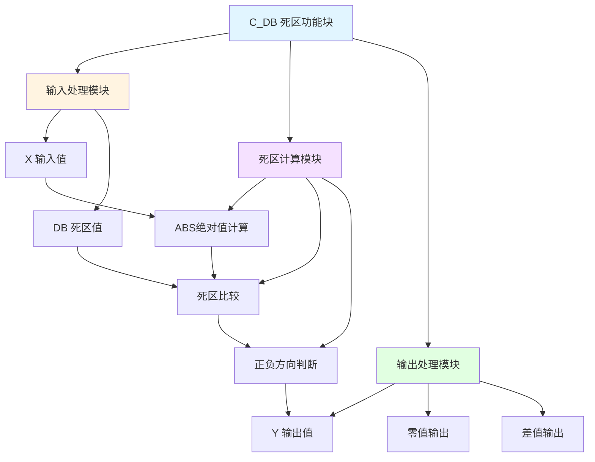

# C_DB 功能块分析报告

## 基本信息

| 项目 | 内容 |
|------|------|
| 功能块名称 | C_DB |
| 功能描述 | Dead Band（死区功能块-REAL类型） |
| 最后修改 | 2015.12.10 |
| 作者 | ShiChunLiang |
| 页数 | 1页（3个程序段） |

## 功能概述

C_DB是一个死区功能块，用于在输入信号中设置一个死区范围。当输入信号在死区范围内时，输出为零；当输入信号超出死区范围时，输出为输入值减去死区值。该功能块常用于消除信号噪声和小幅波动的影响。

### 应用场景
- **信号滤波**：消除小幅波动的干扰
- **位置控制**：设置位置控制的死区范围
- **速度控制**：设置速度控制的死区范围
- **液位控制**：设置液位控制的死区范围

### 功能特点
1. **死区处理**：设置输入信号的不灵敏区
2. **双向处理**：支持正负方向的死区处理
3. **REAL类型**：支持实数类型运算
4. **连续输出**：超出死区后连续输出

## 思维导图



## 流程路径描述

### 死区判断路径：
开始 → 读取X → 计算绝对值AbsDB → 与DB比较 → 判断是否在死区内
**功能**: 判断输入值是否在死区范围内

### 输出计算路径：
开始 → 死区判断 → 在死区内输出0 → 超出死区输出差值
**功能**: 根据死区判断结果计算输出值

## 逐帧功能分析

### Rung 1: 绝对值计算

**功能描述**: 计算输入值的绝对值

**输入条件**:
| 信号名称 | 信号描述 | 信号类型 | 触发值 |
|----------|----------|----------|--------|
| X | 输入值 | REAL | 数值 |

**输出功能**:
| 信号名称 | 信号描述 | 信号类型 |
|----------|----------|----------|
| AbsDB | 绝对值 | REAL |

**触发逻辑**:
- AbsDB = |X|

**功能实现**: 
调用ABS_REAL计算输入值X的绝对值，得到AbsDB。

### Rung 2: 死区判断与零值输出

**功能描述**: 判断输入是否在死区范围内，在范围内输出零

**输入条件**:
| 信号名称 | 信号描述 | 信号类型 | 触发值 |
|----------|----------|----------|--------|
| X | 输入值 | REAL | 数值 |
| AbsDB | 绝对值 | REAL | 数值 |
| DB | 死区值 | REAL | 设定值 |

**输出功能**:
| 信号名称 | 信号描述 | 信号类型 |
|----------|----------|----------|
| Y | 输出值 | REAL |

**触发逻辑**:
- IF AbsDB ≤ DB THEN Y = 0.0

**功能实现**: 
使用CMP_REAL比较AbsDB和DB，如果AbsDB小于等于DB，则输出Y=0.0。

### Rung 3: 差值输出

**功能描述**: 超出死区范围时输出差值

**输入条件**:
| 信号名称 | 信号描述 | 信号类型 | 触发值 |
|----------|----------|----------|--------|
| X | 输入值 | REAL | 数值 |
| AbsDB | 绝对值 | REAL | 数值 |
| DB | 死区值 | REAL | 设定值 |

**输出功能**:
| 信号名称 | 信号描述 | 信号类型 |
|----------|----------|----------|
| Y | 输出值 | REAL |

**触发逻辑**:
- IF X > 0 AND AbsDB > DB THEN Y = X - DB
- IF X < 0 AND AbsDB > DB THEN Y = X + DB

**功能实现**: 
1. 使用CMP_REAL判断X是否大于0
2. 如果X > 0，使用SUB_REAL计算Y = X - DB
3. 如果X < 0，使用ADD_REAL计算Y = X + DB

## 触发条件总结

### 死区内条件
- **|X| ≤ DB**: 输入值在死区范围内
- **Y = 0**: 输出为零

### 正向超出死区
- **X > DB**: 输入值正向超出死区
- **Y = X - DB**: 输出为差值

### 负向超出死区
- **X < -DB**: 输入值负向超出死区
- **Y = X + DB**: 输出为差值

## 实现功能总结

### 主要功能
1. **死区设置**: 设置输入信号的不灵敏区
2. **零值输出**: 死区内输出为零
3. **差值输出**: 超出死区输出差值
4. **双向处理**: 支持正负方向

### 输入输出关系
| 输入范围 | 输出值 |
|----------|--------|
| X > DB | Y = X - DB |
| -DB ≤ X ≤ DB | Y = 0 |
| X < -DB | Y = X + DB |

### 图示说明
```
输出Y
  │
  │     /
  │    /
──┼───/────── 输入X
  │  /   DB
  │ /
  │/
  │
```

## 关键信号说明

| 信号名称 | 信号描述 | 信号类型 | 用途 |
|----------|----------|----------|------|
| X | 输入值 | REAL | 输入信号 |
| DB | 死区值 | REAL | 死区范围设定 |
| AbsDB | 绝对值 | REAL | 输入值绝对值 |
| Y | 输出值 | REAL | 死区处理后的输出 |

## 调试技巧

### 调试步骤
1. 检查输入值X是否正常变化
2. 验证死区值DB设置是否合理
3. 监控AbsDB绝对值计算
4. 测试死区边界值
5. 检查输出Y是否正确

### 常见问题
1. **输出始终为零**: 检查DB设置是否过大
2. **死区不生效**: 检查DB设置是否为零
3. **输出跳变**: 检查死区边界处理
4. **方向错误**: 检查正负方向判断逻辑

### 监控信号列表
- X（输入值）
- DB（死区值）
- AbsDB（绝对值）
- Y（输出值）

### 测试用例
| X值 | DB值 | 预期Y值 |
|-----|------|---------|
| 10.0 | 5.0 | 5.0 |
| 3.0 | 5.0 | 0.0 |
| -10.0 | 5.0 | -5.0 |
| -3.0 | 5.0 | 0.0 |
| 0.0 | 5.0 | 0.0 |
