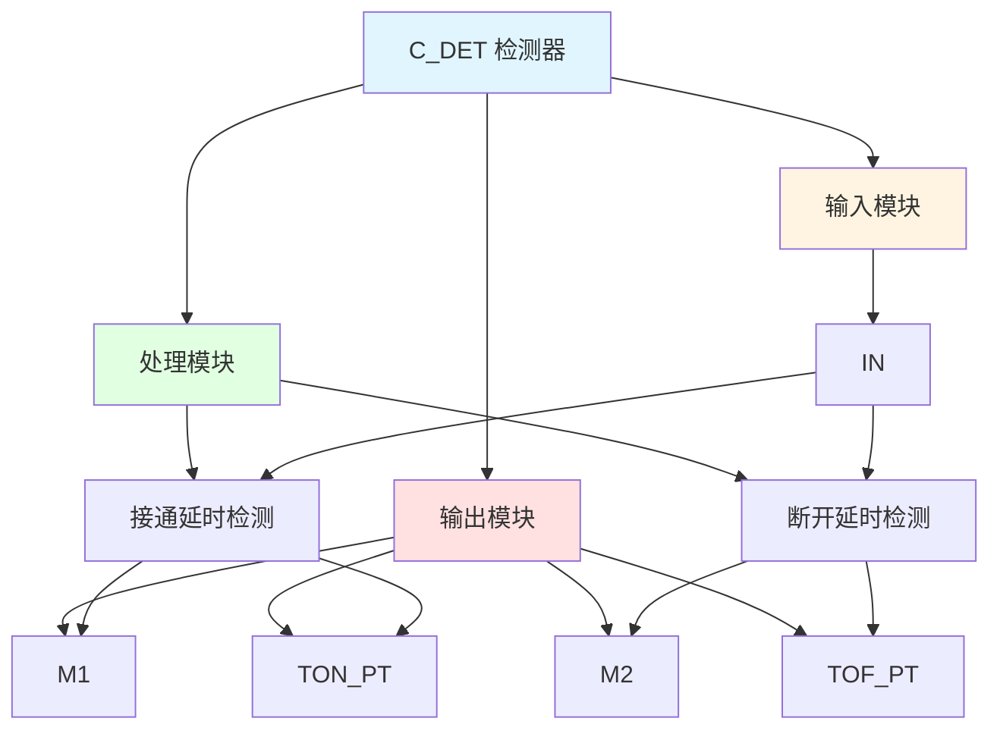

# C_DET 功能块分析报告

## 基本信息

| 项目 | 内容 |
|------|------|
| 功能块名称 | C_DET |
| 功能描述 | Detector（检测器） |
| 最后修改 | - |
| 作者 | - |
| 页数 | 2页 |

## 功能概述

C_DET 是一个检测器功能块，用于检测输入信号的持续时间。该功能块包含一个接通延时定时器（TON）和一个断开延时定时器（TOF），用于检测输入信号的接通和断开状态。

## 思维导图

## 流程路径描述

### 接通延时路径：
开始 → 输入信号 → TON定时器 → 延时20001ms → 输出M1
**功能**: 检测输入信号的接通延时

### 断开延时路径：
开始 → 输入信号 → TOF定时器 → 延时50001ms → 输出M2
**功能**: 检测输入信号的断开延时

## 逐帧功能分析

### Rung 1: 接通延时定时器设置

**功能描述**: 设置接通延时定时器的预设时间

**输入条件**:
| 信号名称 | 信号描述 | 信号类型 | 触发值 |
|----------|----------|----------|--------|
| TON_PT | TON预设时间 | DINT | 20001 |

**输出功能**:
| 信号名称 | 信号描述 | 信号类型 |
|----------|----------|----------|
| TON_PT | TON预设时间 | DINT |

**触发逻辑**:
- TON_PT = 20001

**功能实现**: 
使用MOVE功能块，将TON_PT设置为20001，作为接通延时定时器的预设时间。

### Rung 2: 断开延时定时器设置

**功能描述**: 设置断开延时定时器的预设时间

**输入条件**:
| 信号名称 | 信号描述 | 信号类型 | 触发值 |
|----------|----------|----------|--------|
| TOF_PT | TOF预设时间 | DINT | 50001 |

**输出功能**:
| 信号名称 | 信号描述 | 信号类型 |
|----------|----------|----------|
| TOF_PT | TOF预设时间 | DINT |

**触发逻辑**:
- TOF_PT = 50001

**功能实现**: 
使用MOVE功能块，将TOF_PT设置为50001，作为断开延时定时器的预设时间。

### Rung 3: 接通延时检测

**功能描述**: 检测输入信号的接通延时

**输入条件**:
| 信号名称 | 信号描述 | 信号类型 | 触发值 |
|----------|----------|----------|--------|
| IN | 输入 | BOOL | TRUE/FALSE |
| TON_PT | TON预设时间 | DINT | 20001 |

**输出功能**:
| 信号名称 | 信号描述 | 信号类型 |
|----------|----------|----------|
| M1 | 接通延时输出 | BOOL |
| TON_ET | TON经过时间 | TIME |

**触发逻辑**:
- IF IN = TRUE且持续20001ms THEN M1 = TRUE
- IF IN = FALSE THEN M1 = FALSE

**功能实现**: 
使用TON（接通延时定时器）功能块，当输入IN为TRUE时，开始计时，延时20001ms后输出M1为TRUE。当IN为FALSE时，立即复位，M1为FALSE。

### Rung 3: 断开延时检测

**功能描述**: 检测输入信号的断开延时

**输入条件**:
| 信号名称 | 信号描述 | 信号类型 | 触发值 |
|----------|----------|----------|--------|
| IN | 输入 | BOOL | TRUE/FALSE |
| TOF_PT | TOF预设时间 | DINT | 50001 |

**输出功能**:
| 信号名称 | 信号描述 | 信号类型 |
|----------|----------|----------|
| M2 | 断开延时输出 | BOOL |
| TOF_ET | TOF经过时间 | TIME |

**触发逻辑**:
- IF IN = TRUE THEN M2 = TRUE
- IF IN = FALSE且持续50001ms THEN M2 = FALSE

**功能实现**: 
使用TOF（断开延时定时器）功能块，当输入IN为TRUE时，立即输出M2为TRUE。当IN为FALSE时，开始计时，延时50001ms后输出M2为FALSE。

## 触发条件总结

### 接通延时条件
- **接通触发**: IN = TRUE且持续20001ms
- **接通复位**: IN = FALSE

### 断开延时条件
- **断开触发**: IN = FALSE且持续50001ms
- **断开复位**: IN = TRUE

## 实现功能总结

### 主要功能
1. **接通延时检测**: 检测输入信号的接通延时
2. **断开延时检测**: 检测输入信号的断开延时

### 辅助功能
1. **时间设置**: 设置接通和断开延时的预设时间
2. **经过时间监控**: 监控定时器的经过时间

## 关键信号说明

| 信号名称 | 信号描述 | 信号类型 | 用途 |
|----------|----------|----------|------|
| IN | 输入 | BOOL | 输入信号 |
| M1 | 接通延时输出 | BOOL | 接通延时检测输出 |
| M2 | 断开延时输出 | BOOL | 断开延时检测输出 |
| TON_PT | TON预设时间 | DINT | 接通延时预设时间 |
| TOF_PT | TOF预设时间 | DINT | 断开延时预设时间 |
| TON_ET | TON经过时间 | TIME | 接通延时经过时间 |
| TOF_ET | TOF经过时间 | TIME | 断开延时经过时间 |

## 调试技巧

### 调试步骤
1. 检查IN信号，确认输入状态
2. 监控M1信号，观察接通延时过程
3. 监控M2信号，观察断开延时过程
4. 检查TON_ET和TOF_ET值，确认延时时间正确

### 常见问题
1. **接通延时不工作**: 检查IN信号是否持续20001ms
2. **断开延时不工作**: 检查IN信号是否持续50001ms
3. **延时时间不准确**: 检查TON_PT和TOF_PT值设置

### 调试工具
1. 在线监控IN、M1、M2信号，观察延时过程
2. 监控TON_ET和TOF_ET值，确认延时时间
3. 使用断点调试，检查定时器执行情况

### 监控信号列表
- IN（输入）
- M1（接通延时输出）
- M2（断开延时输出）
- TON_PT（TON预设时间）
- TOF_PT（TOF预设时间）
- TON_ET（TON经过时间）
- TOF_ET（TOF经过时间）
