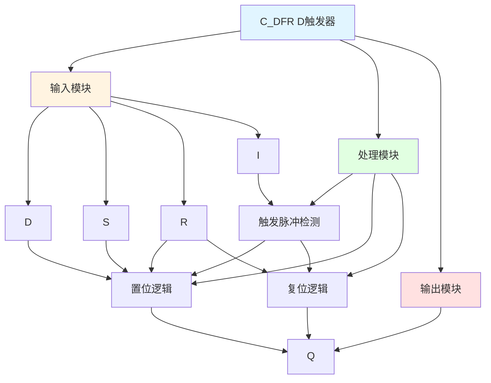

# C_DFR 功能块分析报告

## 基本信息

| 项目 | 内容 |
|------|------|
| 功能块名称 | C_DFR |
| 功能描述 | D-flipflop, R-dominant (BOOL type)（D触发器，R主导，布尔类型） |
| 最后修改 | 2015.12.17 |
| 作者 | Shi Chun Liang |
| 页数 | 1页 |

## 功能概述

C_DFR 是一个D触发器功能块，具有R主导特性。该功能块在触发脉冲到来时，根据D输入设置或复位输出Q，R信号具有优先权。

## 思维导图

## 流程路径描述

### 触发脉冲检测路径：
开始 → I信号 → 上升沿检测 → 触发脉冲
**功能**: 检测触发信号

### 置位路径：
开始 → 触发脉冲 AND D AND NOT R AND S → Q置位
**功能**: 设置输出Q

### 复位路径：
开始 → R信号 OR (触发脉冲 AND NOT D AND NOT S AND NOT R) → Q复位
**功能**: 复位输出Q

## 逐帧功能分析

### Rung 7: 触发脉冲检测

**功能描述**: 检测I信号的上升沿

**输入条件**:
| 信号名称 | 信号描述 | 信号类型 | 触发值 |
|----------|----------|----------|--------|
| I | 触发输入 | BOOL | 上升沿 |

**输出功能**:
| 信号名称 | 信号描述 | 信号类型 |
|----------|----------|----------|
| TrgPls | 触发脉冲 | BOOL |

**触发逻辑**:
- IF I上升沿 THEN TrgPls = TRUE

**功能实现**: 
使用R_TRIG上升沿检测功能块检测I信号的上升沿。

### Rung 8: 置位逻辑

**功能描述**: 设置输出Q

**输入条件**:
| 信号名称 | 信号描述 | 信号类型 | 触发值 |
|----------|----------|----------|--------|
| S | 置位信号 | BOOL | TRUE |
| R | 复位信号 | BOOL | FALSE |
| TrgPls | 触发脉冲 | BOOL | TRUE |
| D | 数据输入 | BOOL | TRUE |

**输出功能**:
| 信号名称 | 信号描述 | 信号类型 |
|----------|----------|----------|
| Q | 输出 | BOOL |

**触发逻辑**:
- IF S = TRUE AND R = FALSE THEN Q = TRUE
- IF TrgPls = TRUE AND D = TRUE AND S = FALSE AND R = FALSE THEN Q = TRUE

**功能实现**: 
当S信号有效且R无效，或触发脉冲有效且D有效且S和R都无效时，置位Q。

### Rung 9: 复位逻辑

**功能描述**: 复位输出Q

**输入条件**:
| 信号名称 | 信号描述 | 信号类型 | 触发值 |
|----------|----------|----------|--------|
| R | 复位信号 | BOOL | TRUE |
| TrgPls | 触发脉冲 | BOOL | TRUE |
| D | 数据输入 | BOOL | FALSE |
| S | 置位信号 | BOOL | FALSE |

**输出功能**:
| 信号名称 | 信号描述 | 信号类型 |
|----------|----------|----------|
| Q | 输出 | BOOL |

**触发逻辑**:
- IF R = TRUE THEN Q = FALSE
- IF TrgPls = TRUE AND D = FALSE AND S = FALSE AND R = FALSE THEN Q = FALSE

**功能实现**: 
当R信号有效，或触发脉冲有效且D无效且S和R都无效时，复位Q。

## 触发条件总结

### 控制条件
- **置位条件**: S = TRUE AND R = FALSE
- **触发置位**: TrgPls = TRUE AND D = TRUE AND S = FALSE AND R = FALSE
- **复位条件**: R = TRUE
- **触发复位**: TrgPls = TRUE AND D = FALSE AND S = FALSE AND R = FALSE

## 实现功能总结

### 主要功能
1. **D触发器**: 实现D触发器功能
2. **R主导**: R信号具有优先权
3. **置位功能**: 支持直接置位

## 关键信号说明

| 信号名称 | 信号描述 | 信号类型 | 用途 |
|----------|----------|----------|------|
| D | 数据输入 | BOOL | 数据输入 |
| S | 置位信号 | BOOL | 直接置位 |
| R | 复位信号 | BOOL | 直接复位（主导） |
| I | 触发输入 | BOOL | 触发信号 |
| Q | 输出 | BOOL | 输出状态 |

## 调试技巧

### 调试步骤
1. 检查I信号，确认触发信号正常
2. 检查D、S、R信号，确认控制信号正常
3. 监控Q信号，观察输出状态

### 常见问题
1. **输出不变化**: 检查触发信号和控制信号
2. **R主导失效**: 检查R信号优先级

### 监控信号列表
- D、S、R（控制信号）
- I（触发信号）
- Q（输出）
