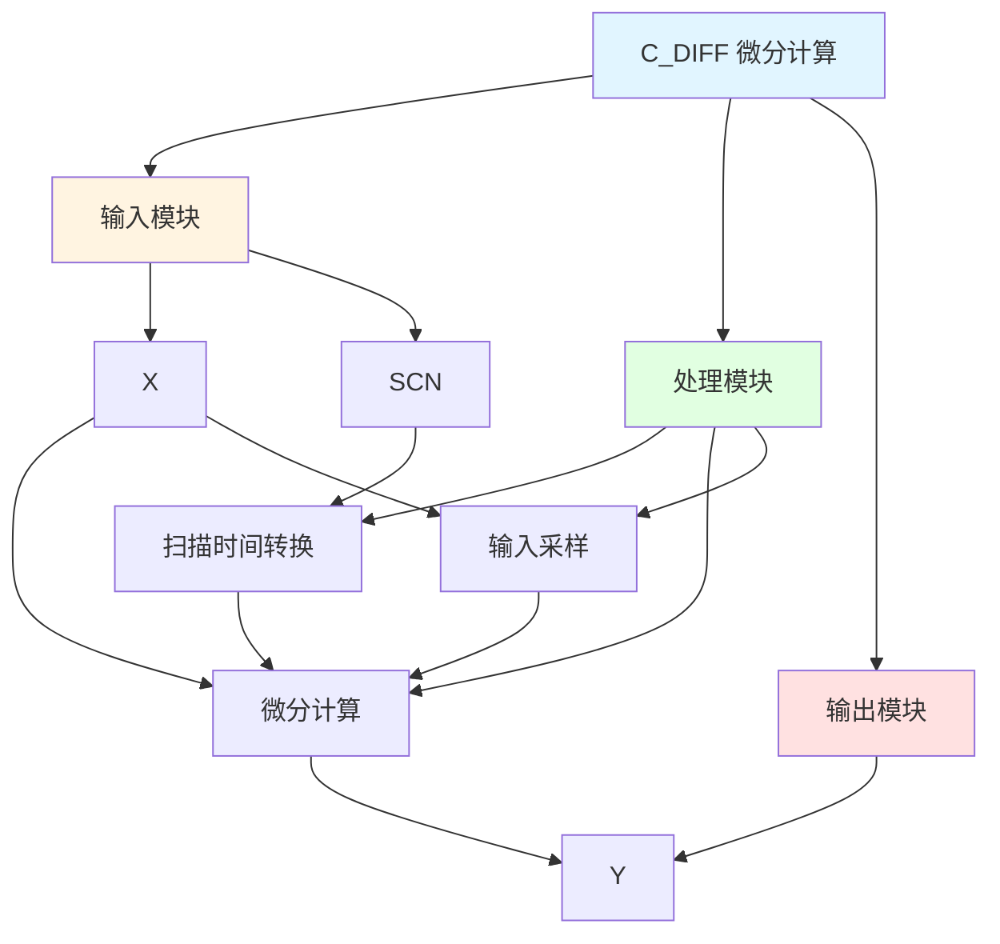

# C_DIFF 功能块分析报告

## 基本信息

| 项目 | 内容 |
|------|------|
| 功能块名称 | C_DIFF |
| 功能描述 | Differential Calculus（微分计算） |
| 最后修改 | 2015.12.13 |
| 作者 | Shi Chun Liang |
| 页数 | 1页 |

## 功能概述

C_DIFF 是一个微分计算功能块，用于计算输入信号的微分值。该功能块通过采样输入值并计算变化率，实现微分功能。

## 思维导图

## 流程路径描述

### 微分计算路径：
开始 → X输入 → 采样存储 → 微分计算 → Y输出
**功能**: 计算输入信号的微分值

## 逐帧功能分析

### Rung 7: 扫描时间转换

**功能描述**: 将扫描时间转换为实际值

**输入条件**:
| 信号名称 | 信号描述 | 信号类型 | 触发值 |
|----------|----------|----------|--------|
| SCN | 扫描时间 | INT | 设定值 |

**输出功能**:
| 信号名称 | 信号描述 | 信号类型 |
|----------|----------|----------|
| Ts | 扫描周期 | REAL |

**触发逻辑**:
- Ts = SCN / 1000.0 (限制在0.001~0.15之间)

**功能实现**: 
将整数扫描时间转换为实数值，并进行限幅处理。

### Rung 8: 微分计算

**功能描述**: 计算输入信号的微分值

**输入条件**:
| 信号名称 | 信号描述 | 信号类型 | 触发值 |
|----------|----------|----------|--------|
| X | 输入值 | REAL | 数值 |
| PrvInp | 前几次输入值 | REAL | 数值 |
| Ts | 扫描周期 | REAL | 计算值 |

**输出功能**:
| 信号名称 | 信号描述 | 信号类型 |
|----------|----------|----------|
| Y | 微分输出 | REAL |

**触发逻辑**:
- Y = ((X - PrvInp[2]) * 3.0 + (PrvInp[0] - PrvInp[1])) / 10.0 / Ts

**功能实现**: 
使用三点差分算法计算微分值，提高计算精度。

### Rung 9: 输入采样

**功能描述**: 保存输入值用于下次计算

**输入条件**:
| 信号名称 | 信号描述 | 信号类型 | 触发值 |
|----------|----------|----------|--------|
| X | 输入值 | REAL | 数值 |
| PrvInp | 前几次输入值 | REAL | 数值 |

**输出功能**:
| 信号名称 | 信号描述 | 信号类型 |
|----------|----------|----------|
| PrvInp[0] | 当前输入 | REAL |
| PrvInp[1] | 上次输入 | REAL |
| PrvInp[2] | 上上次输入 | REAL |

**触发逻辑**:
- PrvInp[2] = PrvInp[1]
- PrvInp[1] = PrvInp[0]
- PrvInp[0] = X

**功能实现**: 
保存输入值用于下次微分计算。

## 触发条件总结

### 计算条件
- **微分计算**: 每个扫描周期执行

## 实现功能总结

### 主要功能
1. **微分计算**: 计算输入信号的微分值
2. **输入采样**: 保存输入值用于计算

## 关键信号说明

| 信号名称 | 信号描述 | 信号类型 | 用途 |
|----------|----------|----------|------|
| X | 输入值 | REAL | 输入信号 |
| SCN | 扫描时间 | INT | 扫描时间设定 |
| Y | 微分输出 | REAL | 微分输出值 |
| PrvInp | 前几次输入值 | REAL | 历史输入值 |

## 调试技巧

### 调试步骤
1. 检查X值，确认输入正常
2. 检查SCN值，确认扫描时间设置
3. 监控Y值，观察微分输出

### 常见问题
1. **微分输出不稳定**: 检查输入信号和扫描时间
2. **微分计算不准确**: 检查采样周期设置

### 监控信号列表
- X（输入值）
- Y（微分输出）
- PrvInp（历史输入值）
