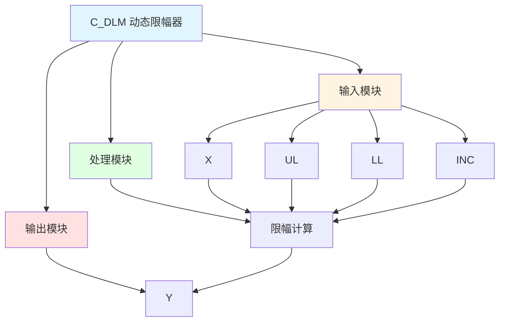

# C_DLM 功能块分析报告

## 基本信息

| 项目 | 内容 |
|------|------|
| 功能块名称 | C_DLM |
| 功能描述 | Dynamic Limiter（动态限幅器） |
| 最后修改 | 2015.11.20 |
| 作者 | Shi Chun Liang |
| 页数 | 1页 |

## 功能概述

C_DLM 是一个动态限幅器功能块，用于实现动态限幅控制功能。

## 思维导图

## 流程路径描述

### 限幅路径：
开始 → X → 限幅计算 → 输出Y
**功能**: 实现动态限幅控制

## 逐帧功能分析

### Rung 7: 限幅计算

**功能描述**: 计算动态限幅值

**输入条件**:
| 信号名称 | 信号描述 | 信号类型 | 触发值 |
|----------|----------|----------|--------|
| X | 输入 | REAL | 数值 |
| UL | 上限值 | REAL | 设定值 |
| LL | 下限值 | REAL | 设定值 |
| INC | 增量 | REAL | 设定值 |

**输出功能**:
| 信号名称 | 信号描述 | 信号类型 |
|----------|----------|----------|
| Y | 输出 | REAL |

**触发逻辑**:
- Y = LIMIT(X, LL, UL, INC)

**功能实现**: 
使用C_LIMR功能块，根据INC增量动态调整限幅范围。

## 触发条件总结

### 限幅条件
- **限幅计算**: X、UL、LL、INC都有值

## 实现功能总结

### 主要功能
1. **动态限幅**: 实现动态限幅控制功能

## 关键信号说明

| 信号名称 | 信号描述 | 信号类型 | 用途 |
|----------|----------|----------|------|
| X | 输入 | REAL | 输入值 |
| UL | 上限值 | REAL | 上限设定值 |
| LL | 下限值 | REAL | 下限设定值 |
| INC | 增量 | REAL | 限幅增量 |
| Y | 输出 | REAL | 限幅输出值 |

## 调试技巧

### 调试步骤
1. 检查X值，确认输入正常
2. 检查UL、LL、INC值，确认限幅设置
3. 监控Y值，观察限幅输出

### 常见问题
1. **限幅不工作**: 检查UL、LL、INC值设置
2. **输出不正确**: 检查X值和INC值

### 监控信号列表
- X（输入）
- UL、LL、INC（限幅值）
- Y（输出）
