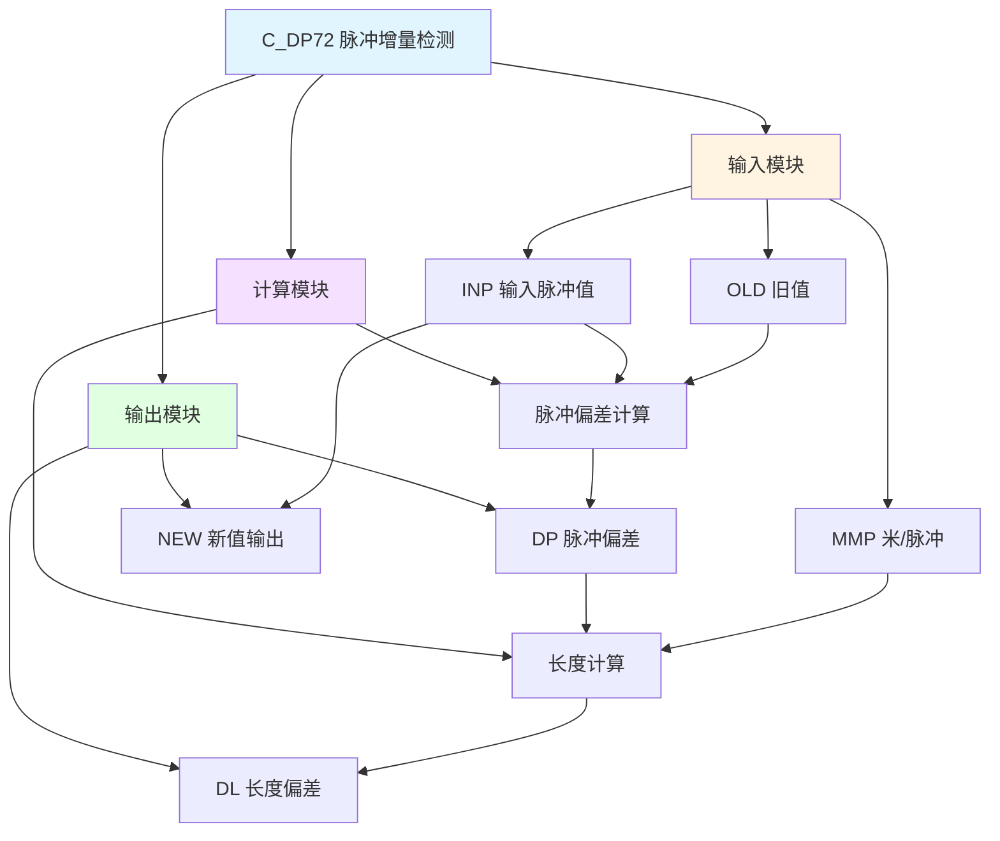

# C_DP72 功能块分析报告

## 基本信息

| 项目 | 内容 |
|------|------|
| 功能块名称 | C_DP72 (C_DPD) |
| 功能描述 | Delta Pulse Detect(for Pulse Counter)（脉冲计数器增量脉冲检测） |
| 最后修改 | 2015.12.18 |
| 作者 | ShiChunLiang |
| 页数 | 1页（3个程序段） |

> **注意**：源代码文件中的功能名称注释为"C_DPD"，文件名为C_DP72，可能是命名差异。

## 功能概述

C_DP72是一个脉冲增量检测功能块，用于计算脉冲计数器的增量值。该功能块通过比较当前输入值与上次采样值，计算脉冲偏差，并将其转换为长度值。

### 应用场景
- **脉冲计数器**：计算编码器或脉冲发生器的增量
- **长度测量**：将脉冲增量转换为实际长度
- **速度计算**：通过脉冲增量计算速度
- **位置跟踪**：跟踪脉冲计数器的变化

### 功能特点
1. **增量计算**：计算当前值与旧值的差值
2. **长度转换**：将脉冲增量转换为长度值
3. **采样输出**：输出当前采样值供下次使用

## 思维导图

## 流程路径描述

### 脉冲偏差计算路径：
开始 → 读取INP → 读取OLD → 计算差值 → 输出DP
**功能**: 计算当前脉冲值与旧值的差值

### 长度计算路径：
开始 → 读取DP → 转换为REAL → 乘以MMP → 输出DL
**功能**: 将脉冲偏差转换为长度值

### 采样输出路径：
开始 → 读取INP → 输出NEW
**功能**: 输出当前值供下次采样使用

## 逐帧功能分析

### Rung 1: 脉冲偏差计算

**功能描述**: 计算输入脉冲值与旧值的差值

**输入条件**:
| 信号名称 | 信号描述 | 信号类型 | 触发值 |
|----------|----------|----------|--------|
| INP | 输入脉冲值 | DINT | 数值 |
| OLD | 旧值 | DINT | 数值 |

**输出功能**:
| 信号名称 | 信号描述 | 信号类型 |
|----------|----------|----------|
| DP | 脉冲偏差 | DINT |

**触发逻辑**:
- DP = INP - OLD

**功能实现**: 
使用SUB_DINT（双整数减法）计算INP与OLD的差值，得到脉冲偏差DP。

### Rung 2: 长度计算

**功能描述**: 将脉冲偏差转换为长度值

**输入条件**:
| 信号名称 | 信号描述 | 信号类型 | 触发值 |
|----------|----------|----------|--------|
| DP | 脉冲偏差 | DINT | 数值 |
| MMP | 米/脉冲系数 | REAL | 设定值 |

**输出功能**:
| 信号名称 | 信号描述 | 信号类型 |
|----------|----------|----------|
| DL | 长度偏差 | REAL |

**触发逻辑**:
- DL = DINT_TO_REAL(DP) × MMP

**功能实现**: 
1. 使用DINT_TO_REAL将DP转换为实数
2. 使用MUL_REAL乘以MMP系数
3. 输出长度偏差DL

### Rung 3: 采样输出

**功能描述**: 输出当前值供下次采样使用

**输入条件**:
| 信号名称 | 信号描述 | 信号类型 | 触发值 |
|----------|----------|----------|--------|
| INP | 输入脉冲值 | DINT | 数值 |

**输出功能**:
| 信号名称 | 信号描述 | 信号类型 |
|----------|----------|----------|
| NEW | 新值输出 | DINT |

**触发逻辑**:
- NEW = INP

**功能实现**: 
使用MOVE_DINT将INP传递到NEW输出，供下次采样时作为OLD使用。

## 触发条件总结

### 计算条件
- **脉冲偏差**: 每个扫描周期计算一次
- **长度偏差**: 根据脉冲偏差和MMP系数计算

### 输出条件
- **DP输出**: INP与OLD的差值
- **DL输出**: DP × MMP
- **NEW输出**: 当前INP值

## 实现功能总结

### 主要功能
1. **脉冲增量检测**: 检测脉冲计数器的增量
2. **长度转换**: 将脉冲增量转换为长度值
3. **采样保持**: 保存当前值供下次使用

### 计算公式
| 参数 | 公式 | 说明 |
|------|------|------|
| DP | INP - OLD | 脉冲偏差 |
| DL | DP × MMP | 长度偏差 |
| NEW | INP | 新值输出 |

## 关键信号说明

| 信号名称 | 信号描述 | 信号类型 | 用途 |
|----------|----------|----------|------|
| INP | 输入脉冲值 | DINT | 当前脉冲计数值 |
| OLD | 旧值 | DINT | 上次采样的脉冲值 |
| NEW | 新值输出 | DINT | 当前值输出 |
| DP | 脉冲偏差 | DINT | 脉冲增量 |
| MMP | 米/脉冲 | REAL | 转换系数 |
| DL | 长度偏差 | REAL | 长度增量 |

## 调试技巧

### 调试步骤
1. 检查INP输入是否正常变化
2. 监控DP脉冲偏差是否正确
3. 验证MMP系数设置是否正确
4. 检查DL长度输出是否准确

### 常见问题
1. **DP为负值**: 检查计数器方向或溢出
2. **DL不准确**: 检查MMP系数设置
3. **值不更新**: 检查NEW输出是否正确传递到OLD

### 监控信号列表
- INP（输入脉冲值）
- OLD（旧值）
- NEW（新值输出）
- DP（脉冲偏差）
- DL（长度偏差）
- MMP（米/脉冲系数）
