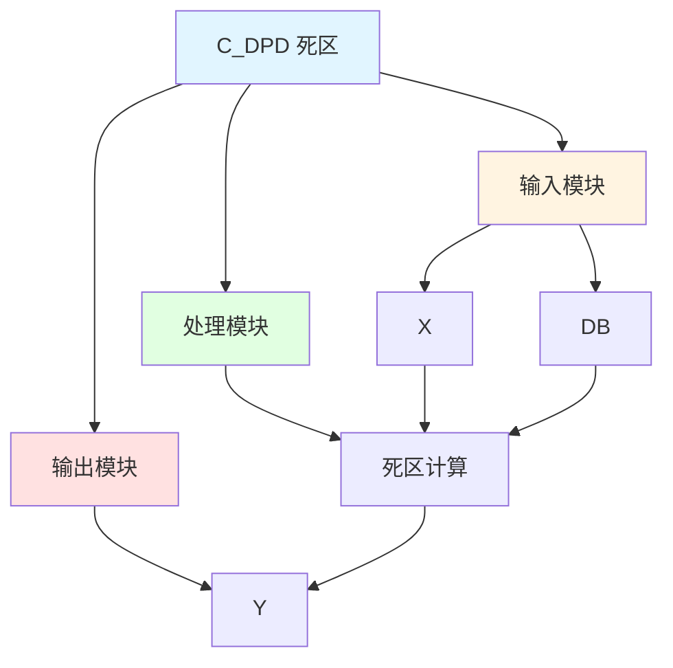

# C_DPD 功能块分析报告

## 基本信息

| 项目 | 内容 |
|------|------|
| 功能块名称 | C_DPD |
| 功能描述 | Dead Band（死区） |
| 最后修改 | 2015.11.20 |
| 作者 | Shi Chun Liang |
| 页数 | 1页 |

## 功能概述

C_DPD 是一个死区功能块，用于实现死区控制功能。

## 思维导图

## 流程路径描述

### 死区路径：
开始 → X → 死区计算 → 输出Y
**功能**: 实现死区控制

## 逐帧功能分析

### Rung 7: 死区计算

**功能描述**: 计算死区输出

**输入条件**:
| 信号名称 | 信号描述 | 信号类型 | 触发值 |
|----------|----------|----------|--------|
| X | 输入 | REAL | 数值 |
| DB | 死区值 | REAL | 设定值 |

**输出功能**:
| 信号名称 | 信号描述 | 信号类型 |
|----------|----------|----------|
| Y | 输出 | REAL |

**触发逻辑**:
- IF ABS(X) < DB THEN Y = 0.0
- ELSE Y = X

**功能实现**: 
使用CMP和MOVE功能块，实现死区控制功能。

## 触发条件总结

### 死区条件
- **死区内**: ABS(X) < DB
- **死区外**: ABS(X) >= DB

## 实现功能总结

### 主要功能
1. **死区控制**: 实现死区控制功能

## 关键信号说明

| 信号名称 | 信号描述 | 信号类型 | 用途 |
|----------|----------|----------|------|
| X | 输入 | REAL | 输入值 |
| DB | 死区值 | REAL | 死区设定值 |
| Y | 输出 | REAL | 死区输出值 |

## 调试技巧

### 调试步骤
1. 检查X值，确认输入正常
2. 检查DB值，确认死区设置
3. 监控Y值，观察死区输出

### 常见问题
1. **死区不工作**: 检查DB值设置
2. **输出不正确**: 检查X值和DB值

### 监控信号列表
- X（输入）
- DB（死区值）
- Y（输出）
