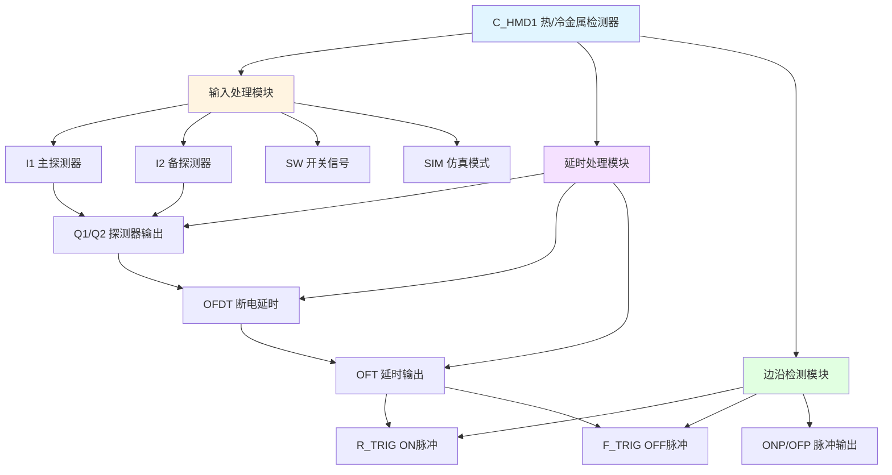

# C_HMD1 功能块分析报告

## 基本信息

| 项目 | 内容 |
|------|------|
| 功能块名称 | C_HMD1 |
| 功能描述 | Hot/Cold Metal Detector（热/冷金属检测器） |
| 最后修改 | 2015.12.25 |
| 作者 | ShiChunLiang |
| 页数 | 1页（5个程序段） |

## 功能概述

C_HMD1是一个热/冷金属检测器功能块，用于检测热金属或冷金属的存在。该功能块支持主备双探测器配置，并具有断电延时功能，用于消除检测信号的抖动。

### 应用场景
- **热金属检测**：检测高温金属的存在（HMD）
- **冷金属检测**：检测常温金属的存在（CMD）
- **材料跟踪**：跟踪材料在生产线的位置
- **自动化控制**：为自动化控制提供材料存在信号

### 功能特点
1. **双探测器配置**：支持主备两个探测器
2. **仿真模式**：支持仿真测试功能
3. **断电延时**：使用OFDT消除信号抖动
4. **边沿检测**：提供ON/OFF脉冲输出

## 思维导图



## 流程路径描述

### 探测器输出路径：
开始 → I1/I2输入 → SW开关检查 → Q1/Q2输出
**功能**: 根据探测器输入和开关状态输出检测结果

### 延时处理路径：
开始 → Q1/Q2信号 → OFDT断电延时 → OFT输出
**功能**: 对检测信号进行断电延时处理

### 边沿检测路径：
开始 → OFT信号 → R_TRIG/F_TRIG → ONP/OFP输出
**功能**: 检测信号的上升沿和下降沿

## 逐帧功能分析

### Rung 1: 主探测器处理

**功能描述**: 处理主探测器信号

**输入条件**:
| 信号名称 | 信号描述 | 信号类型 | 触发值 |
|----------|----------|----------|--------|
| I1 | 主探测器输入 | BOOL | TRUE |
| SW | 开关信号 | BOOL | FALSE |
| SIM | 仿真模式 | BOOL | TRUE |

**输出功能**:
| 信号名称 | 信号描述 | 信号类型 |
|----------|----------|----------|
| Q1 | 主探测器输出 | BOOL |

**触发逻辑**:
- IF I1 = TRUE AND SW = FALSE THEN Q1 = TRUE
- IF SIM = TRUE AND SW = TRUE THEN Q1 = TRUE（仿真模式）

**功能实现**: 
I1和SW串联，当I1为ON且SW为OFF时输出Q1。仿真模式下SW为ON时强制输出。

### Rung 2: 备探测器处理

**功能描述**: 处理备用探测器信号

**输入条件**:
| 信号名称 | 信号描述 | 信号类型 | 触发值 |
|----------|----------|----------|--------|
| I2 | 备探测器输入 | BOOL | TRUE |
| SW | 开关信号 | BOOL | FALSE |
| SIM | 仿真模式 | BOOL | TRUE |

**输出功能**:
| 信号名称 | 信号描述 | 信号类型 |
|----------|----------|----------|
| Q2 | 备探测器输出 | BOOL |

**触发逻辑**:
- IF I2 = TRUE AND SW = FALSE THEN Q2 = TRUE
- IF SIM = TRUE AND SW = TRUE THEN Q2 = TRUE（仿真模式）

### Rung 3: 断电延时处理

**功能描述**: 对探测器输出进行断电延时

**输入条件**:
| 信号名称 | 信号描述 | 信号类型 | 触发值 |
|----------|----------|----------|--------|
| Q1 | 主探测器输出 | BOOL | TRUE |
| Q2 | 备探测器输出 | BOOL | TRUE |
| SCN | 扫描次数 | INT | 数值 |

**输出功能**:
| 信号名称 | 信号描述 | 信号类型 |
|----------|----------|----------|
| OFT | 延时输出 | BOOL |

**触发逻辑**:
- 调用C_OFDT进行断电延时
- OFT = Q1 OR Q2（延时后）

**功能实现**: 
调用C_OFDT功能块，Q1或Q2任一为ON时OFT为ON，断开后延时一段时间才复位。

### Rung 4: ON脉冲检测

**功能描述**: 检测OFT信号的上升沿

**输入条件**:
| 信号名称 | 信号描述 | 信号类型 | 触发值 |
|----------|----------|----------|--------|
| OFT | 延时输出 | BOOL | 上升沿 |

**输出功能**:
| 信号名称 | 信号描述 | 信号类型 |
|----------|----------|----------|
| ONP | ON脉冲 | BOOL |

**触发逻辑**:
- 调用C_RTRIG检测OFT上升沿
- ONP = R_TRIG.Q

**功能实现**: 
调用C_RTRIG检测OFT从FALSE变为TRUE的时刻，输出一个扫描周期的脉冲。

### Rung 5: OFF脉冲检测

**功能描述**: 检测OFT信号的下降沿

**输入条件**:
| 信号名称 | 信号描述 | 信号类型 | 触发值 |
|----------|----------|----------|--------|
| OFT | 延时输出 | BOOL | 下降沿 |

**输出功能**:
| 信号名称 | 信号描述 | 信号类型 |
|----------|----------|----------|
| OFP | OFF脉冲 | BOOL |

**触发逻辑**:
- 调用C_FTRIG检测OFT下降沿
- OFP = F_TRIG.Q

**功能实现**: 
调用C_FTRIG检测OFT从TRUE变为FALSE的时刻，输出一个扫描周期的脉冲。

## 触发条件总结

### 探测器输出条件
- **主探测器**: I1=ON AND SW=OFF
- **备探测器**: I2=ON AND SW=OFF
- **仿真模式**: SIM=ON AND SW=ON

### 延时输出条件
- **OFT=ON**: Q1=ON OR Q2=ON
- **OFT=OFF**: Q1=OFF AND Q2=OFF（延时后）

### 脉冲输出条件
- **ONP**: OFT上升沿
- **OFP**: OFT下降沿

## 实现功能总结

### 主要功能
1. **双探测器检测**: 支持主备两个探测器
2. **仿真模式**: 支持仿真测试
3. **断电延时**: 消除信号抖动
4. **边沿检测**: 提供ON/OFF脉冲

### 信号流程
```
I1/I2 → Q1/Q2 → OFT → ONP/OFP
```

## 关键信号说明

| 信号名称 | 信号描述 | 信号类型 | 用途 |
|----------|----------|----------|------|
| I1 | 主探测器输入 | BOOL | 主探测器信号 |
| I2 | 备探测器输入 | BOOL | 备探测器信号 |
| SW | 开关信号 | BOOL | 探测器使能开关 |
| SIM | 仿真模式 | BOOL | 仿真测试模式 |
| Q1 | 主探测器输出 | BOOL | 主探测器结果 |
| Q2 | 备探测器输出 | BOOL | 备探测器结果 |
| OFT | 延时输出 | BOOL | 延时后的检测信号 |
| ONP | ON脉冲 | BOOL | 上升沿脉冲 |
| OFP | OFF脉冲 | BOOL | 下降沿脉冲 |

## 调试技巧

### 调试步骤
1. 检查I1/I2探测器输入信号
2. 验证SW开关信号状态
3. 监控Q1/Q2探测器输出
4. 测试OFDT延时功能
5. 验证ONP/OFP脉冲输出

### 常见问题
1. **探测器无输出**: 检查SW开关信号
2. **信号抖动**: 检查OFDT延时设置
3. **脉冲丢失**: 检查扫描周期
4. **仿真模式异常**: 检查SIM信号

### 监控信号列表
- I1/I2（探测器输入）
- Q1/Q2（探测器输出）
- OFT（延时输出）
- ONP/OFP（脉冲输出）
- SW/SIM（控制信号）
