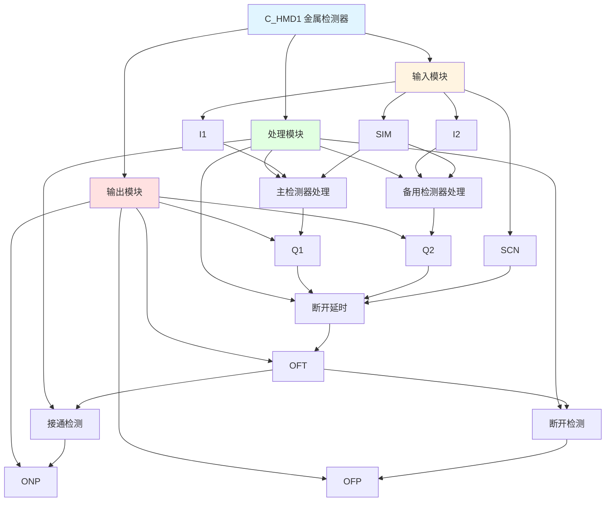

# C_HMD1 功能块分析报告

## 基本信息

| 项目 | 内容 |
|------|------|
| 功能块名称 | C_HMD1 |
| 功能描述 | Hot/Cold Metal Detector(HMD/CMD)（热/冷金属检测器） |
| 最后修改 | 2015.12.25 |
| 作者 | Shi Chun Liang |
| 页数 | 2页 |

## 功能概述

C_HMD1 是一个热/冷金属检测器功能块，用于检测金属的存在。该功能块支持双检测器（主检测器和备用检测器），包含模拟功能、断开延时、接通检测和断开检测等功能。

## 思维导图

## 流程路径描述

### 主检测器路径：
开始 → I1输入 → 模拟开关 → 检测金属 → 输出Q1 → 断开延时 → 接通检测 → 输出ONP
**功能**: 主检测器金属检测

### 备用检测器路径：
开始 → I2输入 → 模拟开关 → 检测金属 → 输出Q2 → 断开延时 → 断开检测 → 输出OFP
**功能**: 备用检测器金属检测

### 断开延时路径：
开始 → Q1或Q2 → 断开延时定时器 → 输出OFT
**功能**: 检测器断开延时

## 逐帧功能分析

### Rung 8: 主检测器处理

**功能描述**: 处理主检测器输入信号

**输入条件**:
| 信号名称 | 信号描述 | 信号类型 | 触发值 |
|----------|----------|----------|--------|
| I1 | 1# HMD/CMD输入开关 | BOOL | TRUE/FALSE |
| SIM | 模拟HMD/CMD输入开关 | BOOL | TRUE/FALSE |

**输出功能**:
| 信号名称 | 信号描述 | 信号类型 |
|----------|----------|----------|
| Q1 | 1# HMD/CMD检测（包含模拟） | BOOL |

**触发逻辑**:
- IF SIM = TRUE THEN Q1 = TRUE（模拟模式）
- IF SIM = FALSE THEN Q1 = I1（正常模式）

**功能实现**: 
主检测器输入I1和模拟开关SIM进行逻辑或操作，当SIM为TRUE时，输出Q1为TRUE（模拟模式），否则Q1等于I1（正常模式）。

### Rung 10: 备用检测器处理

**功能描述**: 处理备用检测器输入信号

**输入条件**:
| 信号名称 | 信号描述 | 信号类型 | 触发值 |
|----------|----------|----------|--------|
| I2 | 2# HMD/CMD输入开关 | BOOL | TRUE/FALSE |
| SIM | 模拟HMD/CMD输入开关 | BOOL | TRUE/FALSE |

**输出功能**:
| 信号名称 | 信号描述 | 信号类型 |
|----------|----------|----------|
| Q2 | 2# HMD/CMD检测（包含模拟） | BOOL |

**触发逻辑**:
- IF SIM = TRUE THEN Q2 = TRUE（模拟模式）
- IF SIM = FALSE THEN Q2 = I2（正常模式）

**功能实现**: 
备用检测器输入I2和模拟开关SIM进行逻辑或操作，当SIM为TRUE时，输出Q2为TRUE（模拟模式），否则Q2等于I2（正常模式）。

### Rung 12: 断开延时

**功能描述**: 检测器断开延时

**输入条件**:
| 信号名称 | 信号描述 | 信号类型 | 触发值 |
|----------|----------|----------|--------|
| Q1 | 1# HMD/CMD检测 | BOOL | TRUE/FALSE |
| Q2 | 2# HMD/CMD检测 | BOOL | TRUE/FALSE |
| SCN | 扫描定时器 | TIME | 设定值 |

**输出功能**:
| 信号名称 | 信号描述 | 信号类型 |
|----------|----------|----------|
| OFT | HMD/CMD检测+断开扩展定时器 | BOOL |
| ET | 脉冲扩展时间 | TIME |

**触发逻辑**:
- IF Q1 = TRUE OR Q2 = TRUE THEN OFT = TRUE
- IF Q1 = FALSE AND Q2 = FALSE THEN OFT延时后变为FALSE

**功能实现**: 
使用C_OFDT（断开延时定时器）功能块，当Q1或Q2为TRUE时，立即输出OFT为TRUE。当Q1和Q2都为FALSE时，延时后OFT变为FALSE。ET为脉冲扩展时间。

### Rung 14: 接通检测

**功能描述**: 检测HMD/CMD接通

**输入条件**:
| 信号名称 | 信号描述 | 信号类型 | 触发值 |
|----------|----------|----------|--------|
| OFT | HMD/CMD检测+断开扩展定时器 | BOOL | 上升沿 |

**输出功能**:
| 信号名称 | 信号描述 | 信号类型 |
|----------|----------|----------|
| ONP | HMD/CMD接通检测 | BOOL |

**触发逻辑**:
- IF OFT上升沿 THEN ONP = TRUE

**功能实现**: 
使用RTRIG（上升沿触发）功能块检测OFT信号的上升沿，当检测到上升沿时，产生ONP信号，表示HMD/CMD接通。

### Rung 16: 断开检测

**功能描述**: 检测HMD/CMD断开

**输入条件**:
| 信号名称 | 信号描述 | 信号类型 | 触发值 |
|----------|----------|----------|--------|
| OFT | HMD/CMD检测+断开扩展定时器 | BOOL | 下降沿 |

**输出功能**:
| 信号名称 | 信号描述 | 信号类型 |
|----------|----------|----------|
| OFP | HMD/CMD断开检测 | BOOL |

**触发逻辑**:
- IF OFT下降沿 THEN OFP = TRUE

**功能实现**: 
使用FTRIG（下降沿触发）功能块检测OFT信号的下降沿，当检测到下降沿时，产生OFP信号，表示HMD/CMD断开。

## 触发条件总结

### 检测条件
- **主检测器检测**: I1 = TRUE OR SIM = TRUE
- **备用检测器检测**: I2 = TRUE OR SIM = TRUE

### 延时条件
- **断开延时**: Q1 = FALSE AND Q2 = FALSE且持续设定时间

### 检测条件
- **接通检测**: OFT上升沿
- **断开检测**: OFT下降沿

## 实现功能总结

### 主要功能
1. **金属检测**: 检测热/冷金属的存在
2. **双检测器**: 支持主检测器和备用检测器
3. **模拟功能**: 支持模拟模式用于测试
4. **断开延时**: 提供断开延时功能
5. **接通检测**: 检测检测器接通
6. **断开检测**: 检测检测器断开

### 辅助功能
1. **脉冲扩展**: 提供脉冲扩展时间
2. **扫描定时**: 支持扫描定时器

## 关键信号说明

| 信号名称 | 信号描述 | 信号类型 | 用途 |
|----------|----------|----------|------|
| I1 | 1# HMD/CMD输入开关 | BOOL | 主检测器输入 |
| I2 | 2# HMD/CMD输入开关 | BOOL | 备用检测器输入 |
| SIM | 模拟HMD/CMD输入开关 | BOOL | 模拟开关 |
| Q1 | 1# HMD/CMD检测 | BOOL | 主检测器输出 |
| Q2 | 2# HMD/CMD检测 | BOOL | 备用检测器输出 |
| OFT | HMD/CMD检测+断开扩展定时器 | BOOL | 断开延时输出 |
| ONP | HMD/CMD接通检测 | BOOL | 接通检测输出 |
| OFP | HMD/CMD断开检测 | BOOL | 断开检测输出 |
| SCN | 扫描定时器 | TIME | 扫描时间 |
| ET | 脉冲扩展时间 | TIME | 脉冲扩展时间 |

## 调试技巧

### 调试步骤
1. 检查I1和I2信号，确认检测器输入正常
2. 测试SIM信号，验证模拟功能
3. 监控Q1和Q2信号，观察检测器输出
4. 监控OFT信号，观察断开延时过程
5. 检查ONP和OFP信号，确认接通和断开检测

### 常见问题
1. **检测器不工作**: 检查I1和I2信号是否正常
2. **模拟功能不工作**: 检查SIM信号
3. **断开延时不工作**: 检查SCN值设置
4. **接通/断开检测不工作**: 检查OFT信号

### 调试工具
1. 在线监控I1、I2、Q1、Q2信号，观察检测器状态
2. 监控OFT信号，观察断开延时过程
3. 监控ONP和OFP信号，确认接通和断开检测
4. 使用断点调试，检查各个Rung的执行情况

### 监控信号列表
- I1（主检测器输入）
- I2（备用检测器输入）
- SIM（模拟开关）
- Q1（主检测器输出）
- Q2（备用检测器输出）
- OFT（断开延时输出）
- ONP（接通检测）
- OFP（断开检测）
- SCN（扫描定时器）
- ET（脉冲扩展时间）
