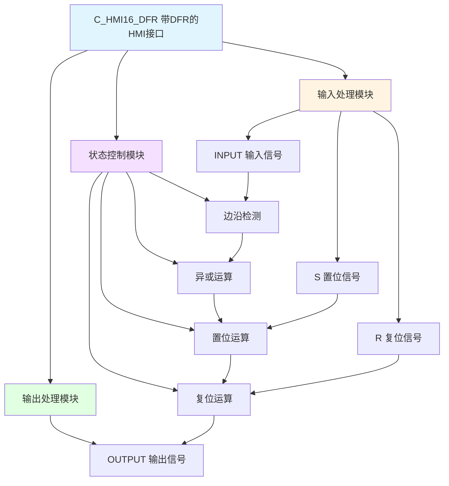

# C_HMI16_DFR 功能块分析报告

## 基本信息

| 项目 | 内容 |
|------|------|
| 功能块名称 | C_HMI16_DFR |
| 功能描述 | HMI Interface with DFR（带边沿检测复位的16位HMI接口） |
| 最后修改 | 2018.03.23 |
| 作者 | HuJingQi |
| 页数 | 1页（4个程序段） |

## 功能概述

C_HMI16_DFR是一个带边沿检测复位功能的16位HMI接口功能块。与C_HMI16不同，该功能块增加了置位(S)和复位(R)控制信号，支持更灵活的命令控制方式。

### 应用场景
- **保持型按钮控制**：需要保持状态的按钮操作
- **置位/复位控制**：通过S/R信号控制输出状态
- **状态锁存**：锁存HMI操作状态

### 功能特点
1. **边沿检测**：检测输入信号的变化
2. **置位控制**：通过S信号置位输出
3. **复位控制**：通过R信号复位输出
4. **状态保持**：输出状态可保持

## 思维导图

## 流程路径描述

### 边沿检测路径：
开始 → 读取INPUT → 检测变化 → 生成INPUT_P → 异或运算
**功能**: 检测输入信号的变化

### 状态控制路径：
开始 → 异或结果 → 置位运算 → 复位运算 → 输出
**功能**: 通过S/R信号控制输出状态

## 逐帧功能分析

### Rung 1: 边沿检测

**功能描述**: 检测INPUT信号的变化并生成脉冲

**输入条件**:
| 信号名称 | 信号描述 | 信号类型 | 触发值 |
|----------|----------|----------|--------|
| INPUT | 输入信号（16位） | WORD | 变化 |

**输出功能**:
| 信号名称 | 信号描述 | 信号类型 |
|----------|----------|----------|
| INPUT_P | 输入脉冲 | WORD |

**触发逻辑**:
- INPUT_P = (INPUT XOR INPUTOLD) AND INPUT
- INPUTOLD = INPUT（保存当前状态）

**功能实现**: 
1. 使用XOR_WORD计算INPUT与INPUTOLD的异或值
2. 使用AND_WORD与INPUT进行与运算
3. 使用MOVE_WORD保存当前INPUT状态

### Rung 2: 异或运算

**功能描述**: 将输入脉冲与输出异或

**输入条件**:
| 信号名称 | 信号描述 | 信号类型 | 触发值 |
|----------|----------|----------|--------|
| INPUT_P | 输入脉冲 | WORD | 非零 |
| OUTPUT | 当前输出 | WORD | 数值 |

**输出功能**:
| 信号名称 | 信号描述 | 信号类型 |
|----------|----------|----------|
| OUTPUT | 输出信号 | WORD |

**触发逻辑**:
- OUTPUT = OUTPUT XOR INPUT_P

**功能实现**: 
使用XOR_WORD将INPUT_P与OUTPUT异或。

### Rung 3: 置位运算

**功能描述**: 通过S信号置位输出

**输入条件**:
| 信号名称 | 信号描述 | 信号类型 | 触发值 |
|----------|----------|----------|--------|
| S | 置位信号 | WORD | 位模式 |
| OUTPUT | 当前输出 | WORD | 数值 |

**输出功能**:
| 信号名称 | 信号描述 | 信号类型 |
|----------|----------|----------|
| OUTPUT | 输出信号 | WORD |

**触发逻辑**:
- OUTPUT = OUTPUT OR S

**功能实现**: 
使用OR_WORD将S与OUTPUT进行或运算，实现置位功能。

### Rung 4: 复位运算

**功能描述**: 通过R信号复位输出

**输入条件**:
| 信号名称 | 信号描述 | 信号类型 | 触发值 |
|----------|----------|----------|--------|
| R | 复位信号 | WORD | 位模式 |
| OUTPUT | 当前输出 | WORD | 数值 |

**输出功能**:
| 信号名称 | 信号描述 | 信号类型 |
|----------|----------|----------|
| OUTPUT | 输出信号 | WORD |

**触发逻辑**:
- OUTPUT = OUTPUT AND (NOT R)

**功能实现**: 
1. 使用NOT_WORD对R取反
2. 使用AND_WORD与OUTPUT进行与运算，实现复位功能

## 触发条件总结

### 边沿检测条件
- **输入变化**: INPUT状态变化产生INPUT_P脉冲

### 置位条件
- **S信号有效**: S对应位为1时置位OUTPUT对应位

### 复位条件
- **R信号有效**: R对应位为1时复位OUTPUT对应位

## 实现功能总结

### 主要功能
1. **边沿检测**: 检测输入信号变化
2. **异或翻转**: 输入脉冲翻转输出状态
3. **置位控制**: 通过S信号置位输出
4. **复位控制**: 通过R信号复位输出

### 与C_HMI16对比
| 功能块 | 置位控制 | 复位控制 | 状态保持 |
|--------|----------|----------|----------|
| C_HMI16 | 无 | CLR清零 | 无 |
| **C_HMI16_DFR** | **有(S)** | **有(R)** | **有** |

### 运算优先级
1. 先执行异或运算（输入脉冲）
2. 再执行置位运算（S信号）
3. 最后执行复位运算（R信号）

## 关键信号说明

| 信号名称 | 信号描述 | 信号类型 | 用途 |
|----------|----------|----------|------|
| INPUT | 输入信号 | WORD | HMI输入（16位） |
| INPUTOLD | 输入旧值 | WORD | 用于边沿检测 |
| INPUT_P | 输入脉冲 | WORD | 变化脉冲 |
| S | 置位信号 | WORD | 置位控制 |
| R | 复位信号 | WORD | 复位控制 |
| OUTPUT | 输出信号 | WORD | 状态输出（16位） |

## 调试技巧

### 调试步骤
1. 检查INPUT输入信号变化
2. 监控INPUT_P脉冲生成
3. 检查S和R信号状态
4. 验证OUTPUT输出正确

### 常见问题
1. **输出不变化**: 检查INPUT是否变化
2. **置位不生效**: 检查S信号
3. **复位不生效**: 检查R信号
4. **状态冲突**: 检查S和R是否同时有效

### 监控信号列表
- INPUT（输入信号）
- INPUT_P（输入脉冲）
- S（置位信号）
- R（复位信号）
- OUTPUT（输出信号）
