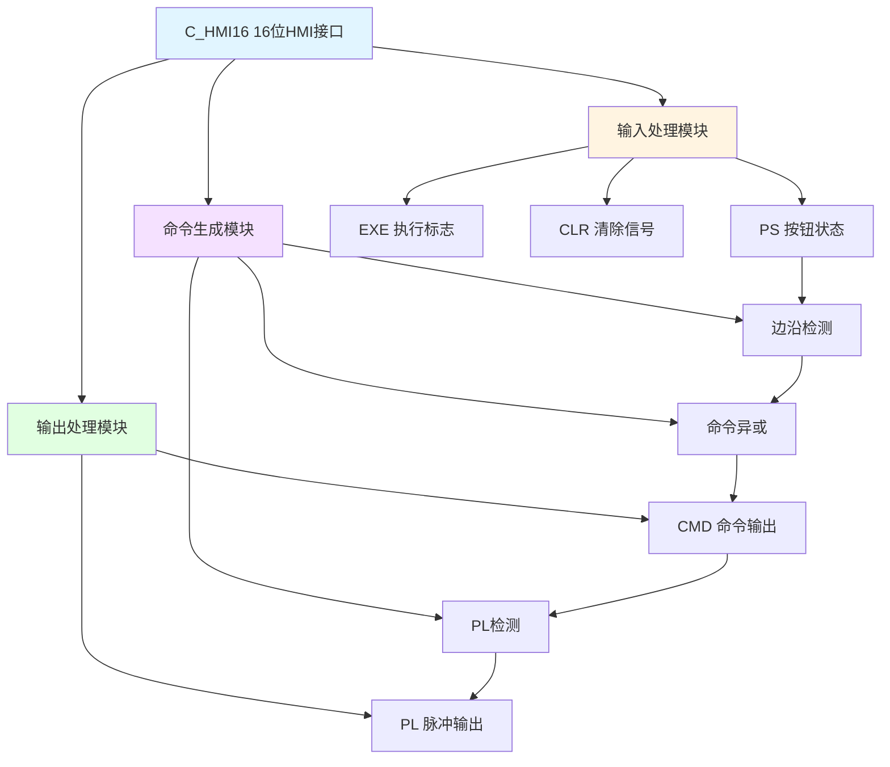

# C_HMI16 功能块分析报告

## 基本信息

| 项目 | 内容 |
|------|------|
| 功能块名称 | C_HMI16 |
| 功能描述 | HMI Interface16（16位HMI接口） |
| 最后修改 | 2018.03.23 |
| 作者 | HuJingQi |
| 页数 | 1页（4个程序段） |

## 功能概述

C_HMI16是一个16位HMI（人机界面）接口功能块，用于处理HMI与PLC之间的命令交互。该功能块通过检测按钮状态的变化来生成命令信号，并支持命令清除功能。

### 应用场景
- **按钮命令处理**：处理HMI上的按钮操作
- **多命令管理**：管理最多16个独立的命令信号
- **命令脉冲生成**：将HMI按钮状态转换为脉冲命令

### 功能特点
1. **边沿检测**：检测按钮状态的上升沿
2. **命令生成**：根据按钮变化生成命令信号
3. **命令清除**：支持命令清除功能
4. **执行标志**：提供命令执行状态反馈

## 思维导图

## 流程路径描述

### 命令生成路径：
开始 → 读取PS状态 → 检测边沿 → 生成PS_P脉冲 → 异或生成CMD → 输出命令
**功能**: 将按钮状态变化转换为命令信号

### PL检测路径：
开始 → 检测CMD非零 → 输出PL脉冲 → 命令清除
**功能**: 检测命令并生成脉冲输出

## 逐帧功能分析

### Rung 1: 边沿检测

**功能描述**: 检测PS按钮状态的变化并生成脉冲

**输入条件**:
| 信号名称 | 信号描述 | 信号类型 | 触发值 |
|----------|----------|----------|--------|
| PS | 按钮状态（16位） | WORD | 变化 |

**输出功能**:
| 信号名称 | 信号描述 | 信号类型 |
|----------|----------|----------|
| PS_P | 按钮脉冲 | WORD |

**触发逻辑**:
- PS_P = (PS XOR PS_OLD) AND PS
- PS_OLD = PS（保存当前状态）

**功能实现**: 
1. 使用XOR_WORD计算PS与PS_OLD的异或值
2. 使用AND_WORD与PS进行与运算，得到上升沿脉冲
3. 使用MOVE_WORD保存当前PS状态到PS_OLD

### Rung 2: 命令生成

**功能描述**: 根据脉冲生成命令信号

**输入条件**:
| 信号名称 | 信号描述 | 信号类型 | 触发值 |
|----------|----------|----------|--------|
| PS_P | 按钮脉冲 | WORD | 非零 |
| CMD | 当前命令 | WORD | 数值 |

**输出功能**:
| 信号名称 | 信号描述 | 信号类型 |
|----------|----------|----------|
| CMD | 命令输出 | WORD |

**触发逻辑**:
- CMD = CMD XOR PS_P

**功能实现**: 
使用XOR_WORD将PS_P与CMD异或，实现命令的翻转。当按钮按下时，对应位翻转。

### Rung 3: PL检测

**功能描述**: 检测命令中非零位并输出PL

**输入条件**:
| 信号名称 | 信号描述 | 信号类型 | 触发值 |
|----------|----------|----------|--------|
| CMD | 命令输出 | WORD | 非零 |
| EXE | 执行标志 | BOOL | TRUE |

**输出功能**:
| 信号名称 | 信号描述 | 信号类型 |
|----------|----------|----------|
| PL | 脉冲输出 | WORD |

**触发逻辑**:
- 调用C_NSWI选择CMD或0
- 当EXE=TRUE时，PL = CMD AND CMD

**功能实现**: 
1. 调用C_NSWI功能块，当CMD非零时选择CMD
2. 使用AND_WORD将CMD与自身相与
3. 当EXE为TRUE时输出PL

### Rung 4: 命令清除

**功能描述**: 清除已处理的命令

**输入条件**:
| 信号名称 | 信号描述 | 信号类型 | 触发值 |
|----------|----------|----------|--------|
| PL | 脉冲输出 | WORD | 非零 |
| CLR | 清除信号 | BOOL | TRUE |

**输出功能**:
| 信号名称 | 信号描述 | 信号类型 |
|----------|----------|----------|
| CMD | 命令输出 | WORD |

**触发逻辑**:
- IF PL ≠ 0 OR CLR = TRUE THEN CMD = 0

**功能实现**: 
当PL非零或CLR为TRUE时，使用MOVE_WORD将CMD清零。

## 触发条件总结

### 命令生成条件
- **按钮按下**: PS状态变化产生PS_P脉冲
- **命令翻转**: CMD对应位翻转

### 命令清除条件
- **命令执行**: PL非零表示命令已执行
- **手动清除**: CLR信号触发清除

## 实现功能总结

### 主要功能
1. **边沿检测**: 检测HMI按钮状态变化
2. **命令生成**: 将按钮状态转换为命令信号
3. **脉冲输出**: 提供命令执行脉冲
4. **命令清除**: 支持自动和手动清除

### HMI系列对比
| 功能块 | 数据类型 | 位数 | 用途 |
|--------|----------|------|------|
| **C_HMI16** | **WORD** | **16位** | **16按钮命令处理** |
| C_HMI32 | DWORD | 32位 | 32按钮命令处理 |
| C_HMI16_DFR | WORD | 16位 | 带边沿检测的16位接口 |
| C_HMI32_DFR | DWORD | 32位 | 带边沿检测的32位接口 |

## 关键信号说明

| 信号名称 | 信号描述 | 信号类型 | 用途 |
|----------|----------|----------|------|
| PS | 按钮状态 | WORD | HMI按钮输入（16位） |
| PS_OLD | 按钮状态旧值 | WORD | 用于边沿检测 |
| PS_P | 按钮脉冲 | WORD | 上升沿脉冲 |
| CMD | 命令输出 | WORD | 命令信号（16位） |
| PL | 脉冲输出 | WORD | 命令执行脉冲 |
| EXE | 执行标志 | BOOL | 命令执行使能 |
| CLR | 清除信号 | BOOL | 命令清除控制 |

## 调试技巧

### 调试步骤
1. 检查PS输入信号是否正常变化
2. 监控PS_P脉冲是否正确生成
3. 检查CMD命令输出是否正确
4. 验证PL脉冲输出
5. 测试CLR清除功能

### 常见问题
1. **命令不生成**: 检查PS信号是否变化
2. **命令不清除**: 检查PL和CLR信号
3. **脉冲丢失**: 检查扫描周期是否过长

### 监控信号列表
- PS（按钮状态）
- PS_P（按钮脉冲）
- CMD（命令输出）
- PL（脉冲输出）
- EXE（执行标志）
- CLR（清除信号）
