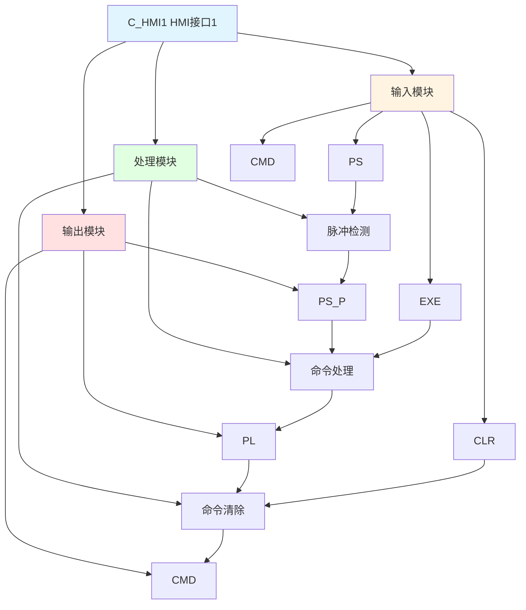

# C_HMI1 功能块分析报告

## 基本信息

| 项目 | 内容 |
|------|------|
| 功能块名称 | C_HMI1 |
| 功能描述 | HMI Interface 1（人机界面接口1） |
| 最后修改 | 2018.03.23 |
| 作者 | Hu Jing Qi |
| 页数 | 2页 |

## 功能概述

C_HMI1 是一个人机界面接口功能块，用于处理HMI命令。该功能块接收HMI的PS（脉冲选择）命令，产生脉冲信号，执行命令，并在命令完成后清除命令。

## 思维导图

## 流程路径描述

### 命令脉冲路径：
开始 → PS命令 → 上升沿检测 → 输出PS_P → 命令处理 → 输出PL → 命令清除
**功能**: 处理HMI命令脉冲

### 命令清除路径：
开始 → PL检测 → CLR命令 → 清除CMD
**功能**: 清除命令

## 逐帧功能分析

### Rung 8: 脉冲检测

**功能描述**: 检测PS命令的上升沿，产生脉冲信号

**输入条件**:
| 信号名称 | 信号描述 | 信号类型 | 触发值 |
|----------|----------|----------|--------|
| PS | PS命令 | BOOL | 上升沿 |

**输出功能**:
| 信号名称 | 信号描述 | 信号类型 |
|----------|----------|----------|
| PS_P | PS脉冲 | BOOL |

**触发逻辑**:
- IF PS上升沿 THEN PS_P = TRUE

**功能实现**: 
使用RTRIG（上升沿触发）功能块检测PS信号的上升沿，当检测到上升沿时，产生PS_P脉冲信号。

### Rung 9: 命令处理

**功能描述**: 处理命令，产生PL检测信号

**输入条件**:
| 信号名称 | 信号描述 | 信号类型 | 触发值 |
|----------|----------|----------|--------|
| PS_P | PS脉冲 | BOOL | TRUE |
| CMD | 命令 | BOOL | TRUE |
| EXE | 执行命令 | BOOL | TRUE |

**输出功能**:
| 信号名称 | 信号描述 | 信号类型 |
|----------|----------|----------|
| PL | PL检测 | BOOL |

**触发逻辑**:
- IF PS_P = TRUE AND CMD = TRUE AND EXE = TRUE THEN PL = TRUE

**功能实现**: 
当PS_P脉冲、CMD命令和EXE执行命令都为TRUE时，产生PL检测信号。

### Rung 11: 命令清除

**功能描述**: 清除命令

**输入条件**:
| 信号名称 | 信号描述 | 信号类型 | 触发值 |
|----------|----------|----------|--------|
| PL | PL检测 | BOOL | TRUE |
| CLR | 清除命令 | BOOL | TRUE |

**输出功能**:
| 信号名称 | 信号描述 | 信号类型 |
|----------|----------|----------|
| CMD | 命令 | BOOL |

**触发逻辑**:
- IF PL = TRUE AND CLR = TRUE THEN CMD = FALSE

**功能实现**: 
当PL检测和CLR清除命令都为TRUE时，清除CMD命令。

### Rung 13: PL检测

**功能描述**: 检测PL信号的上升沿

**输入条件**:
| 信号名称 | 信号描述 | 信号类型 | 触发值 |
|----------|----------|----------|--------|
| PL | PL检测 | BOOL | 上升沿 |

**输出功能**:
| 信号名称 | 信号描述 | 信号类型 |
|----------|----------|----------|
| CMD | 命令 | BOOL |

**触发逻辑**:
- IF PL上升沿 THEN CMD = FALSE

**功能实现**: 
使用RTRIG功能块检测PL信号的上升沿，当检测到上升沿时，清除CMD命令。

## 触发条件总结

### 脉冲条件
- **脉冲触发**: PS上升沿

### 命令条件
- **命令处理**: PS_P = TRUE AND CMD = TRUE AND EXE = TRUE
- **命令清除**: PL = TRUE AND CLR = TRUE

### 检测条件
- **PL检测**: PL上升沿

## 实现功能总结

### 主要功能
1. **脉冲检测**: 检测HMI命令的脉冲
2. **命令处理**: 处理HMI命令
3. **命令清除**: 清除已执行的命令

### 辅助功能
1. **命令执行**: 支持命令执行
2. **命令检测**: 检测命令状态

## 关键信号说明

| 信号名称 | 信号描述 | 信号类型 | 用途 |
|----------|----------|----------|------|
| PS | PS命令 | BOOL | HMI脉冲选择命令 |
| PS_P | PS脉冲 | BOOL | PS脉冲信号 |
| CMD | 命令 | BOOL | 命令信号 |
| CLR | 清除命令 | BOOL | 清除命令信号 |
| EXE | 执行命令 | BOOL | 执行命令信号 |
| PL | PL检测 | BOOL | PL检测信号 |

## 调试技巧

### 调试步骤
1. 检查PS信号，确认HMI命令输入
2. 监控PS_P信号，观察脉冲检测
3. 检查CMD信号，确认命令状态
4. 监控PL信号，观察命令处理
5. 检查CLR信号，确认命令清除

### 常见问题
1. **脉冲不工作**: 检查PS信号是否产生上升沿
2. **命令不处理**: 检查PS_P、CMD、EXE信号
3. **命令不清除**: 检查PL和CLR信号

### 调试工具
1. 在线监控PS、PS_P、CMD、PL信号
2. 使用断点调试，检查各个Rung的执行情况

### 监控信号列表
- PS（PS命令）
- PS_P（PS脉冲）
- CMD（命令）
- CLR（清除命令）
- EXE（执行命令）
- PL（PL检测）
