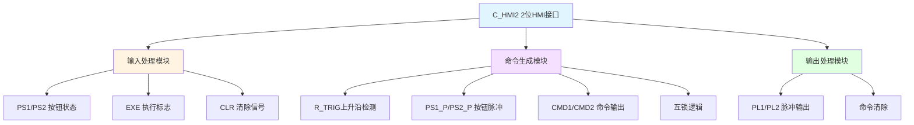

# C_HMI2 功能块分析报告

## 基本信息

| 项目 | 内容 |
|------|------|
| 功能块名称 | C_HMI2 |
| 功能描述 | HMI Interface2（2位HMI接口） |
| 最后修改 | 2018.03.23 |
| 作者 | HuJingQi |
| 页数 | 1页（6个程序段） |

## 功能概述

C_HMI2是一个2位HMI（人机界面）接口功能块，用于处理两个独立的HMI按钮命令。该功能块通过检测按钮状态的上升沿来生成命令信号，并支持命令自动清除功能。两个命令之间具有互锁功能，防止同时有效。

### 应用场景
- **双按钮命令处理**：处理HMI上的两个按钮操作
- **A/B选择控制**：用于A/B两种选择控制
- **正反转控制**：用于正转/反转选择控制

### 功能特点
1. **上升沿检测**：使用R_TRIG检测按钮上升沿
2. **命令生成**：根据按钮脉冲生成命令信号
3. **互锁保护**：两个命令之间具有互锁功能
4. **自动清除**：命令执行后自动清除

## 思维导图

## 流程路径描述

### 命令1生成路径：
开始 → PS1按钮 → R_TRIG检测上升沿 → 生成PS1_P脉冲 → 互锁检查 → CMD1命令翻转
**功能**: 将按钮1状态变化转换为命令信号

### 命令2生成路径：
开始 → PS2按钮 → R_TRIG检测上升沿 → 生成PS2_P脉冲 → 互锁检查 → CMD2命令翻转
**功能**: 将按钮2状态变化转换为命令信号

### PL检测路径：
开始 → EXE标志 → CMD命令 → 输出PL脉冲
**功能**: 检测命令执行状态

### 命令清除路径：
开始 → PL脉冲 → R_TRIG检测 → 清除CMD
**功能**: 命令执行后自动清除

## 逐帧功能分析

### Rung 1: 按钮1脉冲检测

**功能描述**: 检测PS1按钮状态的上升沿

**输入条件**:
| 信号名称 | 信号描述 | 信号类型 | 触发值 |
|----------|----------|----------|--------|
| PS1 | 按钮1状态 | BOOL | 上升沿 |

**输出功能**:
| 信号名称 | 信号描述 | 信号类型 |
|----------|----------|----------|
| PS1_P | 按钮1脉冲 | BOOL |

**触发逻辑**:
- 调用C_RTRIG检测PS1上升沿
- PS1_P = R_TRIG.Q

**功能实现**: 
调用C_RTRIG功能块，当PS1从FALSE变为TRUE时，输出一个扫描周期的脉冲PS1_P。

### Rung 2: 命令1生成

**功能描述**: 根据按钮1脉冲生成命令信号

**输入条件**:
| 信号名称 | 信号描述 | 信号类型 | 触发值 |
|----------|----------|----------|--------|
| PS1_P | 按钮1脉冲 | BOOL | TRUE |
| CMD1 | 当前命令1 | BOOL | TRUE/FALSE |
| CMD2 | 命令2状态 | BOOL | FALSE（互锁） |
| CLR | 清除信号 | BOOL | FALSE |

**输出功能**:
| 信号名称 | 信号描述 | 信号类型 |
|----------|----------|----------|
| CMD1 | 命令输出1 | BOOL |

**触发逻辑**:
- IF PS1_P = TRUE AND CMD2 = FALSE AND CLR = FALSE THEN CMD1翻转

**功能实现**: 
使用RS触发器逻辑，PS1_P脉冲使CMD1翻转，CMD2作为互锁条件，CLR信号可强制复位CMD1。

### Rung 3: 按钮2脉冲检测

**功能描述**: 检测PS2按钮状态的上升沿

**输入条件**:
| 信号名称 | 信号描述 | 信号类型 | 触发值 |
|----------|----------|----------|--------|
| PS2 | 按钮2状态 | BOOL | 上升沿 |

**输出功能**:
| 信号名称 | 信号描述 | 信号类型 |
|----------|----------|----------|
| PS2_P | 按钮2脉冲 | BOOL |

**触发逻辑**:
- 调用C_RTRIG检测PS2上升沿
- PS2_P = R_TRIG.Q

**功能实现**: 
调用C_RTRIG功能块，当PS2从FALSE变为TRUE时，输出一个扫描周期的脉冲PS2_P。

### Rung 4: 命令2生成

**功能描述**: 根据按钮2脉冲生成命令信号

**输入条件**:
| 信号名称 | 信号描述 | 信号类型 | 触发值 |
|----------|----------|----------|--------|
| PS2_P | 按钮2脉冲 | BOOL | TRUE |
| CMD2 | 当前命令2 | BOOL | TRUE/FALSE |
| CMD1 | 命令1状态 | BOOL | FALSE（互锁） |
| CLR | 清除信号 | BOOL | FALSE |

**输出功能**:
| 信号名称 | 信号描述 | 信号类型 |
|----------|----------|----------|
| CMD2 | 命令输出2 | BOOL |

**触发逻辑**:
- IF PS2_P = TRUE AND CMD1 = FALSE AND CLR = FALSE THEN CMD2翻转

**功能实现**: 
使用RS触发器逻辑，PS2_P脉冲使CMD2翻转，CMD1作为互锁条件，CLR信号可强制复位CMD2。

### Rung 5: PL检测

**功能描述**: 检测两个命令的执行状态

**输入条件**:
| 信号名称 | 信号描述 | 信号类型 | 触发值 |
|----------|----------|----------|--------|
| EXE | 执行标志 | BOOL | TRUE |
| CMD1/CMD2 | 命令输出 | BOOL | TRUE |

**输出功能**:
| 信号名称 | 信号描述 | 信号类型 |
|----------|----------|----------|
| PL1 | 脉冲输出1 | BOOL |
| PL2 | 脉冲输出2 | BOOL |

**触发逻辑**:
- PL1 = EXE AND CMD1
- PL2 = EXE AND CMD2

**功能实现**: 
当EXE和CMD同时为TRUE时，输出PL脉冲。

### Rung 6: 命令清除

**功能描述**: 命令执行后自动清除

**输入条件**:
| 信号名称 | 信号描述 | 信号类型 | 触发值 |
|----------|----------|----------|--------|
| PL1/PL2 | 脉冲输出 | BOOL | 上升沿 |

**输出功能**:
| 信号名称 | 信号描述 | 信号类型 |
|----------|----------|----------|
| CMD1/CMD2 | 命令输出 | BOOL |

**触发逻辑**:
- 调用C_RTRIG检测PL上升沿
- IF R_TRIG.Q = TRUE THEN CMD = FALSE

**功能实现**: 
调用C_RTRIG检测PL上升沿，使用MOVE_BOOL将CMD清零。

## 触发条件总结

### 命令生成条件
- **命令1**: PS1上升沿 AND CMD2=FALSE AND CLR=FALSE
- **命令2**: PS2上升沿 AND CMD1=FALSE AND CLR=FALSE

### PL输出条件
- **EXE = TRUE**: 执行标志有效
- **CMD = TRUE**: 命令有效

### 命令清除条件
- **PL上升沿**: 命令执行完成

## 实现功能总结

### 主要功能
1. **按钮脉冲检测**: 检测HMI按钮上升沿
2. **命令翻转**: 按钮按下时命令状态翻转
3. **互锁保护**: 防止两个命令同时有效
4. **PL输出**: 命令执行脉冲输出
5. **自动清除**: 命令执行后自动清除

### HMI系列对比
| 功能块 | 命令数 | 数据类型 | 特点 |
|--------|--------|----------|------|
| C_HMI1 | 1 | BOOL | 单按钮控制 |
| **C_HMI2** | **2** | **BOOL** | **双按钮互锁控制** |
| C_HMI3 | 3 | BOOL | 三按钮控制 |
| C_HMI4 | 4 | BOOL | 四按钮控制 |
| C_HMI16 | 16 | WORD | 16位批量处理 |

## 关键信号说明

| 信号名称 | 信号描述 | 信号类型 | 用途 |
|----------|----------|----------|------|
| PS1/PS2 | 按钮1/2状态 | BOOL | HMI按钮输入 |
| PS1_P/PS2_P | 按钮1/2脉冲 | BOOL | 上升沿脉冲 |
| CMD1/CMD2 | 命令输出1/2 | BOOL | 命令信号 |
| PL1/PL2 | 脉冲输出1/2 | BOOL | 命令执行脉冲 |
| EXE | 执行标志 | BOOL | 命令执行使能 |
| CLR | 清除信号 | BOOL | 命令清除控制 |

## 调试技巧

### 调试步骤
1. 检查PS1/PS2输入信号是否正常变化
2. 监控PS1_P/PS2_P脉冲是否正确生成
3. 检查CMD1/CMD2命令输出是否正确翻转
4. 验证互锁功能是否正常
5. 验证PL脉冲输出
6. 测试CLR清除功能

### 常见问题
1. **命令不生成**: 检查PS信号是否变化
2. **命令不清除**: 检查PL和CLR信号
3. **互锁失效**: 检查CMD1/CMD2互锁触点
4. **两个命令同时有效**: 检查互锁逻辑

### 监控信号列表
- PS1/PS2（按钮状态）
- PS1_P/PS2_P（按钮脉冲）
- CMD1/CMD2（命令输出）
- PL1/PL2（脉冲输出）
- EXE（执行标志）
- CLR（清除信号）
