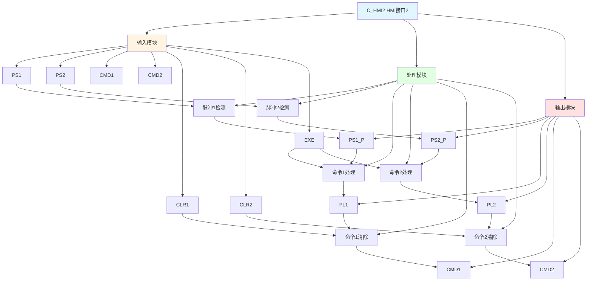

# C_HMI2 功能块分析报告

## 基本信息

| 项目 | 内容 |
|------|------|
| 功能块名称 | C_HMI2 |
| 功能描述 | HMI Interface 2（人机界面接口2） |
| 最后修改 | 2018.03.23 |
| 作者 | Hu Jing Qi |
| 页数 | 2页 |

## 功能概述

C_HMI2 是一个人机界面接口功能块，用于处理两个HMI命令。该功能块接收HMI的PS1和PS2命令，产生脉冲信号，执行命令，并在命令完成后清除命令。

## 思维导图

## 流程路径描述

### 命令1脉冲路径：
开始 → PS1命令 → 上升沿检测 → 输出PS1_P → 命令1处理 → 输出PL1 → 命令1清除
**功能**: 处理HMI命令1脉冲

### 命令2脉冲路径：
开始 → PS2命令 → 上升沿检测 → 输出PS2_P → 命令2处理 → 输出PL2 → 命令2清除
**功能**: 处理HMI命令2脉冲

## 逐帧功能分析

### Rung 8: 脉冲1检测

**功能描述**: 检测PS1命令的上升沿，产生脉冲信号

**输入条件**:
| 信号名称 | 信号描述 | 信号类型 | 触发值 |
|----------|----------|----------|--------|
| PS1 | PS1命令 | BOOL | 上升沿 |

**输出功能**:
| 信号名称 | 信号描述 | 信号类型 |
|----------|----------|----------|
| PS1_P | PS1脉冲 | BOOL |

**触发逻辑**:
- IF PS1上升沿 THEN PS1_P = TRUE

**功能实现**: 
使用RTRIG（上升沿触发）功能块检测PS1信号的上升沿，当检测到上升沿时，产生PS1_P脉冲信号。

### Rung 9: 命令1处理

**功能描述**: 处理命令1，产生PL1检测信号

**输入条件**:
| 信号名称 | 信号描述 | 信号类型 | 触发值 |
|----------|----------|----------|--------|
| PS1_P | PS1脉冲 | BOOL | TRUE |
| CMD1 | 命令1 | BOOL | TRUE |
| EXE | 执行命令 | BOOL | TRUE |

**输出功能**:
| 信号名称 | 信号描述 | 信号类型 |
|----------|----------|----------|
| PL1 | PL1检测 | BOOL |

**触发逻辑**:
- IF PS1_P = TRUE AND CMD1 = TRUE AND EXE = TRUE THEN PL1 = TRUE

**功能实现**: 
当PS1_P脉冲、CMD1命令和EXE执行命令都为TRUE时，产生PL1检测信号。

### Rung 11: 脉冲2检测

**功能描述**: 检测PS2命令的上升沿，产生脉冲信号

**输入条件**:
| 信号名称 | 信号描述 | 信号类型 | 触发值 |
|----------|----------|----------|--------|
| PS2 | PS2命令 | BOOL | 上升沿 |

**输出功能**:
| 信号名称 | 信号描述 | 信号类型 |
|----------|----------|----------|
| PS2_P | PS2脉冲 | BOOL |

**触发逻辑**:
- IF PS2上升沿 THEN PS2_P = TRUE

**功能实现**: 
使用RTRIG（上升沿触发）功能块检测PS2信号的上升沿，当检测到上升沿时，产生PS2_P脉冲信号。

### Rung 12: 命令2处理

**功能描述**: 处理命令2，产生PL2检测信号

**输入条件**:
| 信号名称 | 信号描述 | 信号类型 | 触发值 |
|----------|----------|----------|--------|
| PS2_P | PS2脉冲 | BOOL | TRUE |
| CMD2 | 命令2 | BOOL | TRUE |
| EXE | 执行命令 | BOOL | TRUE |

**输出功能**:
| 信号名称 | 信号描述 | 信号类型 |
|----------|----------|----------|
| PL2 | PL2检测 | BOOL |

**触发逻辑**:
- IF PS2_P = TRUE AND CMD2 = TRUE AND EXE = TRUE THEN PL2 = TRUE

**功能实现**: 
当PS2_P脉冲、CMD2命令和EXE执行命令都为TRUE时，产生PL2检测信号。

### Rung 15: 命令1清除

**功能描述**: 清除命令1

**输入条件**:
| 信号名称 | 信号描述 | 信号类型 | 触发值 |
|----------|----------|----------|--------|
| PL1 | PL1检测 | BOOL | TRUE |
| CLR1 | 清除命令1 | BOOL | TRUE |

**输出功能**:
| 信号名称 | 信号描述 | 信号类型 |
|----------|----------|----------|
| CMD1 | 命令1 | BOOL |

**触发逻辑**:
- IF PL1 = TRUE AND CLR1 = TRUE THEN CMD1 = FALSE

**功能实现**: 
当PL1检测和CLR1清除命令1都为TRUE时，清除CMD1命令。

### Rung 16: PL1检测

**功能描述**: 检测PL1信号的上升沿

**输入条件**:
| 信号名称 | 信号描述 | 信号类型 | 触发值 |
|----------|----------|----------|--------|
| PL1 | PL1检测 | BOOL | 上升沿 |

**输出功能**:
| 信号名称 | 信号描述 | 信号类型 |
|----------|----------|----------|
| CMD1 | 命令1 | BOOL |

**触发逻辑**:
- IF PL1上升沿 THEN CMD1 = FALSE

**功能实现**: 
使用RTRIG功能块检测PL1信号的上升沿，当检测到上升沿时，清除CMD1命令。

### Rung 17: 命令2清除

**功能描述**: 清除命令2

**输入条件**:
| 信号名称 | 信号描述 | 信号类型 | 触发值 |
|----------|----------|----------|--------|
| PL2 | PL2检测 | BOOL | TRUE |
| CLR2 | 清除命令2 | BOOL | TRUE |

**输出功能**:
| 信号名称 | 信号描述 | 信号类型 |
|----------|----------|----------|
| CMD2 | 命令2 | BOOL |

**触发逻辑**:
- IF PL2 = TRUE AND CLR2 = TRUE THEN CMD2 = FALSE

**功能实现**: 
当PL2检测和CLR2清除命令2都为TRUE时，清除CMD2命令。

### Rung 17: PL2检测

**功能描述**: 检测PL2信号的上升沿

**输入条件**:
| 信号名称 | 信号描述 | 信号类型 | 触发值 |
|----------|----------|----------|--------|
| PL2 | PL2检测 | BOOL | 上升沿 |

**输出功能**:
| 信号名称 | 信号描述 | 信号类型 |
|----------|----------|----------|
| CMD2 | 命令2 | BOOL |

**触发逻辑**:
- IF PL2上升沿 THEN CMD2 = FALSE

**功能实现**: 
使用RTRIG功能块检测PL2信号的上升沿，当检测到上升沿时，清除CMD2命令。

## 触发条件总结

### 脉冲条件
- **脉冲1触发**: PS1上升沿
- **脉冲2触发**: PS2上升沿

### 命令条件
- **命令1处理**: PS1_P = TRUE AND CMD1 = TRUE AND EXE = TRUE
- **命令2处理**: PS2_P = TRUE AND CMD2 = TRUE AND EXE = TRUE
- **命令1清除**: PL1 = TRUE AND CLR1 = TRUE
- **命令2清除**: PL2 = TRUE AND CLR2 = TRUE

### 检测条件
- **PL1检测**: PL1上升沿
- **PL2检测**: PL2上升沿

## 实现功能总结

### 主要功能
1. **脉冲检测**: 检测两个HMI命令的脉冲
2. **命令处理**: 处理两个HMI命令
3. **命令清除**: 清除已执行的命令

### 辅助功能
1. **命令执行**: 支持命令执行
2. **命令检测**: 检测命令状态

## 关键信号说明

| 信号名称 | 信号描述 | 信号类型 | 用途 |
|----------|----------|----------|------|
| PS1 | PS1命令 | BOOL | HMI脉冲选择命令1 |
| PS2 | PS2命令 | BOOL | HMI脉冲选择命令2 |
| PS1_P | PS1脉冲 | BOOL | PS1脉冲信号 |
| PS2_P | PS2脉冲 | BOOL | PS2脉冲信号 |
| CMD1 | 命令1 | BOOL | 命令1信号 |
| CMD2 | 命令2 | BOOL | 命令2信号 |
| CLR1 | 清除命令1 | BOOL | 清除命令1信号 |
| CLR2 | 清除命令2 | BOOL | 清除命令2信号 |
| EXE | 执行命令 | BOOL | 执行命令信号 |
| PL1 | PL1检测 | BOOL | PL1检测信号 |
| PL2 | PL2检测 | BOOL | PL2检测信号 |

## 调试技巧

### 调试步骤
1. 检查PS1和PS2信号，确认HMI命令输入
2. 监控PS1_P和PS2_P信号，观察脉冲检测
3. 检查CMD1和CMD2信号，确认命令状态
4. 监控PL1和PL2信号，观察命令处理
5. 检查CLR1和CLR2信号，确认命令清除

### 常见问题
1. **脉冲不工作**: 检查PS1和PS2信号是否产生上升沿
2. **命令不处理**: 检查PS1_P、CMD1、EXE或PS2_P、CMD2、EXE信号
3. **命令不清除**: 检查PL1、CLR1或PL2、CLR2信号

### 调试工具
1. 在线监控PS1、PS1_P、CMD1、PL1、PS2、PS2_P、CMD2、PL2信号
2. 使用断点调试，检查各个Rung的执行情况

### 监控信号列表
- PS1（PS1命令）
- PS2（PS2命令）
- PS1_P（PS1脉冲）
- PS2_P（PS2脉冲）
- CMD1（命令1）
- CMD2（命令2）
- CLR1（清除命令1）
- CLR2（清除命令2）
- EXE（执行命令）
- PL1（PL1检测）
- PL2（PL2检测）
