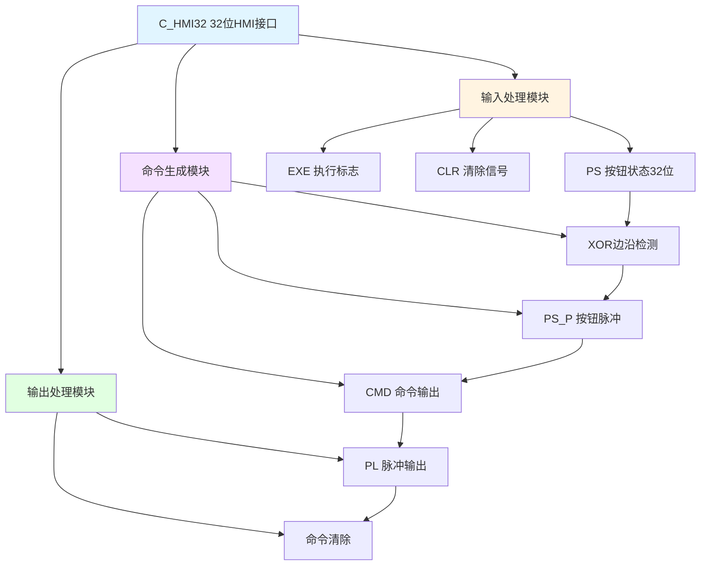

# C_HMI32 功能块分析报告

## 基本信息

| 项目 | 内容 |
|------|------|
| 功能块名称 | C_HMI32 |
| 功能描述 | HMI Interface32（32位HMI接口） |
| 最后修改 | 2018.03.23 |
| 作者 | HuJingQi |
| 页数 | 1页（4个程序段） |

## 功能概述

C_HMI32是一个32位HMI（人机界面）接口功能块，用于批量处理32个HMI按钮命令。该功能块使用DWORD（32位）数据类型，通过位运算实现高效的命令处理，支持边沿检测、命令生成和自动清除功能。

### 应用场景
- **批量按钮命令处理**：处理HMI上的多个按钮操作
- **多命令管理**：管理最多32个独立的命令信号
- **命令脉冲生成**：将HMI按钮状态转换为脉冲命令

### 功能特点
1. **位运算处理**：使用XOR、AND等位运算高效处理
2. **32位数据宽度**：支持最多32个命令信号
3. **边沿检测**：检测按钮状态的上升沿
4. **命令生成**：根据按钮变化生成命令信号
5. **自动清除**：支持命令自动清除功能

## 思维导图

## 流程路径描述

### 命令生成路径：
开始 → PS按钮状态 → XOR检测变化 → AND生成脉冲 → XOR翻转CMD
**功能**: 将按钮状态变化转换为命令信号

### PL检测路径：
开始 → EXE标志 → CMD命令 → 输出PL脉冲
**功能**: 检测命令执行状态

### 命令清除路径：
开始 → PL非零或CLR → 清除CMD
**功能**: 命令执行后自动清除

## 逐帧功能分析

### Rung 1: 按钮脉冲检测

**功能描述**: 检测PS按钮状态的变化并生成上升沿脉冲

**输入条件**:
| 信号名称 | 信号描述 | 信号类型 | 触发值 |
|----------|----------|----------|--------|
| PS | 按钮状态（32位） | DWORD | 变化 |
| PS_OLD | 上次按钮状态 | DWORD | 数值 |

**输出功能**:
| 信号名称 | 信号描述 | 信号类型 |
|----------|----------|----------|
| PS_P | 按钮脉冲（32位） | DWORD |
| PS_OLD | 保存当前状态 | DWORD |

**触发逻辑**:
- PS_P = (PS XOR PS_OLD) AND PS
- PS_OLD = PS

**功能实现**: 
1. 使用XOR_DWORD计算PS与PS_OLD的异或值，得到变化的位
2. 使用AND_DWORD与PS进行与运算，得到上升沿脉冲
3. 使用MOVE_DWORD保存当前PS状态到PS_OLD

### Rung 2: 命令生成

**功能描述**: 根据按钮脉冲生成命令信号

**输入条件**:
| 信号名称 | 信号描述 | 信号类型 | 触发值 |
|----------|----------|----------|--------|
| PS_P | 按钮脉冲 | DWORD | 非零 |
| CMD | 当前命令 | DWORD | 数值 |

**输出功能**:
| 信号名称 | 信号描述 | 信号类型 |
|----------|----------|----------|
| CMD | 命令输出 | DWORD |

**触发逻辑**:
- CMD = CMD XOR PS_P

**功能实现**: 
使用XOR_DWORD将PS_P与CMD异或，实现命令的翻转。当按钮按下时，对应位翻转。

### Rung 3: PL检测

**功能描述**: 检测命令中非零位并输出PL

**输入条件**:
| 信号名称 | 信号描述 | 信号类型 | 触发值 |
|----------|----------|----------|--------|
| CMD | 命令输出 | DWORD | 非零 |
| EXE | 执行标志 | BOOL | TRUE |

**输出功能**:
| 信号名称 | 信号描述 | 信号类型 |
|----------|----------|----------|
| PL | 脉冲输出 | DWORD |

**触发逻辑**:
- 调用C_NSWD选择CMD或0
- 当EXE=TRUE时，PL = CMD AND CMD

**功能实现**: 
1. 调用C_NSWD功能块，当CMD非零时选择CMD
2. 使用AND_DWORD将CMD与自身相与
3. 当EXE为TRUE时输出PL

### Rung 4: 命令清除

**功能描述**: 清除已处理的命令

**输入条件**:
| 信号名称 | 信号描述 | 信号类型 | 触发值 |
|----------|----------|----------|--------|
| PL | 脉冲输出 | DWORD | 非零 |
| CLR | 清除信号 | BOOL | TRUE |

**输出功能**:
| 信号名称 | 信号描述 | 信号类型 |
|----------|----------|----------|
| CMD | 命令输出 | DWORD |

**触发逻辑**:
- IF PL ≠ 0 OR CLR = TRUE THEN CMD = 0

**功能实现**: 
当PL非零或CLR为TRUE时，使用MOVE_DWORD将CMD清零。

## 触发条件总结

### 命令生成条件
- **按钮按下**: PS状态变化产生PS_P脉冲
- **命令翻转**: CMD对应位翻转

### PL输出条件
- **EXE = TRUE**: 执行标志有效
- **CMD ≠ 0**: 命令非零

### 命令清除条件
- **PL ≠ 0**: 命令执行完成
- **CLR = TRUE**: 手动清除

## 实现功能总结

### 主要功能
1. **按钮脉冲检测**: 检测HMI按钮状态变化
2. **命令翻转**: 按钮按下时命令状态翻转
3. **PL输出**: 命令执行脉冲输出
4. **自动清除**: 命令执行后自动清除

### HMI系列对比
| 功能块 | 命令数 | 数据类型 | 运算方式 |
|--------|--------|----------|----------|
| C_HMI1 | 1 | BOOL | 单独处理 |
| C_HMI2 | 2 | BOOL | 单独处理 |
| C_HMI4 | 4 | BOOL | 单独处理 |
| C_HMI16 | 16 | WORD | 位运算 |
| **C_HMI32** | **32** | **DWORD** | **位运算** |

## 关键信号说明

| 信号名称 | 信号描述 | 信号类型 | 用途 |
|----------|----------|----------|------|
| PS | 按钮状态 | DWORD | HMI按钮输入（32位） |
| PS_OLD | 按钮状态旧值 | DWORD | 用于边沿检测 |
| PS_P | 按钮脉冲 | DWORD | 上升沿脉冲 |
| CMD | 命令输出 | DWORD | 命令信号（32位） |
| PL | 脉冲输出 | DWORD | 命令执行脉冲 |
| EXE | 执行标志 | BOOL | 命令执行使能 |
| CLR | 清除信号 | BOOL | 命令清除控制 |

## 调试技巧

### 调试步骤
1. 检查PS输入信号是否正常变化
2. 监控PS_P脉冲是否正确生成
3. 检查CMD命令输出是否正确翻转
4. 验证PL脉冲输出
5. 测试CLR清除功能

### 常见问题
1. **命令不生成**: 检查PS信号是否变化
2. **命令不清除**: 检查PL和CLR信号
3. **脉冲丢失**: 检查扫描周期是否过长
4. **高位命令丢失**: 确认使用DWORD类型

### 监控信号列表
- PS（按钮状态）
- PS_P（按钮脉冲）
- CMD（命令输出）
- PL（脉冲输出）
- EXE（执行标志）
- CLR（清除信号）
