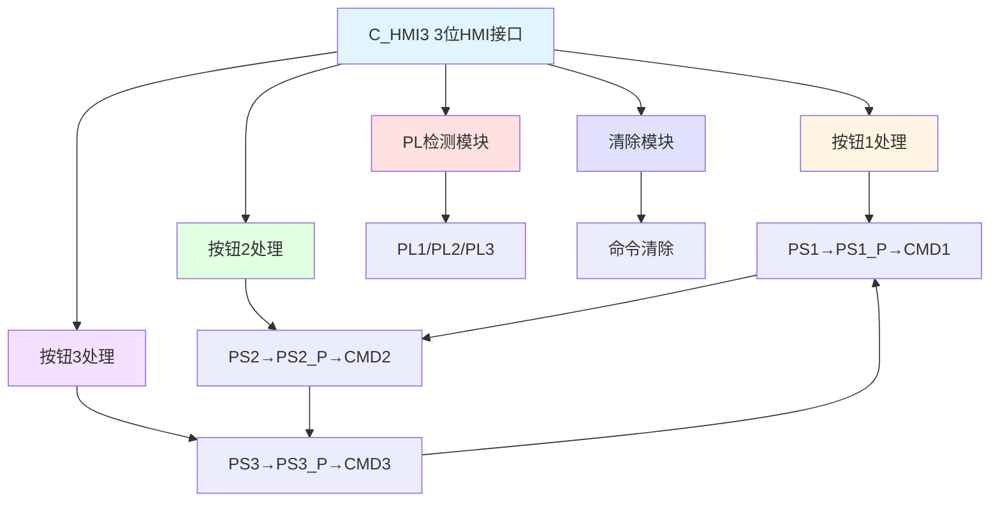

# C_HMI3 功能块分析报告

## 基本信息

| 项目 | 内容 |
|------|------|
| 功能块名称 | C_HMI3 |
| 功能描述 | HMI Interface3（3位HMI接口） |
| 最后修改 | 2018.03.23 |
| 作者 | HuJingQi |
| 页数 | 1页（9个程序段） |

## 功能概述

C_HMI3是一个3位HMI（人机界面）接口功能块，用于处理三个独立的HMI按钮命令。该功能块支持三个按钮的独立控制，并具有多选一互锁功能，确保同一时间只有一个命令有效。

### 应用场景
- **三档选择控制**：用于低/中/高三档选择
- **三工位控制**：用于三个工位的选择控制
- **三模式切换**：用于三种工作模式的切换

### 功能特点
1. **三按钮独立控制**：三个按钮独立控制各自的命令
2. **多选一互锁**：同一时间只有一个命令有效
3. **上升沿检测**：使用R_TRIG检测按钮上升沿
4. **自动清除**：命令执行后自动清除

## 思维导图

## 流程路径描述

### 命令生成路径：
开始 → PSn按钮 → R_TRIG检测 → PSn_P脉冲 → 互锁检查 → CMDn翻转
**功能**: 生成对应命令信号

### 互锁逻辑：
CMD1、CMD2、CMD3之间互锁，同一时间只能有一个有效

## 逐帧功能分析

### Rung 1-2: 命令1处理

**功能描述**: 检测PS1按钮并生成CMD1命令

**输入条件**:
| 信号名称 | 信号描述 | 信号类型 | 触发值 |
|----------|----------|----------|--------|
| PS1 | 按钮状态1 | BOOL | 上升沿 |
| CMD1/CMD2/CMD3 | 命令状态 | BOOL | 互锁条件 |
| CLR | 清除信号 | BOOL | FALSE |

**输出功能**:
| 信号名称 | 信号描述 | 信号类型 |
|----------|----------|----------|
| PS1_P | 按钮1脉冲 | BOOL |
| CMD1 | 命令输出1 | BOOL |

**触发逻辑**:
- IF PS1_P AND NOT CMD2 AND NOT CMD3 AND NOT CLR THEN CMD1翻转

### Rung 3-4: 命令2处理

**功能描述**: 检测PS2按钮并生成CMD2命令

**触发逻辑**:
- IF PS2_P AND NOT CMD1 AND NOT CMD3 AND NOT CLR THEN CMD2翻转

### Rung 5-6: 命令3处理

**功能描述**: 检测PS3按钮并生成CMD3命令

**触发逻辑**:
- IF PS3_P AND NOT CMD1 AND NOT CMD2 AND NOT CLR THEN CMD3翻转

### Rung 7: PL检测

**功能描述**: 检测三个命令的执行状态

**输出功能**:
| 信号名称 | 信号描述 | 信号类型 |
|----------|----------|----------|
| PL1/PL2/PL3 | 脉冲输出 | BOOL |

**触发逻辑**:
- PL1 = EXE AND CMD1
- PL2 = EXE AND CMD2
- PL3 = EXE AND CMD3

### Rung 8-9: 命令清除

**功能描述**: 命令执行后自动清除

**触发逻辑**:
- IF R_TRIG(PLn).Q THEN CMDn = FALSE

## 触发条件总结

### 命令生成条件
| 命令 | 触发条件 | 互锁条件 |
|------|----------|----------|
| CMD1 | PS1上升沿 | CMD2=OFF, CMD3=OFF |
| CMD2 | PS2上升沿 | CMD1=OFF, CMD3=OFF |
| CMD3 | PS3上升沿 | CMD1=OFF, CMD2=OFF |

## 实现功能总结

### 主要功能
1. **三按钮控制**: 三个按钮独立控制
2. **多选一互锁**: 同一时间只有一个命令有效
3. **PL输出**: 命令执行脉冲输出
4. **自动清除**: 命令执行后自动清除

### HMI系列对比
| 功能块 | 命令数 | 互锁方式 | 适用场景 |
|--------|--------|----------|----------|
| C_HMI1 | 1 | 无 | 单按钮控制 |
| C_HMI2 | 2 | 双向互锁 | 双按钮控制 |
| **C_HMI3** | **3** | **多选一互锁** | **三按钮控制** |

## 关键信号说明

| 信号名称 | 信号描述 | 信号类型 | 用途 |
|----------|----------|----------|------|
| PS1/PS2/PS3 | 按钮状态1/2/3 | BOOL | HMI按钮输入 |
| PS1_P/PS2_P/PS3_P | 按钮1/2/3脉冲 | BOOL | 上升沿脉冲 |
| CMD1/CMD2/CMD3 | 命令输出1/2/3 | BOOL | 命令信号 |
| PL1/PL2/PL3 | 脉冲输出1/2/3 | BOOL | 命令执行脉冲 |
| EXE | 执行标志 | BOOL | 命令执行使能 |
| CLR | 清除信号 | BOOL | 命令清除控制 |

## 调试技巧

### 调试步骤
1. 检查各PS输入信号
2. 验证互锁功能是否正常
3. 监控CMD输出
4. 测试PL脉冲输出

### 常见问题
1. **互锁失效**: 检查各CMD互锁触点
2. **多个命令同时有效**: 检查互锁逻辑
3. **命令不翻转**: 检查互锁条件

### 监控信号列表
- PS1/PS2/PS3（按钮状态）
- CMD1/CMD2/CMD3（命令输出）
- PL1/PL2/PL3（脉冲输出）
