# C_HMI3 功能块分析报告

## 基本信息

| 项目 | 内容 |
|------|------|
| 功能块名称 | C_HMI3 |
| 功能描述 | HMI Interface 3（人机界面接口3） |
| 最后修改 | 2018.03.23 |
| 作者 | Hu Jing Qi |
| 页数 | 3页 |

## 功能概述

C_HMI3 是一个人机界面接口功能块，用于处理三个HMI命令。该功能块接收HMI的PS1、PS2和PS3命令，产生脉冲信号，执行命令，并在命令完成后清除命令。

## 思维导图

```mermaid
graph TD
    A[C_HMI3 HMI接口3] --> B[输入模块]
    A --> C[处理模块]
    A --> D[输出模块]
    
    B --> B1[PS1]
    B --> B2[PS2]
    B --> B3[PS3]
    B --> B4[CMD1]
    B --> B5[CMD2]
    B --> B6[CMD3]
    B --> B7[CLR1]
    B --> B8[CLR2]
    B --> B9[CLR3]
    B --> B10[EXE]
    
    C --> C1[脉冲1检测]
    C --> C2[脉冲2检测]
    C --> C3[脉冲3检测]
    C --> C4[命令1处理]
    C --> C5[命令2处理]
    C --> C6[命令3处理]
    C --> C7[命令1清除]
    C --> C8[命令2清除]
    C --> C9[命令3清除]
    
    D --> D1[PS1_P]
    D --> D2[PS2_P]
    D --> D3[PS3_P]
    D --> D4[PL1]
    D --> D5[PL2]
    D --> D6[PL3]
    D --> D7[CMD1]
    D --> D8[CMD2]
    D --> D9[CMD3]
    
    style A fill:#e1f5ff
    style B fill:#fff4e1
    style C fill:#e1ffe1
    style D fill:#ffe1e1
```

## 流程路径描述

### 命令1脉冲路径：
开始 → PS1命令 → 上升沿检测 → 输出PS1_P → 命令1处理 → 输出PL1 → 命令1清除
**功能**: 处理HMI命令1脉冲

### 命令2脉冲路径：
开始 → PS2命令 → 上升沿检测 → 输出PS2_P → 命令2处理 → 输出PL2 → 命令2清除
**功能**: 处理HMI命令2脉冲

### 命令3脉冲路径：
开始 → PS3命令 → 上升沿检测 → 输出PS3_P → 命令3处理 → 输出PL3 → 命令3清除
**功能**: 处理HMI命令3脉冲

## 逐帧功能分析

### Rung 8: 脉冲1检测
**功能描述**: 检测PS1命令的上升沿，产生脉冲信号
**输入条件**: PS1上升沿
**输出功能**: PS1_P = TRUE
**触发逻辑**: IF PS1上升沿 THEN PS1_P = TRUE

### Rung 9: 命令1处理
**功能描述**: 处理命令1，产生PL1检测信号
**输入条件**: PS1_P = TRUE AND CMD1 = TRUE AND EXE = TRUE
**输出功能**: PL1 = TRUE
**触发逻辑**: IF PS1_P = TRUE AND CMD1 = TRUE AND EXE = TRUE THEN PL1 = TRUE

### Rung 11: 脉冲2检测
**功能描述**: 检测PS2命令的上升沿，产生脉冲信号
**输入条件**: PS2上升沿
**输出功能**: PS2_P = TRUE
**触发逻辑**: IF PS2上升沿 THEN PS2_P = TRUE

### Rung 12: 命令2处理
**功能描述**: 处理命令2，产生PL2检测信号
**输入条件**: PS2_P = TRUE AND CMD2 = TRUE AND EXE = TRUE
**输出功能**: PL2 = TRUE
**触发逻辑**: IF PS2_P = TRUE AND CMD2 = TRUE AND EXE = TRUE THEN PL2 = TRUE

### Rung 14: 脉冲3检测
**功能描述**: 检测PS3命令的上升沿，产生脉冲信号
**输入条件**: PS3上升沿
**输出功能**: PS3_P = TRUE
**触发逻辑**: IF PS3上升沿 THEN PS3_P = TRUE

### Rung 15: 命令3处理
**功能描述**: 处理命令3，产生PL3检测信号
**输入条件**: PS3_P = TRUE AND CMD3 = TRUE AND EXE = TRUE
**输出功能**: PL3 = TRUE
**触发逻辑**: IF PS3_P = TRUE AND CMD3 = TRUE AND EXE = TRUE THEN PL3 = TRUE

### Rung 19: 命令1清除
**功能描述**: 清除命令1
**输入条件**: PL1上升沿
**输出功能**: CMD1 = FALSE
**触发逻辑**: IF PL1上升沿 THEN CMD1 = FALSE

### Rung 20: 命令2清除
**功能描述**: 清除命令2
**输入条件**: PL2上升沿
**输出功能**: CMD2 = FALSE
**触发逻辑**: IF PL2上升沿 THEN CMD2 = FALSE

### Rung 21: 命令3清除
**功能描述**: 清除命令3
**输入条件**: PL3上升沿
**输出功能**: CMD3 = FALSE
**触发逻辑**: IF PL3上升沿 THEN CMD3 = FALSE

## 触发条件总结

### 脉冲条件
- **脉冲1触发**: PS1上升沿
- **脉冲2触发**: PS2上升沿
- **脉冲3触发**: PS3上升沿

### 命令条件
- **命令1处理**: PS1_P = TRUE AND CMD1 = TRUE AND EXE = TRUE
- **命令2处理**: PS2_P = TRUE AND CMD2 = TRUE AND EXE = TRUE
- **命令3处理**: PS3_P = TRUE AND CMD3 = TRUE AND EXE = TRUE
- **命令1清除**: PL1上升沿
- **命令2清除**: PL2上升沿
- **命令3清除**: PL3上升沿

## 实现功能总结

### 主要功能
1. **脉冲检测**: 检测三个HMI命令的脉冲
2. **命令处理**: 处理三个HMI命令
3. **命令清除**: 清除已执行的命令

## 关键信号说明

| 信号名称 | 信号描述 | 信号类型 | 用途 |
|----------|----------|----------|------|
| PS1 | PS1命令 | BOOL | HMI脉冲选择命令1 |
| PS2 | PS2命令 | BOOL | HMI脉冲选择命令2 |
| PS3 | PS3命令 | BOOL | HMI脉冲选择命令3 |
| PS1_P | PS1脉冲 | BOOL | PS1脉冲信号 |
| PS2_P | PS2脉冲 | BOOL | PS2脉冲信号 |
| PS3_P | PS3脉冲 | BOOL | PS3脉冲信号 |
| CMD1 | 命令1 | BOOL | 命令1信号 |
| CMD2 | 命令2 | BOOL | 命令2信号 |
| CMD3 | 命令3 | BOOL | 命令3信号 |
| EXE | 执行命令 | BOOL | 执行命令信号 |
| PL1 | PL1检测 | BOOL | PL1检测信号 |
| PL2 | PL2检测 | BOOL | PL2检测信号 |
| PL3 | PL3检测 | BOOL | PL3检测信号 |

## 调试技巧

### 监控信号列表
- PS1、PS2、PS3（命令）
- PS1_P、PS2_P、PS3_P（脉冲）
- CMD1、CMD2、CMD3（命令）
- PL1、PL2、PL3（检测）
- EXE（执行命令）
