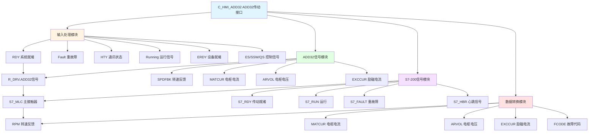

# C_HMI_ADD32 功能块分析报告

## 基本信息

| 项目 | 内容 |
|------|------|
| 功能块名称 | C_HMI_ADD32 |
| 功能描述 | HMI Drive ADD32 Interface（HMI ADD32传动接口） |
| 最后修改 | 2018.06.08 |
| 作者 | ZhangXiaoLiang |
| 页数 | 约2页（30+个程序段） |

## 功能概述

C_HMI_ADD32是一个专门用于ADD32系列直流传动的HMI接口功能块。该功能块集成了ADD32传动和S7-200 PLC的双重信号处理，提供完整的直流传动设备状态监控和数据传输功能。

### 应用场景
- **直流传动监控**：监控ADD32系列直流调速器
- **双系统接口**：同时处理ADD32和S7-200的信号
- **HMI状态显示**：为HMI提供完整的设备状态显示
- **数据采集**：采集直流传动的电枢电流、励磁电流等数据

### 功能特点
1. **双系统支持**：同时处理ADD32和S7-200信号
2. **直流传动专用**：支持电枢电流、励磁电流等直流传动特有参数
3. **状态信号处理**：处理就绪、运行、故障等状态信号
4. **延时滤波**：对状态信号进行延时滤波处理
5. **数据转换**：将REAL类型数据转换为INT类型供HMI显示

## 思维导图

## 流程路径描述

### ADD32信号处理路径：
开始 → 读取R_DRV状态 → 延时滤波 → 输出到HMI_ADD32
**功能**: 处理ADD32传动的状态信号

### S7-200信号处理路径：
开始 → 读取R_S7200状态 → 直接输出到HMI_ADD32
**功能**: 处理S7-200 PLC的状态信号

### 数据转换路径：
开始 → 读取REAL数据 → REAL_TO_INT转换 → 输出到HMI_ADD32
**功能**: 将浮点数据转换为整数供HMI显示

## 逐帧功能分析

### Rung 1: 报警延时时间设置

**功能描述**: 设置故障报警的延时时间

**输出功能**:
| 信号名称 | 信号描述 | 信号类型 |
|----------|----------|----------|
| ALM_TIME | 报警延时时间 | DINT |

**触发逻辑**:
- ALM_TIME = 5000 (毫秒)

### Rung 2: 系统就绪

**功能描述**: 对系统就绪信号进行延时确认

**输入条件**:
| 信号名称 | 信号描述 | 信号类型 | 触发值 |
|----------|----------|----------|--------|
| R_DRV.RDY | 传动就绪 | BOOL | TRUE |
| ALM_TIME | 延时时间 | DINT | 5000 |

**输出功能**:
| 信号名称 | 信号描述 | 信号类型 |
|----------|----------|----------|
| HMI_ADD32.RDY | 系统就绪 | BOOL |

**触发逻辑**:
- 使用TON延时5秒确认就绪

### Rung 3: 重故障处理

**功能描述**: 对重故障信号进行延时滤波

**输入条件**:
| 信号名称 | 信号描述 | 信号类型 | 触发值 |
|----------|----------|----------|--------|
| R_DRV.Fault | 重故障 | BOOL | TRUE |
| ALM_TIME | 延时时间 | DINT | 5000 |

**输出功能**:
| 信号名称 | 信号描述 | 信号类型 |
|----------|----------|----------|
| HMI_ADD32.Fault | 重故障 | BOOL |

**触发逻辑**:
- 使用TOF延时5秒复位故障

### Rung 4: 通讯状态

**功能描述**: 输出通讯状态

**输入条件**:
| 信号名称 | 信号描述 | 信号类型 | 触发值 |
|----------|----------|----------|--------|
| HTY | 通讯正常 | BOOL | TRUE |

**输出功能**:
| 信号名称 | 信号描述 | 信号类型 |
|----------|----------|----------|
| HMI_ADD32.HTY | 通讯状态 | BOOL |

### Rung 5: 运行信号

**功能描述**: 输出运行信号

**输入条件**:
| 信号名称 | 信号描述 | 信号类型 | 触发值 |
|----------|----------|----------|--------|
| R_DRV.Running | 运行中 | BOOL | TRUE |

**输出功能**:
| 信号名称 | 信号描述 | 信号类型 |
|----------|----------|----------|
| HMI_ADD32.Running | 运行信号 | BOOL |

### Rung 6: 设备就绪

**功能描述**: 对设备就绪信号进行延时确认

**输入条件**:
| 信号名称 | 信号描述 | 信号类型 | 触发值 |
|----------|----------|----------|--------|
| ERDY | 设备就绪 | BOOL | TRUE |
| ALM_TIME | 延时时间 | DINT | 5000 |

**输出功能**:
| 信号名称 | 信号描述 | 信号类型 |
|----------|----------|----------|
| HMI_ADD32.ERDY | 设备就绪 | BOOL |

### Rung 7-9: PLC控制信号

**功能描述**: 输出PLC控制信号

**输入条件**:
| 信号名称 | 信号描述 | 信号类型 |
|----------|----------|----------|
| PLC_ES | PLC急停 | BOOL |
| PLC_SSW | PLC安全开关 | BOOL |
| PLC_QS | PLC快停 | BOOL |

**输出功能**:
| 信号名称 | 信号描述 | 信号类型 |
|----------|----------|----------|
| HMI_ADD32.ES | PLC急停 | BOOL |
| HMI_ADD32.SSW | PLC安全开关 | BOOL |
| HMI_ADD32.QS | PLC快停 | BOOL |

### Rung 10: 转速反馈

**功能描述**: 转换并输出转速反馈

**输入条件**:
| 信号名称 | 信号描述 | 信号类型 | 触发值 |
|----------|----------|----------|--------|
| SPDFBK | 转速反馈 | REAL | 数值 |

**输出功能**:
| 信号名称 | 信号描述 | 信号类型 |
|----------|----------|----------|
| HMI_ADD32.RPM | 转速反馈 | INT |

**触发逻辑**:
- 使用REAL_TO_INT将REAL转换为INT

### Rung 11-12: 电枢电流和电压反馈

**功能描述**: 转换并输出电枢电流和电压反馈

**输入条件**:
| 信号名称 | 信号描述 | 信号类型 | 触发值 |
|----------|----------|----------|--------|
| R_DRV.MATCUR | 电枢电流 | REAL | 数值 |
| R_DRV.ARVOL | 电枢电压 | REAL | 数值 |

**输出功能**:
| 信号名称 | 信号描述 | 信号类型 |
|----------|----------|----------|
| HMI_ADD32.MATCUR | 电枢电流 | INT |
| HMI_ADD32.ARVOL | 电枢电压 | INT |

### Rung 13: 励磁电流反馈

**功能描述**: 转换并输出励磁电流反馈

**输入条件**:
| 信号名称 | 信号描述 | 信号类型 | 触发值 |
|----------|----------|----------|--------|
| R_DRV.EXCCUR | 励磁电流 | REAL | 数值 |

**输出功能**:
| 信号名称 | 信号描述 | 信号类型 |
|----------|----------|----------|
| HMI_ADD32.EXCCUR | 励磁电流 | INT |

### Rung 14: 通讯状态返回

**功能描述**: 转换并输出通讯状态返回值

**输入条件**:
| 信号名称 | 信号描述 | 信号类型 | 触发值 |
|----------|----------|----------|--------|
| R_DRV.HBR | 通讯状态 | REAL | 数值 |

**输出功能**:
| 信号名称 | 信号描述 | 信号类型 |
|----------|----------|----------|
| HMI_ADD32.HBR | 通讯状态 | INT |

### Rung 15-16: 故障代码传输

**功能描述**: 传输故障代码

**输入条件**:
| 信号名称 | 信号描述 | 信号类型 |
|----------|----------|----------|
| R_DRV.FCODE1 | 故障代码1 | UINT |
| R_DRV.FCODE2 | 故障代码2 | UINT |

**输出功能**:
| 信号名称 | 信号描述 | 信号类型 |
|----------|----------|----------|
| HMI_ADD32.FCODE1 | 故障代码1 | UINT |
| HMI_ADD32.FCODE2 | 故障代码2 | UINT |

### Rung 17-30: S7-200信号处理

**功能描述**: 处理S7-200 PLC的各种状态信号

**主要信号**:
| 信号名称 | 信号描述 | 来源 |
|----------|----------|------|
| S7_MLC | 主接触器 | R_S7200.MLC |
| S7_RDY | 传动就绪 | R_S7200.RDY |
| S7_RUN | 运行 | R_S7200.RUN |
| S7_FAULT | 重故障 | R_S7200.Fault |
| S7_MELT_OK | 快熔正常 | R_S7200.Melt_OK |
| S7_PBFAN_OK | 功率桥风机正常 | R_S7200.PBFAN_OK |
| S7_PBT_OK | 功率桥正常 | R_S7200.PBT_OK |
| S7_HCS_OK | HCS正常 | R_S7200.HCS_OK |
| S7_AFM_FLT | AFM故障 | R_S7200.AFM_FLT |
| S7_ALARM | 报警 | R_S7200.Alarm |
| S7_TEM_OK | 温度正常 | R_S7200.TEM_OK |
| S7_LUB_OK | 润滑正常 | R_S7200.LUB_OK |
| S7_FAN_OK | 风机正常 | R_S7200.FAN_OK |
| S7_BSP1~8 | 扩展信号 | R_S7200.BSP1~8 |
| S7_HBR | 心跳信号 | S7_HTY |

## 触发条件总结

### ADD32信号
- **系统就绪**: R_DRV.RDY延时5秒
- **重故障**: R_DRV.Fault，延时5秒复位
- **运行**: R_DRV.Running直接输出

### S7-200信号
- **主接触器**: R_S7200.MLC直接输出
- **传动就绪**: R_S7200.RDY直接输出
- **重故障**: R_S7200.Fault直接输出
- **心跳**: S7_HTY直接输入

## 实现功能总结

### 主要功能
1. **双系统接口**: 同时处理ADD32和S7-200信号
2. **直流传动专用**: 支持电枢电流、励磁电流等参数
3. **状态监控**: 监控传动设备的各种运行状态
4. **数据转换**: 将REAL数据转换为INT供HMI显示
5. **故障代码**: 传输故障代码

### 与其他HMI接口对比
| 功能块 | 传动类型 | 特有参数 |
|--------|----------|----------|
| C_HMI_YAS | YSK变频器 | 频率、电流 |
| C_HMI_S120 | S120变频器 | 转速、转矩 |
| **C_HMI_ADD32** | **ADD32直流传动** | **电枢电流、励磁电流、电枢电压** |

## 关键信号说明

| 信号名称 | 信号描述 | 信号类型 | 用途 |
|----------|----------|----------|------|
| R_DRV.RDY | 传动就绪 | BOOL | ADD32就绪输入 |
| R_DRV.Fault | 重故障 | BOOL | ADD32故障输入 |
| R_DRV.Running | 运行中 | BOOL | ADD32运行输入 |
| SPDFBK | 转速反馈 | REAL | 转速输入 |
| R_DRV.MATCUR | 电枢电流 | REAL | 电枢电流输入 |
| R_DRV.ARVOL | 电枢电压 | REAL | 电枢电压输入 |
| R_DRV.EXCCUR | 励磁电流 | REAL | 励磁电流输入 |
| R_S7200.* | S7-200信号 | 各类型 | S7-200状态输入 |
| HMI_ADD32.* | HMI输出 | 各类型 | HMI接口输出 |

## 调试技巧

### 调试步骤
1. 检查R_DRV和R_S7200数据是否正常
2. 验证ADD32信号处理是否正确
3. 检查S7-200信号传输
4. 验证数据转换是否正确
5. 检查直流传动特有参数（电枢电流、励磁电流）

### 常见问题
1. **就绪不确认**: 检查TON延时和RDY信号
2. **故障不消失**: 检查TOF延时
3. **电流数据异常**: 检查REAL_TO_INT转换
4. **S7信号丢失**: 检查R_S7200通讯

### 监控信号列表
- HMI_ADD32.RDY（系统就绪）
- HMI_ADD32.Fault（重故障）
- HMI_ADD32.Running（运行信号）
- HMI_ADD32.RPM（转速反馈）
- HMI_ADD32.MATCUR（电枢电流）
- HMI_ADD32.EXCCUR（励磁电流）
- HMI_ADD32.S7_HBR（心跳信号）
