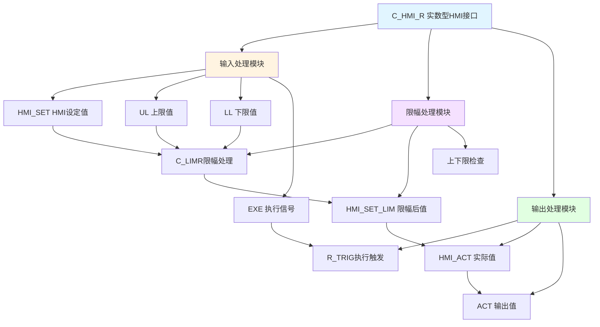

# C_HMI_R 功能块分析报告

## 基本信息

| 项目 | 内容 |
|------|------|
| 功能块名称 | C_HMI_R |
| 功能描述 | HMI Interface Real Variable（实数型HMI接口） |
| 最后修改 | 2021.03.31 |
| 作者 | Wangzhaoyang |
| 页数 | 1页（4个程序段） |

## 功能概述

C_HMI_R是一个实数型HMI接口功能块，用于处理HMI上的实数变量设定。该功能块实现了设定值限幅、执行触发和输出处理功能，确保HMI设定的实数值在有效范围内。

### 应用场景
- **实数参数设定**：处理HMI上的实数参数输入
- **速度设定**：处理速度参考值的设定
- **位置设定**：处理位置参考值的设定
- **温度设定**：处理温度设定值的输入

### 功能特点
1. **设定值限幅**：将设定值限制在上下限范围内
2. **执行触发**：使用R_TRIG检测执行信号上升沿
3. **输出处理**：将限幅后的值输出到实际变量
4. **上下限检查**：检查上下限设置是否有效

## 思维导图

## 流程路径描述

### 限幅处理路径：
开始 → 读取HMI_SET → 调用C_LIMR限幅 → 输出HMI_SET_LIM
**功能**: 将设定值限制在有效范围内

### 执行触发路径：
开始 → EXE信号 → R_TRIG检测上升沿 → 输出HMI_ACT
**功能**: 检测执行信号并输出实际值

### 输出处理路径：
开始 → HMI_ACT → MOVE传输 → 输出ACT
**功能**: 将实际值传输到输出变量

## 逐帧功能分析

### Rung 1: 设定值限幅

**功能描述**: 将HMI设定值限制在上下限范围内

**输入条件**:
| 信号名称 | 信号描述 | 信号类型 | 触发值 |
|----------|----------|----------|--------|
| HMI_SET | HMI设定值 | REAL | 数值 |
| UL | 上限值 | REAL | 设定值 |
| LL | 下限值 | REAL | 设定值 |

**输出功能**:
| 信号名称 | 信号描述 | 信号类型 |
|----------|----------|----------|
| HMI_SET_LIM | 限幅后设定值 | REAL |

**触发逻辑**:
- HMI_SET_LIM = LIMIT(HMI_SET, LL, UL)

**功能实现**: 
调用C_LIMR功能块，将HMI_SET限制在LL和UL之间。

### Rung 2: 执行触发

**功能描述**: 检测执行信号并输出实际值

**输入条件**:
| 信号名称 | 信号描述 | 信号类型 | 触发值 |
|----------|----------|----------|--------|
| EXE | 执行信号 | BOOL | 上升沿 |
| HMI_SET_LIM | 限幅后设定值 | REAL | 数值 |

**输出功能**:
| 信号名称 | 信号描述 | 信号类型 |
|----------|----------|----------|
| HMI_ACT | 实际值 | REAL |

**触发逻辑**:
- 调用C_RTRIG检测EXE上升沿
- IF R_TRIG.Q = TRUE THEN HMI_ACT = HMI_SET_LIM

**功能实现**: 
调用C_RTRIG检测EXE上升沿，当检测到上升沿时，将限幅后的设定值传输到HMI_ACT。

### Rung 3: 输出传输

**功能描述**: 将实际值传输到输出变量

**输入条件**:
| 信号名称 | 信号描述 | 信号类型 | 触发值 |
|----------|----------|----------|--------|
| HMI_ACT | 实际值 | REAL | 数值 |

**输出功能**:
| 信号名称 | 信号描述 | 信号类型 |
|----------|----------|----------|
| ACT | 输出值 | REAL |

**触发逻辑**:
- ACT = HMI_ACT

**功能实现**: 
使用MOVE_REAL将HMI_ACT传输到ACT输出。

### Rung 4: 上下限检查

**功能描述**: 检查上下限设置是否有效

**输入条件**:
| 信号名称 | 信号描述 | 信号类型 | 触发值 |
|----------|----------|----------|--------|
| UL | 上限值 | REAL | 数值 |
| LL | 下限值 | REAL | 数值 |

**输出功能**:
| 信号名称 | 信号描述 | 信号类型 |
|----------|----------|----------|
| HMI_ACT | 实际值 | REAL |
| ACT | 输出值 | REAL |

**触发逻辑**:
- IF UL < LL THEN HMI_ACT = 0.0 AND ACT = 0.0

**功能实现**: 
使用LT_REAL检查UL是否小于LL，如果是则将输出清零，表示上下限设置错误。

## 触发条件总结

### 限幅条件
- **正常限幅**: LL ≤ HMI_SET ≤ UL
- **超上限**: HMI_SET > UL → HMI_SET_LIM = UL
- **超下限**: HMI_SET < LL → HMI_SET_LIM = LL

### 执行条件
- **EXE上升沿**: 检测到执行信号上升沿时输出

### 错误条件
- **上下限错误**: UL < LL 时输出清零

## 实现功能总结

### 主要功能
1. **设定值限幅**: 将设定值限制在有效范围内
2. **执行触发**: 检测执行信号后输出设定值
3. **输出传输**: 将实际值传输到输出变量
4. **错误检查**: 检查上下限设置是否有效

### 与其他HMI功能块对比
| 功能块 | 数据类型 | 限幅功能 | 适用场景 |
|--------|----------|----------|----------|
| C_HMI1 | BOOL | 无 | 单按钮控制 |
| C_HMI16 | WORD | 无 | 16位批量处理 |
| **C_HMI_R** | **REAL** | **有** | **实数参数设定** |

## 关键信号说明

| 信号名称 | 信号描述 | 信号类型 | 用途 |
|----------|----------|----------|------|
| HMI_SET | HMI设定值 | REAL | HMI输入设定值 |
| UL | 上限值 | REAL | 设定值上限 |
| LL | 下限值 | REAL | 设定值下限 |
| EXE | 执行信号 | BOOL | 执行触发信号 |
| HMI_SET_LIM | 限幅后设定值 | REAL | 限幅处理结果 |
| HMI_ACT | 实际值 | REAL | 实际输出值 |
| ACT | 输出值 | REAL | 最终输出值 |

## 调试技巧

### 调试步骤
1. 检查UL和LL上下限设置是否正确
2. 验证HMI_SET输入是否正常
3. 监控HMI_SET_LIM限幅结果
4. 测试EXE执行触发功能
5. 检查ACT输出是否正确

### 常见问题
1. **输出始终为零**: 检查UL是否小于LL
2. **限幅不正确**: 检查UL和LL设置值
3. **执行不触发**: 检查EXE信号是否正常变化
4. **设定值不更新**: 检查EXE上升沿是否触发

### 监控信号列表
- HMI_SET（HMI设定值）
- HMI_SET_LIM（限幅后设定值）
- HMI_ACT（实际值）
- ACT（输出值）
- EXE（执行信号）
- UL/LL（上下限值）
