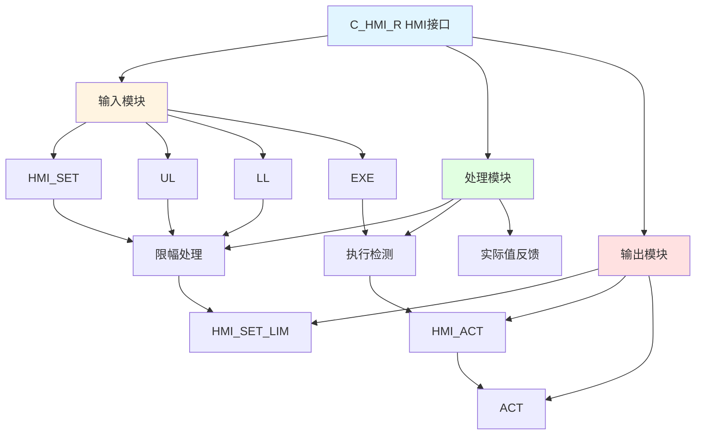

# C_HMI_R 功能块分析报告

## 基本信息

| 项目 | 内容 |
|------|------|
| 功能块名称 | C_HMI_R |
| 功能描述 | HMI Interface Real Variable（HMI接口实数变量） |
| 最后修改 | 2021.03.31 |
| 作者 | Wangzhaoyang |
| 页数 | 1页 |

## 功能概述

C_HMI_R 是一个HMI接口实数变量功能块，用于处理HMI设置的实数变量，包括限幅、执行和实际值反馈。

## 思维导图

## 流程路径描述

### 限幅路径：
开始 → HMI_SET → 限幅处理 → 输出HMI_SET_LIM
**功能**: 对HMI设置值进行限幅

### 执行路径：
开始 → EXE → 执行检测 → 输出HMI_ACT
**功能**: 检测执行命令

### 实际值路径：
开始 → HMI_ACT → 实际值反馈 → 输出ACT
**功能**: 反馈实际使用值

## 逐帧功能分析

### Rung 4: 限幅处理

**功能描述**: 对HMI设置值进行限幅

**输入条件**:
| 信号名称 | 信号描述 | 信号类型 | 触发值 |
|----------|----------|----------|--------|
| HMI_SET | HMI设置值 | REAL | 数值 |
| UL | 输入上限 | REAL | 设定值 |
| LL | 输入下限 | REAL | 设定值 |

**输出功能**:
| 信号名称 | 信号描述 | 信号类型 |
|----------|----------|----------|
| HMI_SET_LIM | HMI设置限幅 | REAL |

**触发逻辑**:
- HMI_SET_LIM = LIMIT(HMI_SET, LL, UL)

**功能实现**: 
使用C_LIMR功能块，对HMI_SET进行限幅，输出到HMI_SET_LIM。

### Rung 3: 执行检测

**功能描述**: 检测执行命令的上升沿

**输入条件**:
| 信号名称 | 信号描述 | 信号类型 | 触发值 |
|----------|----------|----------|--------|
| EXE | 执行命令 | BOOL | 上升沿 |

**输出功能**:
| 信号名称 | 信号描述 | 信号类型 |
|----------|----------|----------|
| HMI_ACT | 实际使用值 | REAL |

**触发逻辑**:
- IF EXE上升沿 THEN HMI_ACT = HMI_SET_LIM

**功能实现**: 
使用RTRIG功能块检测EXE的上升沿，当检测到上升沿时，将HMI_SET_LIM输出到HMI_ACT。

### Rung 4: 实际值反馈

**功能描述**: 反馈实际使用值

**输入条件**:
| 信号名称 | 信号描述 | 信号类型 | 触发值 |
|----------|----------|----------|--------|
| HMI_ACT | 实际使用值 | REAL | 数值 |

**输出功能**:
| 信号名称 | 信号描述 | 信号类型 |
|----------|----------|----------|
| ACT | 实际使用值 | REAL |

**触发逻辑**:
- ACT = HMI_ACT

**功能实现**: 
使用MOVE功能块，将HMI_ACT输出到ACT。

### Rung 5: 下限检查

**功能描述**: 检查实际值是否低于下限

**输入条件**:
| 信号名称 | 信号描述 | 信号类型 | 触发值 |
|----------|----------|----------|--------|
| UL | 输入上限 | REAL | 设定值 |
| HMI_ACT | 实际使用值 | REAL | 数值 |

**输出功能**:
| 信号名称 | 信号描述 | 信号类型 |
|----------|----------|----------|
| HMI_ACT | 实际使用值 | REAL |
| ACT | 实际使用值 | REAL |

**触发逻辑**:
- IF HMI_ACT < LL THEN HMI_ACT = 0.01 AND ACT = 0.01

**功能实现**: 
使用LT功能块比较HMI_ACT和LL，当HMI_ACT小于LL时，将HMI_ACT和ACT设置为0.01。

## 触发条件总结

### 限幅条件
- **限幅处理**: HMI_SET在LL和UL之间

### 执行条件
- **执行触发**: EXE上升沿

### 反馈条件
- **下限检查**: HMI_ACT < LL

## 实现功能总结

### 主要功能
1. **限幅处理**: 对HMI设置值进行限幅
2. **执行检测**: 检测执行命令
3. **实际值反馈**: 反馈实际使用值

## 关键信号说明

| 信号名称 | 信号描述 | 信号类型 | 用途 |
|----------|----------|----------|------|
| HMI_SET | HMI设置值 | REAL | HMI设置 |
| UL | 输入上限 | REAL | 上限值 |
| LL | 输入下限 | REAL | 下限值 |
| EXE | 执行命令 | BOOL | 执行命令 |
| HMI_SET_LIM | HMI设置限幅 | REAL | 限幅后的设置值 |
| HMI_ACT | 实际使用值 | REAL | 实际使用值 |
| ACT | 实际使用值 | REAL | 实际使用值反馈 |

## 调试技巧

### 调试步骤
1. 检查HMI_SET值，确认HMI设置
2. 检查UL和LL值，确认限幅范围
3. 监控EXE信号，观察执行命令
4. 监控HMI_SET_LIM、HMI_ACT、ACT值，观察处理过程

### 常见问题
1. **限幅不工作**: 检查UL和LL值设置
2. **执行不触发**: 检查EXE信号
3. **反馈不正确**: 检查HMI_ACT值

### 监控信号列表
- HMI_SET（HMI设置）
- UL、LL（限幅范围）
- EXE（执行命令）
- HMI_SET_LIM（限幅后设置）
- HMI_ACT（实际使用值）
- ACT（实际使用值反馈）
