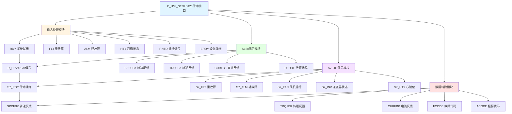

# C_HMI_S120 功能块分析报告

## 基本信息

| 项目 | 内容 |
|------|------|
| 功能块名称 | C_HMI_S120 |
| 功能描述 | HMI Drive S120 Interface（HMI S120传动接口） |
| 最后修改 | 2018.06.08 |
| 作者 | ZhangXiaoLiang |
| 页数 | 约2页（30+个程序段） |

## 功能概述

C_HMI_S120是一个专门用于西门子S120系列传动的HMI接口功能块。该功能块集成了S120传动和S7-200 PLC的双重信号处理，提供完整的设备状态监控和数据传输功能。

### 应用场景
- **S120传动监控**：监控西门子S120系列变频器/传动设备
- **双系统接口**：同时处理S120和S7-200的信号
- **HMI状态显示**：为HMI提供完整的设备状态显示
- **数据采集**：采集传动设备的运行数据

### 功能特点
1. **双系统支持**：同时处理S120和S7-200信号
2. **状态信号处理**：处理就绪、运行、故障等状态信号
3. **延时滤波**：对状态信号进行延时滤波处理
4. **数据转换**：将REAL类型数据转换为INT类型供HMI显示
5. **故障代码传输**：传输故障代码和报警代码

## 思维导图

## 流程路径描述

### S120信号处理路径：
开始 → 读取R_DRV状态 → 延时滤波 → 输出到HMI_S120
**功能**: 处理S120传动的状态信号

### S7-200信号处理路径：
开始 → 读取R_S7200状态 → 直接输出到HMI_S120
**功能**: 处理S7-200 PLC的状态信号

### 数据转换路径：
开始 → 读取REAL数据 → REAL_TO_INT转换 → 输出到HMI_S120
**功能**: 将浮点数据转换为整数供HMI显示

## 逐帧功能分析

### Rung 1: 报警延时时间设置

**功能描述**: 设置故障报警的延时时间

**输出功能**:
| 信号名称 | 信号描述 | 信号类型 |
|----------|----------|----------|
| ALM_TIME | 报警延时时间 | DINT |

**触发逻辑**:
- ALM_TIME = 5000 (毫秒)

### Rung 2: 系统就绪

**功能描述**: 对系统就绪信号进行延时确认

**输入条件**:
| 信号名称 | 信号描述 | 信号类型 | 触发值 |
|----------|----------|----------|--------|
| R_DRV.RDY | 传动就绪 | BOOL | TRUE |
| ALM_TIME | 延时时间 | DINT | 5000 |

**输出功能**:
| 信号名称 | 信号描述 | 信号类型 |
|----------|----------|----------|
| HMI_S120.RDY | 系统就绪 | BOOL |

**触发逻辑**:
- 使用TON延时5秒确认就绪

### Rung 3: 重故障处理

**功能描述**: 对重故障信号进行延时滤波

**输入条件**:
| 信号名称 | 信号描述 | 信号类型 | 触发值 |
|----------|----------|----------|--------|
| R_DRV.Fault | 重故障 | BOOL | TRUE |
| ALM_TIME | 延时时间 | DINT | 5000 |

**输出功能**:
| 信号名称 | 信号描述 | 信号类型 |
|----------|----------|----------|
| HMI_S120.FLT | 重故障 | BOOL |

**触发逻辑**:
- 使用TOF延时5秒复位故障

### Rung 4: 轻故障处理

**功能描述**: 轻故障信号（常ON）

**输出功能**:
| 信号名称 | 信号描述 | 信号类型 |
|----------|----------|----------|
| HMI_S120.ALM | 轻故障 | BOOL |

**触发逻辑**:
- HMI_S120.ALM = TRUE（常ON）

### Rung 5: 通讯状态

**功能描述**: 输出通讯状态

**输入条件**:
| 信号名称 | 信号描述 | 信号类型 | 触发值 |
|----------|----------|----------|--------|
| HTY | 通讯正常 | BOOL | TRUE |

**输出功能**:
| 信号名称 | 信号描述 | 信号类型 |
|----------|----------|----------|
| HMI_S120.HTY | 通讯状态 | BOOL |

### Rung 6-8: 电机其他状态

**功能描述**: 输出电机其他状态信号（默认OFF）

**输出功能**:
| 信号名称 | 信号描述 | 信号类型 |
|----------|----------|----------|
| HMI_S120.OFF2 | 电机其他状态 | BOOL |
| HMI_S120.SSW | 安全开关 | BOOL |
| HMI_S120.ES | 急停指令 | BOOL |

**触发逻辑**:
- 默认值为FALSE（常OFF）

### Rung 9: 运行信号

**功能描述**: 输出运行信号

**输入条件**:
| 信号名称 | 信号描述 | 信号类型 | 触发值 |
|----------|----------|----------|--------|
| R_DRV.Running | 运行中 | BOOL | TRUE |

**输出功能**:
| 信号名称 | 信号描述 | 信号类型 |
|----------|----------|----------|
| HMI_S120.RNTD | 运行信号 | BOOL |

### Rung 10: 设备就绪

**功能描述**: 对设备就绪信号进行延时确认

**输入条件**:
| 信号名称 | 信号描述 | 信号类型 | 触发值 |
|----------|----------|----------|--------|
| ERDY | 设备就绪 | BOOL | TRUE |
| ALM_TIME | 延时时间 | DINT | 5000 |

**输出功能**:
| 信号名称 | 信号描述 | 信号类型 |
|----------|----------|----------|
| HMI_S120.ERDY | 设备就绪 | BOOL |

### Rung 11-13: PLC控制信号

**功能描述**: 输出PLC控制信号

**输入条件**:
| 信号名称 | 信号描述 | 信号类型 |
|----------|----------|----------|
| PLC_ES | PLC急停 | BOOL |
| PLC_SSW | PLC安全开关 | BOOL |
| PLC_QS | PLC快停 | BOOL |

**输出功能**:
| 信号名称 | 信号描述 | 信号类型 |
|----------|----------|----------|
| HMI_S120.PLC_ES | PLC急停 | BOOL |
| HMI_S120.PLC_SSW | PLC安全开关 | BOOL |
| HMI_S120.PLC_QS | PLC快停 | BOOL |

### Rung 14: 转速反馈

**功能描述**: 转换并输出转速反馈

**输入条件**:
| 信号名称 | 信号描述 | 信号类型 | 触发值 |
|----------|----------|----------|--------|
| SPDFBK | 转速反馈 | REAL | 数值 |

**输出功能**:
| 信号名称 | 信号描述 | 信号类型 |
|----------|----------|----------|
| HMI_S120.SPDFBK | 转速反馈 | INT |

**触发逻辑**:
- 使用REAL_TO_INT将REAL转换为INT

### Rung 15-16: 转矩和电流反馈

**功能描述**: 转换并输出转矩和电流反馈

**输入条件**:
| 信号名称 | 信号描述 | 信号类型 | 触发值 |
|----------|----------|----------|--------|
| R_DRV.RPM | 转矩/电流 | REAL | 数值 |

**输出功能**:
| 信号名称 | 信号描述 | 信号类型 |
|----------|----------|----------|
| HMI_S120.TRQFBK | 转矩反馈 | INT |
| HMI_S120.CURFBK | 电流反馈 | INT |

### Rung 17-18: 故障代码传输

**功能描述**: 传输故障代码和报警代码

**输入条件**:
| 信号名称 | 信号描述 | 信号类型 |
|----------|----------|----------|
| R_DRV.FCODE1 | 故障代码 | UINT |
| R_DRV.FCODE2 | 报警代码 | UINT |

**输出功能**:
| 信号名称 | 信号描述 | 信号类型 |
|----------|----------|----------|
| HMI_S120.FCODE | 故障代码 | UINT |
| HMI_S120.ACODE | 报警代码 | UINT |

### Rung 19-30: S7-200信号处理

**功能描述**: 处理S7-200 PLC的各种状态信号

**主要信号**:
| 信号名称 | 信号描述 | 默认值 |
|----------|----------|--------|
| S7_RDY | 传动就绪 | OFF |
| S7_FLT | 重故障 | ON |
| S7_ALM | 轻故障 | ON |
| S7_FAN1RUN | 1#风机运行 | OFF |
| S7_FAN2RUN | 2#风机运行 | OFF |
| S7_UTMPNRM | U相温度正常 | OFF |
| S7_VTMPNRM | V相温度正常 | OFF |
| S7_WTMPNRM | W相温度正常 | OFF |
| S7_MTBRNRM | 轴承温度正常 | OFF |
| S7_INVAFNRM | 快熔正常 | OFF |
| S7_MTCNWL | 冷却器漏水 | OFF |
| S7_INVRDY | 逆变器就绪 | OFF |
| S7_INVRNTD | 逆变器运行 | OFF |
| S7_INVFLT | 逆变器故障 | ON |
| S7_CNVRNTD | 整流器运行 | OFF |
| S7_HTY | 心跳位 | 输入 |

## 触发条件总结

### S120信号
- **系统就绪**: R_DRV.RDY延时5秒
- **重故障**: R_DRV.Fault，延时5秒复位
- **运行**: R_DRV.Running直接输出

### S7-200信号
- **传动就绪**: 默认OFF
- **重故障**: 默认ON
- **轻故障**: 默认ON
- **心跳**: S7_HTY直接输入

## 实现功能总结

### 主要功能
1. **双系统接口**: 同时处理S120和S7-200信号
2. **状态监控**: 监控传动设备的各种运行状态
3. **数据转换**: 将REAL数据转换为INT供HMI显示
4. **故障代码**: 传输故障和报警代码

### 信号处理方式
| 信号类型 | 处理方式 | 说明 |
|----------|----------|------|
| 就绪信号 | TON延时 | 通电延时5秒确认 |
| 故障信号 | TOF延时 | 断电延时5秒复位 |
| 状态信号 | 直接传递 | 无延时 |
| 数据信号 | REAL_TO_INT | 类型转换 |

## 关键信号说明

| 信号名称 | 信号描述 | 信号类型 | 用途 |
|----------|----------|----------|------|
| R_DRV.RDY | 传动就绪 | BOOL | S120就绪输入 |
| R_DRV.Fault | 重故障 | BOOL | S120故障输入 |
| R_DRV.Running | 运行中 | BOOL | S120运行输入 |
| SPDFBK | 转速反馈 | REAL | 转速输入 |
| R_DRV.RPM | 转矩/电流 | REAL | 数据输入 |
| R_DRV.FCODE1/2 | 故障代码 | UINT | 代码输入 |
| PLC_ES/SSW/QS | PLC控制 | BOOL | PLC控制输入 |
| S7_HTY | 心跳位 | BOOL | S7-200心跳输入 |
| HMI_S120.* | HMI输出 | 各类型 | HMI接口输出 |

## 调试技巧

### 调试步骤
1. 检查R_DRV数据是否正常
2. 验证S120信号处理是否正确
3. 检查S7-200信号默认值
4. 验证数据转换是否正确
5. 检查故障代码传输

### 常见问题
1. **就绪不确认**: 检查TON延时和RDY信号
2. **故障不消失**: 检查TOF延时
3. **数据不准确**: 检查REAL_TO_INT转换
4. **S7信号异常**: 检查默认值设置

### 监控信号列表
- HMI_S120.RDY（系统就绪）
- HMI_S120.FLT（重故障）
- HMI_S120.RNTD（运行信号）
- HMI_S120.SPDFBK（转速反馈）
- HMI_S120.FCODE（故障代码）
- HMI_S120.S7_HTY（心跳位）
