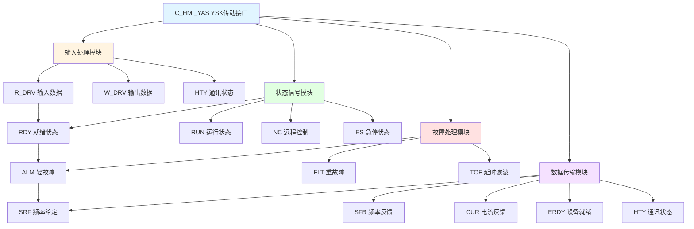

# C_HMI_YAS 功能块分析报告

## 基本信息

| 项目 | 内容 |
|------|------|
| 功能块名称 | C_HMI_YAS |
| 功能描述 | HMI Drive YSK Interface（HMI YSK传动接口） |
| 最后修改 | 2018.06.08 |
| 作者 | ZhangXiaoLiang |
| 页数 | 1页（12个程序段） |

## 功能概述

C_HMI_YAS是一个专门用于YSK系列传动的HMI接口功能块。该功能块将传动设备的各种状态信号转换为HMI显示所需的格式，包括就绪、运行、轻故障、重故障、通讯状态等信号的处理。

### 应用场景
- **YSK传动监控**：监控YSK系列变频器/传动设备
- **HMI状态显示**：为HMI提供设备状态显示数据
- **故障报警处理**：处理传动设备的故障和报警信号
- **数据采集**：采集传动设备的运行数据

### 功能特点
1. **状态信号处理**：处理就绪、运行、故障等状态信号
2. **延时滤波**：对故障信号进行延时滤波处理
3. **通讯状态**：显示设备通讯状态
4. **数据传输**：传输频率给定、频率反馈、电流反馈等数据

## 思维导图

## 流程路径描述

### 状态信号路径：
开始 → 读取R_DRV状态 → 直接输出到HMI_YAS
**功能**: 将传动状态直接传递到HMI接口

### 故障处理路径：
开始 → 读取故障信号 → TOF延时滤波 → 输出到HMI_YAS
**功能**: 对故障信号进行延时滤波后输出

### 数据传输路径：
开始 → 读取W_DRV/R_DRV数据 → MOVE传输 → 输出到HMI_YAS
**功能**: 将传动数据传输到HMI接口

## 逐帧功能分析

### Rung 1: 报警延时时间设置

**功能描述**: 设置故障报警的延时时间

**输出功能**:
| 信号名称 | 信号描述 | 信号类型 |
|----------|----------|----------|
| ALM_TIME | 报警延时时间 | DINT |

**触发逻辑**:
- ALM_TIME = 5000 (毫秒)

**功能实现**: 
使用MOVE_DINT将5000ms设置为报警延时时间。

### Rung 2: 就绪状态

**功能描述**: 输出传动就绪状态

**输入条件**:
| 信号名称 | 信号描述 | 信号类型 | 触发值 |
|----------|----------|----------|--------|
| R_DRV.RDY | 传动就绪 | BOOL | TRUE |

**输出功能**:
| 信号名称 | 信号描述 | 信号类型 |
|----------|----------|----------|
| HMI_YAS.RDY | HMI就绪状态 | BOOL |

**触发逻辑**:
- HMI_YAS.RDY = R_DRV.RDY

**功能实现**: 
直接将R_DRV.RDY传递到HMI_YAS.RDY输出。

### Rung 3: 运行状态

**功能描述**: 输出传动运行状态

**输入条件**:
| 信号名称 | 信号描述 | 信号类型 | 触发值 |
|----------|----------|----------|--------|
| R_DRV.RUN | 传动运行 | BOOL | TRUE |

**输出功能**:
| 信号名称 | 信号描述 | 信号类型 |
|----------|----------|----------|
| HMI_YAS.RUN | HMI运行状态 | BOOL |

**触发逻辑**:
- HMI_YAS.RUN = R_DRV.RUN

**功能实现**: 
直接将R_DRV.RUN传递到HMI_YAS.RUN输出。

### Rung 4: 轻故障处理

**功能描述**: 对轻故障信号进行延时滤波

**输入条件**:
| 信号名称 | 信号描述 | 信号类型 | 触发值 |
|----------|----------|----------|--------|
| R_DRV.Alarm | 轻故障信号 | BOOL | TRUE |
| ALM_TIME | 延时时间 | DINT | 5000 |

**输出功能**:
| 信号名称 | 信号描述 | 信号类型 |
|----------|----------|----------|
| HMI_YAS.ALM | HMI轻故障 | BOOL |

**触发逻辑**:
- 使用TOF（断电延时）对Alarm信号进行滤波
- 延时5秒后故障信号复位

**功能实现**: 
调用TOF功能块，当Alarm信号消失后延时5秒才复位HMI_YAS.ALM。

### Rung 5: 重故障处理

**功能描述**: 对重故障信号进行延时滤波

**输入条件**:
| 信号名称 | 信号描述 | 信号类型 | 触发值 |
|----------|----------|----------|--------|
| R_DRV.Fault | 重故障信号 | BOOL | TRUE |
| ALM_TIME | 延时时间 | DINT | 5000 |

**输出功能**:
| 信号名称 | 信号描述 | 信号类型 |
|----------|----------|----------|
| HMI_YAS.FLT | HMI重故障 | BOOL |

**触发逻辑**:
- 使用TOF对Fault信号进行滤波
- 延时5秒后故障信号复位

**功能实现**: 
调用TOF功能块，对重故障信号进行断电延时处理。

### Rung 6: 远程控制状态

**功能描述**: 输出远程控制状态

**输入条件**:
| 信号名称 | 信号描述 | 信号类型 | 触发值 |
|----------|----------|----------|--------|
| R_DRV.NC | 远程控制 | BOOL | TRUE |

**输出功能**:
| 信号名称 | 信号描述 | 信号类型 |
|----------|----------|----------|
| HMI_YAS.NC | HMI远程控制 | BOOL |

**触发逻辑**:
- HMI_YAS.NC = R_DRV.NC

### Rung 7: 急停状态

**功能描述**: 输出急停状态

**输入条件**:
| 信号名称 | 信号描述 | 信号类型 | 触发值 |
|----------|----------|----------|--------|
| R_DRV.BSP6 | 急停信号 | BOOL | TRUE |

**输出功能**:
| 信号名称 | 信号描述 | 信号类型 |
|----------|----------|----------|
| HMI_YAS.ES | HMI急停 | BOOL |

**触发逻辑**:
- HMI_YAS.ES = R_DRV.BSP6

### Rung 8: 通讯状态

**功能描述**: 输出通讯状态

**输入条件**:
| 信号名称 | 信号描述 | 信号类型 | 触发值 |
|----------|----------|----------|--------|
| HTY | 通讯正常 | BOOL | TRUE |

**输出功能**:
| 信号名称 | 信号描述 | 信号类型 |
|----------|----------|----------|
| HMI_YAS.HTY | HMI通讯状态 | BOOL |

**触发逻辑**:
- HMI_YAS.HTY = HTY

### Rung 9: 设备就绪

**功能描述**: 对设备就绪信号进行延时确认

**输入条件**:
| 信号名称 | 信号描述 | 信号类型 | 触发值 |
|----------|----------|----------|--------|
| ERDY | 设备就绪 | BOOL | TRUE |
| ALM_TIME | 延时时间 | DINT | 5000 |

**输出功能**:
| 信号名称 | 信号描述 | 信号类型 |
|----------|----------|----------|
| HMI_YAS.ERDY | HMI设备就绪 | BOOL |

**触发逻辑**:
- 使用TON（通电延时）确认设备就绪
- 延时5秒后才确认就绪

**功能实现**: 
调用TON功能块，设备就绪信号需持续5秒后才输出。

### Rung 10: 频率给定传输

**功能描述**: 传输频率给定值

**输入条件**:
| 信号名称 | 信号描述 | 信号类型 | 触发值 |
|----------|----------|----------|--------|
| W_DRV.HzREF | 频率给定 | INT | 数值 |

**输出功能**:
| 信号名称 | 信号描述 | 信号类型 |
|----------|----------|----------|
| HMI_YAS.SRF | HMI速度参考 | INT |

**触发逻辑**:
- HMI_YAS.SRF = W_DRV.HzREF

### Rung 11: 频率反馈传输

**功能描述**: 传输频率反馈值

**输入条件**:
| 信号名称 | 信号描述 | 信号类型 | 触发值 |
|----------|----------|----------|--------|
| R_DRV.HZFBK | 频率反馈 | INT | 数值 |

**输出功能**:
| 信号名称 | 信号描述 | 信号类型 |
|----------|----------|----------|
| HMI_YAS.SFB | HMI速度反馈 | INT |

**触发逻辑**:
- HMI_YAS.SFB = R_DRV.HZFBK

### Rung 12: 电流反馈传输

**功能描述**: 传输电流反馈值

**输入条件**:
| 信号名称 | 信号描述 | 信号类型 | 触发值 |
|----------|----------|----------|--------|
| R_DRV.CURFBK | 电流反馈 | INT | 数值 |

**输出功能**:
| 信号名称 | 信号描述 | 信号类型 |
|----------|----------|----------|
| HMI_YAS.CUR | HMI电流 | INT |

**触发逻辑**:
- HMI_YAS.CUR = R_DRV.CURFBK

## 触发条件总结

### 状态信号
- **就绪**: R_DRV.RDY = TRUE
- **运行**: R_DRV.RUN = TRUE
- **远程**: R_DRV.NC = TRUE
- **急停**: R_DRV.BSP6 = TRUE

### 故障信号
- **轻故障**: R_DRV.Alarm = TRUE，延时5秒复位
- **重故障**: R_DRV.Fault = TRUE，延时5秒复位

### 数据传输
- **频率给定**: W_DRV.HzREF
- **频率反馈**: R_DRV.HZFBK
- **电流反馈**: R_DRV.CURFBK

## 实现功能总结

### 主要功能
1. **状态监控**: 监控传动设备的各种运行状态
2. **故障处理**: 对故障信号进行延时滤波
3. **数据传输**: 传输频率和电流等运行数据
4. **通讯状态**: 显示设备通讯状态

### 信号处理方式
| 信号类型 | 处理方式 | 说明 |
|----------|----------|------|
| 状态信号 | 直接传递 | 无延时 |
| 故障信号 | TOF延时 | 断电延时5秒 |
| 就绪确认 | TON延时 | 通电延时5秒 |
| 数据信号 | MOVE传输 | 直接传输 |

## 关键信号说明

| 信号名称 | 信号描述 | 信号类型 | 用途 |
|----------|----------|----------|------|
| R_DRV.RDY | 传动就绪 | BOOL | 就绪状态输入 |
| R_DRV.RUN | 传动运行 | BOOL | 运行状态输入 |
| R_DRV.Alarm | 轻故障 | BOOL | 轻故障输入 |
| R_DRV.Fault | 重故障 | BOOL | 重故障输入 |
| R_DRV.NC | 远程控制 | BOOL | 远程状态输入 |
| R_DRV.BSP6 | 急停 | BOOL | 急停状态输入 |
| HTY | 通讯正常 | BOOL | 通讯状态输入 |
| W_DRV.HzREF | 频率给定 | INT | 频率给定输入 |
| R_DRV.HZFBK | 频率反馈 | INT | 频率反馈输入 |
| R_DRV.CURFBK | 电流反馈 | INT | 电流反馈输入 |
| HMI_YAS.* | HMI输出 | 各类型 | HMI接口输出 |

## 调试技巧

### 调试步骤
1. 检查R_DRV和W_DRV数据是否正常
2. 监控各状态信号是否正确传递
3. 验证故障延时功能是否正常
4. 检查数据传输是否正确

### 常见问题
1. **状态不显示**: 检查R_DRV信号源
2. **故障不消失**: 检查TOF延时设置
3. **数据不更新**: 检查通讯状态HTY
4. **就绪不确认**: 检查TON延时

### 监控信号列表
- HMI_YAS.RDY（就绪状态）
- HMI_YAS.RUN（运行状态）
- HMI_YAS.ALM（轻故障）
- HMI_YAS.FLT（重故障）
- HMI_YAS.SRF（频率给定）
- HMI_YAS.SFB（频率反馈）
- HMI_YAS.CUR（电流反馈）
