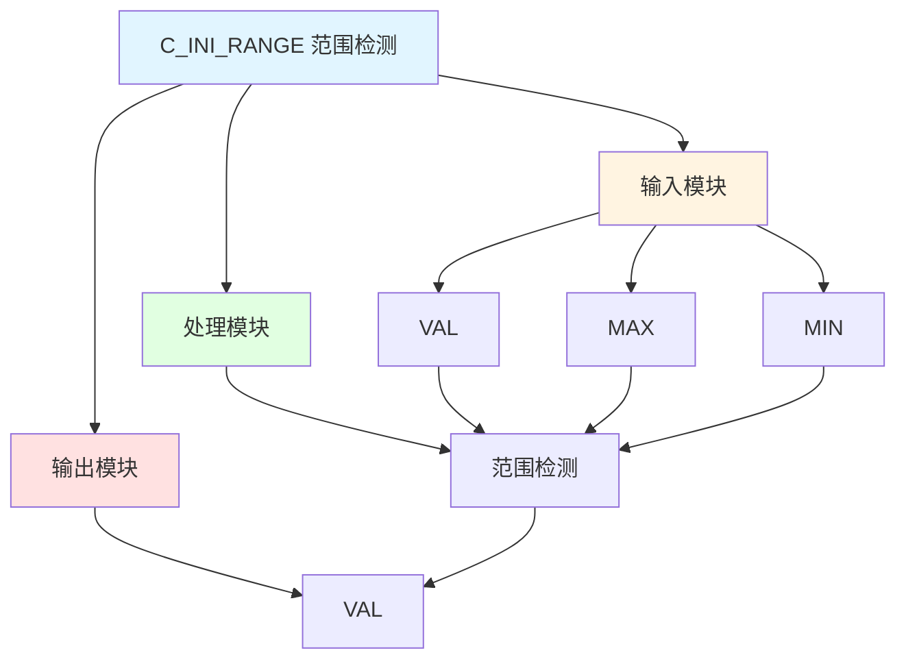

# C_INI_RANGE 功能块分析报告

## 基本信息

| 项目 | 内容 |
|------|------|
| 功能块名称 | C_INI_RANGE |
| 功能描述 | The value is in range（值在范围内） |
| 最后修改 | 2024.05.15 |
| 作者 | Zhu Guang Bin |
| 页数 | 1页 |

## 功能概述

C_INI_RANGE 是一个范围检测功能块，用于检测整数值是否在指定范围内。

## 思维导图

## 流程路径描述

### 范围检测路径：
开始 → VAL → 范围检测 → 输出VAL
**功能**: 检测值是否在范围内

## 逐帧功能分析

### Rung 7: 范围检测

**功能描述**: 检测VAL是否在MAX和MIN范围内

**输入条件**:
| 信号名称 | 信号描述 | 信号类型 | 触发值 |
|----------|----------|----------|--------|
| VAL | 前值 | INT | 数值 |
| MAX | 最大值 | INT | 设定值 |
| MIN | 最小值 | INT | 设定值 |

**输出功能**:
| 信号名称 | 信号描述 | 信号类型 |
|----------|----------|----------|
| VAL | 前值 | INT |

**触发逻辑**:
- IF MIN <= VAL <= MAX THEN VAL保持不变
- ELSE VAL = 0

**功能实现**: 
使用LE和GE功能块，检测VAL是否在MIN和MAX范围内。

## 触发条件总结

### 范围条件
- **在范围内**: MIN <= VAL <= MAX
- **超出范围**: VAL < MIN OR VAL > MAX

## 实现功能总结

### 主要功能
1. **范围检测**: 检测值是否在指定范围内

## 关键信号说明

| 信号名称 | 信号描述 | 信号类型 | 用途 |
|----------|----------|----------|------|
| VAL | 前值 | INT | 输入值 |
| MAX | 最大值 | INT | 最大值 |
| MIN | 最小值 | INT | 最小值 |

## 调试技巧

### 调试步骤
1. 检查VAL值，确认输入正常
2. 检查MAX和MIN值，确认范围设置
3. 监控VAL值，观察范围检测

### 常见问题
1. **范围检测不工作**: 检查MAX和MIN值设置

### 监控信号列表
- VAL（输入值）
- MAX（最大值）
- MIN（最小值）
