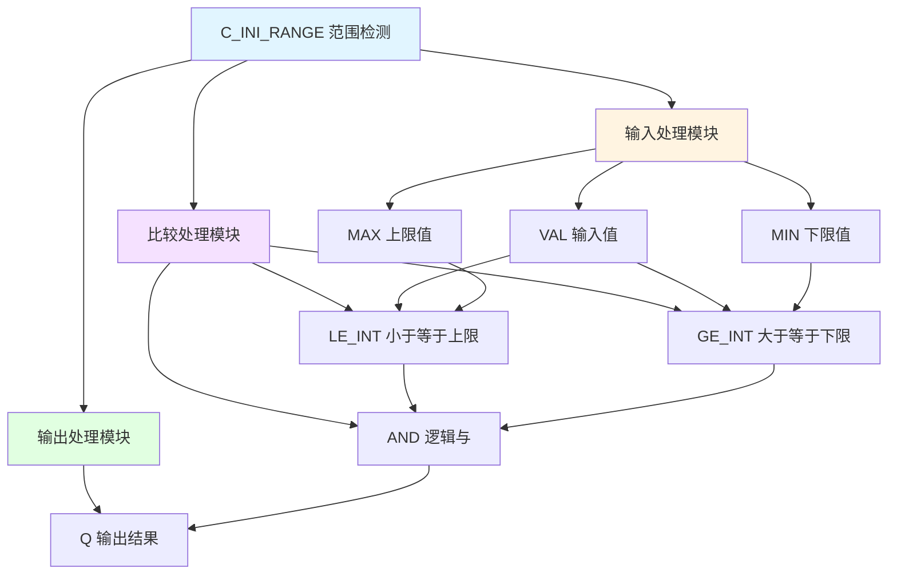

# C_INI_RANGE 功能块分析报告

## 基本信息

| 项目 | 内容 |
|------|------|
| 功能块名称 | C_INI_RANGE |
| 功能描述 | The value is in range（值在范围内检测-INT类型） |
| 最后修改 | 2024.05.15 |
| 作者 | ZhuGuangBin |
| 页数 | 1页（1个程序段） |

## 功能概述

C_INI_RANGE是一个范围检测功能块，用于检测INT类型的输入值是否在指定的上下限范围内。当值在范围内时，输出Q为TRUE。

### 应用场景
- **范围检测**：检测变量是否在有效范围内
- **限位检查**：检查位置、速度等是否在安全范围内
- **数据验证**：验证输入数据是否有效
- **报警检测**：检测是否超出正常工作范围

### 功能特点
1. **范围检测**：检测值是否在MIN和MAX之间
2. **INT类型**：支持整数类型运算
3. **布尔输出**：输出布尔类型结果

## 思维导图



## 流程路径描述

### 范围检测路径：
开始 → 检测VAL≤MAX → 检测VAL≥MIN → 逻辑与 → 输出Q
**功能**: 检测输入值是否在范围内

## 逐帧功能分析

### Rung 1: 范围检测

**功能描述**: 检测VAL是否在MIN和MAX范围内

**输入条件**:
| 信号名称 | 信号描述 | 信号类型 | 触发值 |
|----------|----------|----------|--------|
| VAL | 输入值 | INT | 数值 |
| MIN | 下限值 | INT | 设定值 |
| MAX | 上限值 | INT | 设定值 |

**输出功能**:
| 信号名称 | 信号描述 | 信号类型 |
|----------|----------|----------|
| Q | 输出结果 | BOOL |

**触发逻辑**:
- IF VAL ≤ MAX AND VAL ≥ MIN THEN Q = TRUE
- ELSE Q = FALSE

**功能实现**: 
1. 使用LE_INT检测VAL是否小于等于MAX
2. 使用GE_INT检测VAL是否大于等于MIN
3. 使用AND逻辑将两个条件相与
4. 输出Q为布尔类型结果

## 触发条件总结

### 在范围内条件
- **VAL ≤ MAX**: 输入值小于等于上限
- **VAL ≥ MIN**: 输入值大于等于下限
- **两个条件同时满足**: Q = TRUE

### 超出范围条件
- **VAL > MAX**: 输入值大于上限
- **VAL < MIN**: 输入值小于下限
- **任一条件不满足**: Q = FALSE

## 实现功能总结

### 主要功能
1. **范围检测**: 检测值是否在指定范围内
2. **布尔输出**: 输出TRUE或FALSE

### 计算公式
```
Q = (VAL ≥ MIN) AND (VAL ≤ MAX)
```

### 输入输出关系
| VAL | MIN | MAX | Q |
|-----|-----|-----|---|
| 50 | 0 | 100 | TRUE |
| 150 | 0 | 100 | FALSE |
| -10 | 0 | 100 | FALSE |
| 0 | 0 | 100 | TRUE |
| 100 | 0 | 100 | TRUE |

## 关键信号说明

| 信号名称 | 信号描述 | 信号类型 | 用途 |
|----------|----------|----------|------|
| VAL | 输入值 | INT | 待检测的值 |
| MIN | 下限值 | INT | 范围下限 |
| MAX | 上限值 | INT | 范围上限 |
| Q | 输出结果 | BOOL | 是否在范围内 |

## 调试技巧

### 调试步骤
1. 检查VAL输入值是否正常
2. 验证MIN和MAX设置是否正确
3. 监控Q输出结果
4. 测试边界值

### 常见问题
1. **输出始终为FALSE**: 检查MIN和MAX设置
2. **边界值处理**: 确认是否包含边界值
3. **MIN > MAX**: 检查参数设置是否正确

### 监控信号列表
- VAL（输入值）
- MIN/MAX（范围设置）
- Q（输出结果）
