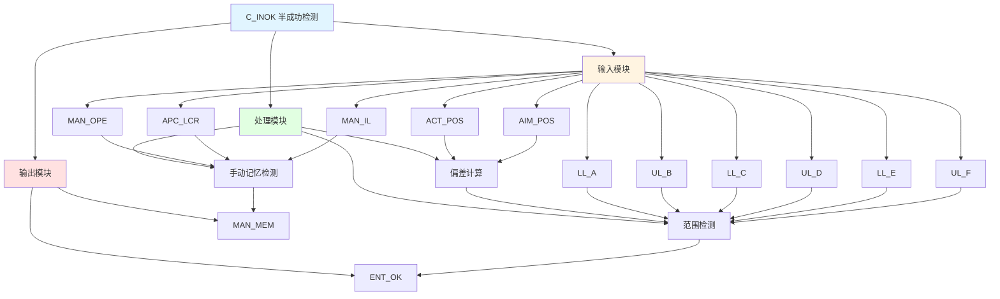

# C_INOK 功能块分析报告

## 基本信息

| 项目 | 内容 |
|------|------|
| 功能块名称 | C_INOK |
| 功能描述 | Automatic Position Control Semi-Successful Detection（自动位置控制半成功检测） |
| 最后修改 | 2016.01.06 |
| 作者 | Gao Weidi |
| 页数 | 1页 |

## 功能概述

C_INOK 是一个自动位置控制半成功检测功能块，用于检测位置控制是否在允许的偏差范围内。该功能块支持多种偏差范围检测，并输出进入OK状态。

## 思维导图

## 流程路径描述

### 偏差计算路径：
开始 → ACT_POS - AIM_POS → 偏差值
**功能**: 计算位置偏差

### 范围检测路径：
开始 → 偏差值 → 范围比较 → ENT_OK输出
**功能**: 检测偏差是否在允许范围内

## 逐帧功能分析

### Rung 7: 手动记忆检测

**功能描述**: 检测手动操作记忆

**输入条件**:
| 信号名称 | 信号描述 | 信号类型 | 触发值 |
|----------|----------|----------|--------|
| MAN_OPE | 手动操作 | BOOL | TRUE/FALSE |
| MAN_OFT | 手动断开延时时间 | DINT | 设定值 |
| APC_LCR | APC运行 | BOOL | FALSE |
| MAN_IL | 手动联锁 | BOOL | TRUE |

**输出功能**:
| 信号名称 | 信号描述 | 信号类型 |
|----------|----------|----------|
| MAN_MEM | 手动记忆 | BOOL |

**触发逻辑**:
- IF MAN_OPE下降延 AND NOT FST_SCN AND NOT APC_LCR AND MAN_IL THEN MAN_MEM = TRUE

**功能实现**: 
使用TOF断开延时定时器和FTRIG下降沿检测，当手动操作结束且满足条件时，产生手动记忆信号。

### Rung 8: 偏差计算

**功能描述**: 计算位置偏差

**输入条件**:
| 信号名称 | 信号描述 | 信号类型 | 触发值 |
|----------|----------|----------|--------|
| ACT_POS | 实际位置 | REAL | 数值 |
| AIM_POS | 目标位置 | REAL | 数值 |

**输出功能**:
| 信号名称 | 信号描述 | 信号类型 |
|----------|----------|----------|
| DEV | 偏差值 | REAL |

**触发逻辑**:
- DEV = ACT_POS - AIM_POS

**功能实现**: 
使用SUB减法功能块计算实际位置与目标位置的偏差。

### Rung 9: 范围检测

**功能描述**: 检测偏差是否在允许范围内

**输入条件**:
| 信号名称 | 信号描述 | 信号类型 | 触发值 |
|----------|----------|----------|--------|
| DEV | 偏差值 | REAL | 数值 |
| LL_A | 下限A | REAL | 设定值 |
| UL_B | 上限B | REAL | 设定值 |
| LL_C | 下限C | REAL | 设定值 |
| UL_D | 上限D | REAL | 设定值 |
| LL_E | 下限E | REAL | 设定值 |
| UL_F | 上限F | REAL | 设定值 |
| APC_LCR | APC运行 | BOOL | TRUE/FALSE |
| MAN_MEM | 手动记忆 | BOOL | TRUE/FALSE |

**输出功能**:
| 信号名称 | 信号描述 | 信号类型 |
|----------|----------|----------|
| ENT_OK | 进入OK | BOOL |

**触发逻辑**:
- IF LL_A <= DEV <= UL_B THEN ENT_OK = TRUE
- IF LL_C <= DEV <= UL_D AND APC_LCR THEN ENT_OK = TRUE
- IF LL_E <= DEV <= UL_F AND MAN_MEM THEN ENT_OK = TRUE

**功能实现**: 
使用LE比较器检测偏差是否在多个允许范围内，根据不同条件输出ENT_OK信号。

## 触发条件总结

### 检测条件
- **范围A检测**: LL_A <= DEV <= UL_B
- **范围C检测**: LL_C <= DEV <= UL_D AND APC_LCR
- **范围E检测**: LL_E <= DEV <= UL_F AND MAN_MEM

## 实现功能总结

### 主要功能
1. **偏差计算**: 计算实际位置与目标位置的偏差
2. **手动记忆检测**: 检测手动操作记忆
3. **范围检测**: 检测偏差是否在允许范围内

## 关键信号说明

| 信号名称 | 信号描述 | 信号类型 | 用途 |
|----------|----------|----------|------|
| ACT_POS | 实际位置 | REAL | 实际位置输入 |
| AIM_POS | 目标位置 | REAL | 目标位置输入 |
| DEV | 偏差值 | REAL | 位置偏差 |
| LL_A~LL_E | 下限值 | REAL | 偏差下限设定 |
| UL_B~UL_F | 上限值 | REAL | 偏差上限设定 |
| MAN_OPE | 手动操作 | BOOL | 手动操作信号 |
| APC_LCR | APC运行 | BOOL | APC运行状态 |
| MAN_MEM | 手动记忆 | BOOL | 手动记忆状态 |
| ENT_OK | 进入OK | BOOL | 半成功检测输出 |

## 调试技巧

### 调试步骤
1. 检查ACT_POS和AIM_POS值，确认位置输入正常
2. 检查DEV值，观察偏差计算结果
3. 检查LL_A~LL_E和UL_B~UL_F值，确认范围设置
4. 监控ENT_OK信号，确认半成功检测

### 常见问题
1. **ENT_OK不输出**: 检查偏差值和范围设置
2. **手动记忆不工作**: 检查MAN_OPE和MAN_IL信号

### 监控信号列表
- ACT_POS、AIM_POS（位置输入）
- DEV（偏差值）
- MAN_OPE、APC_LCR（控制信号）
- ENT_OK（输出）
