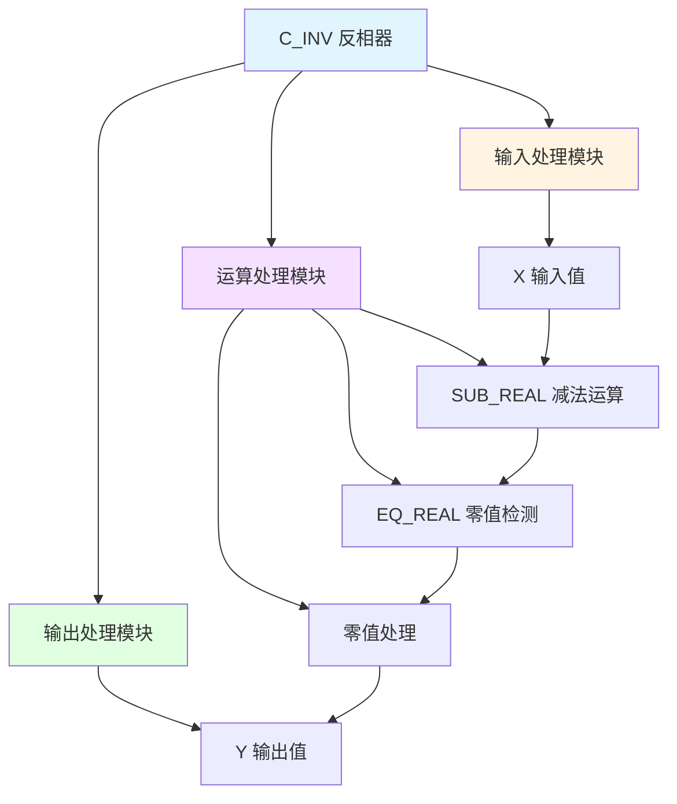

# C_INV 功能块分析报告

## 基本信息

| 项目 | 内容 |
|------|------|
| 功能块名称 | C_INV |
| 功能描述 | Inverter(REAL type)（反相器-REAL类型） |
| 最后修改 | 2015.11.20 |
| 作者 | ShiChunLiang |
| 页数 | 1页（1个程序段） |

## 功能概述

C_INV是一个反相器功能块，用于将输入值取反输出。当输入值为零时，输出也为零。该功能块实现了简单的数学取反运算。

### 应用场景
- **信号反相**：将正信号转换为负信号
- **方向反转**：实现控制方向的反转
- **误差计算**：计算设定值与实际值的反向偏差
- **补偿计算**：用于控制系统的补偿计算

### 功能特点
1. **取反运算**：输出等于输入的负值
2. **零值处理**：输入为零时输出也为零
3. **REAL类型**：支持实数类型运算

## 思维导图



## 流程路径描述

### 取反运算路径：
开始 → 读取X → 计算0.0 - X → 检测结果是否为零 → 输出Y
**功能**: 将输入值取反后输出

## 逐帧功能分析

### Rung 1: 取反运算

**功能描述**: 计算输入值的相反数

**输入条件**:
| 信号名称 | 信号描述 | 信号类型 | 触发值 |
|----------|----------|----------|--------|
| X | 输入值 | REAL | 数值 |

**输出功能**:
| 信号名称 | 信号描述 | 信号类型 |
|----------|----------|----------|
| Y | 输出值 | REAL |

**触发逻辑**:
- Y = 0.0 - X
- IF Y = 0.0 THEN Y = 0.0（强制零值处理）

**功能实现**: 
1. 使用SUB_REAL计算0.0减去X，得到Y
2. 使用EQ_REAL检测结果是否为零
3. 如果为零，使用MOVE_REAL强制输出0.0

## 触发条件总结

### 运算条件
- **正常运算**: 每个扫描周期执行一次
- **零值处理**: 当计算结果为零时

### 输出条件
- **Y输出**: 输入值的相反数

## 实现功能总结

### 主要功能
1. **取反运算**: 输出等于输入的负值
2. **零值处理**: 输入为零时输出也为零

### 计算公式
```
Y = -X
```

### 输入输出关系
| X值 | Y值 |
|-----|-----|
| 10.0 | -10.0 |
| 0.0 | 0.0 |
| -5.0 | 5.0 |

## 关键信号说明

| 信号名称 | 信号描述 | 信号类型 | 用途 |
|----------|----------|----------|------|
| X | 输入值 | REAL | 输入信号 |
| Y | 输出值 | REAL | 取反后的输出 |

## 调试技巧

### 调试步骤
1. 检查X输入是否正常
2. 监控Y输出是否正确
3. 验证零值处理是否正常

### 常见问题
1. **输出不正确**: 检查输入值是否正确
2. **零值处理异常**: 检查EQ_REAL比较逻辑

### 监控信号列表
- X（输入值）
- Y（输出值）
