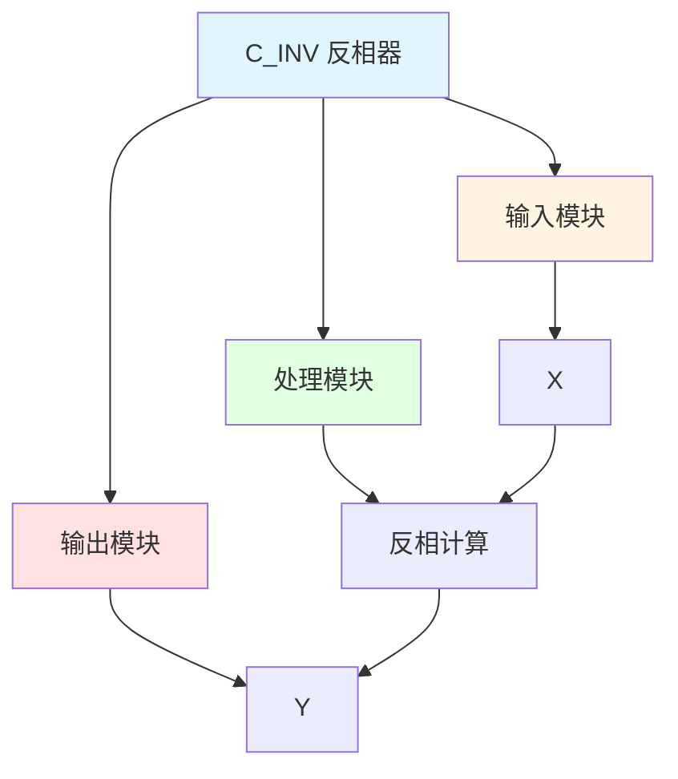

# C_INV 功能块分析报告

## 基本信息

| 项目 | 内容 |
|------|------|
| 功能块名称 | C_INV |
| 功能描述 | Inverter(REAL type)（反相器，实数类型） |
| 最后修改 | 2015.11.20 |
| 作者 | Shi Chun Liang |
| 页数 | 1页 |

## 功能概述

C_INV 是一个反相器功能块，用于实现反相控制。当输入值为0时，输出为0.0；当输入值不为0时，输出为输入值的反相。

## 思维导图

## 流程路径描述

### 反相路径：
开始 → X → 反相计算 → 输出Y
**功能**: 实现反相控制

## 逐帧功能分析

### Rung 7: 反相计算

**功能描述**: 计算输入值的反相

**输入条件**:
| 信号名称 | 信号描述 | 信号类型 | 触发值 |
|----------|----------|----------|--------|
| X | 输入 | REAL | 数值 |

**输出功能**:
| 信号名称 | 信号描述 | 信号类型 |
|----------|----------|----------|
| Y | 反相输出 | REAL |

**触发逻辑**:
- IF X = 0.0 THEN Y = 0.0
- ELSE Y = 0.0 - X

**功能实现**: 
使用SUB功能块，计算0.0减去X，实现反相功能。

## 触发条件总结

### 反相条件
- **反相计算**: X有值

## 实现功能总结

### 主要功能
1. **反相控制**: 实现反相控制功能

## 关键信号说明

| 信号名称 | 信号描述 | 信号类型 | 用途 |
|----------|----------|----------|------|
| X | 输入 | REAL | 输入值 |
| Y | 反相输出 | REAL | 反相输出 |

## 调试技巧

### 调试步骤
1. 检查X值，确认输入正常
2. 监控Y值，观察反相输出

### 常见问题
1. **反相不正确**: 检查X值

### 监控信号列表
- X（输入）
- Y（输出）
