# C_IPLN40 功能块分析报告

## 基本信息

| 项目 | 内容 |
|------|------|
| 功能块名称 | C_IPLN40 |
| 功能描述 | Interpolator 40（插值器40） |
| 最后修改 | 2015.11.20 |
| 作者 | Shi Chun Liang |
| 页数 | 1页 |

## 功能概述

C_IPLN40 是一个插值器功能块，用于实现插值功能。

## 思维导图

```mermaid
graph TD
    A[C_IPLN40 插值器] --> B[输入模块]
    A --> C[处理模块]
    A --> D[输出模块]
    
    B --> B1[X]
    B --> B2[X1]
    B --> B3[X2]
    B --> B4[X3]
    B --> B5[X4]
    B --> B6[X5]
    B --> B7[X6]
    B --> B8[X7]
    B --> B9[X8]
    B --> B10[X9]
    B --> B11[X10]
    B --> B12[X11]
    B --> B13[X12]
    B --> B14[X13]
    B --> B15[X14]
    B --> B16[X15]
    B --> B17[X16]
    B --> B18[X17]
    B --> B19[X18]
    B --> B20[X19]
    B --> B21[X20]
    B --> B22[X21]
    B --> B23[X22]
    B --> B24[X23]
    B --> B25[X24]
    B --> B26[X25]
    B --> B27[X26]
    B --> B28[X27]
    B --> B29[X28]
    B --> B30[X29]
    B --> B31[X30]
    B --> B32[X31]
    B --> B33[X32]
    B --> B34[X33]
    B --> B35[X34]
    B --> B36[X35]
    B --> B37[X36]
    B --> B38[X37]
    B --> B39[X38]
    B --> B40[X39]
    
    C --> C1[插值计算]
    
    D --> D1[Y]
    
    B1 --> C1
    C1 --> D1
    
    style A fill:#e1f5ff
    style B fill:#fff4e1
    style C fill:#e1ffe1
    style D fill:#ffe1e1
```

## 流程路径描述

### 插值路径：
开始 → X → 插值计算 → 输出Y
**功能**: 实现插值功能

## 逐帧功能分析

### Rung 7: 插值计算

**功能描述**: 计算插值输出

**输入条件**:
| 信号名称 | 信号描述 | 信号类型 | 触发值 |
|----------|----------|----------|--------|
| X | 输入 | DINT | 数值 |
| X1-X40 | 插值点 | DINT | 设定值 |

**输出功能**:
| 信号名称 | 信号描述 | 信号类型 |
|----------|----------|----------|
| Y | 输出 | DINT |

**触发逻辑**:
- Y = 插值计算(X, X1-X40)

**功能实现**: 
使用插值算法，根据输入值和插值点计算输出。

## 触发条件总结

### 插值条件
- **插值计算**: X和X1-X40都有值

## 实现功能总结

### 主要功能
1. **插值功能**: 实现40点插值功能

## 关键信号说明

| 信号名称 | 信号描述 | 信号类型 | 用途 |
|----------|----------|----------|------|
| X | 输入 | DINT | 输入值 |
| X1-X40 | 插值点 | DINT | 插值点 |
| Y | 输出 | DINT | 插值输出值 |

## 调试技巧

### 调试步骤
1. 检查X值，确认输入正常
2. 检查X1-X40值，确认插值点设置
3. 监控Y值，观察插值输出

### 常见问题
1. **插值不工作**: 检查X1-X40值设置
2. **输出不正确**: 检查X值和X1-X40值

### 监控信号列表
- X（输入）
- X1-X40（插值点）
- Y（输出）
