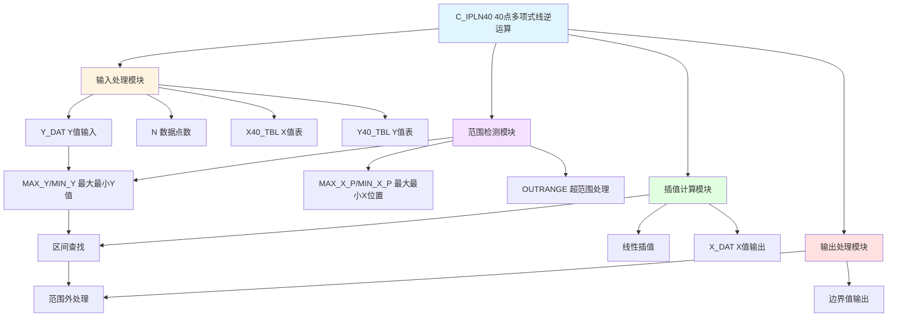

# C_IPLN40 功能块分析报告

## 基本信息

| 项目 | 内容 |
|------|------|
| 功能块名称 | C_IPLN40 |
| 功能描述 | Inverse of 40-Points Polynomial Line（40点多项式线的逆） |
| 最后修改 | 2016.03.14 |
| 作者 | GaoWeidi |
| 页数 | 1页（约20个程序段） |

## 功能概述

C_IPLN40是一个40点多项式线逆运算功能块，用于根据Y值查找对应的X值。该功能块实现了多项式曲线的逆运算，适用于需要根据输出值反推输入值的场合。

### 应用场景
- **曲线逆运算**：根据输出值查找输入值
- **传感器校准**：根据测量值反推实际值
- **非线性转换**：实现非线性关系的逆转换
- **位置控制**：根据位置反馈计算控制量

### 功能特点
1. **40点插值**：支持最多40个数据点的插值
2. **逆运算**：根据Y值查找X值
3. **范围检测**：检测输入是否超出有效范围
4. **线性插值**：在数据点之间进行线性插值

## 思维导图



## 流程路径描述

### 初始化路径：
开始 → 计算END_P → 查找MAX_Y/MIN_Y → 记录MAX_X_P/MIN_X_P
**功能**: 初始化数据点范围

### 范围检测路径：
开始 → 检测Y_DAT是否在范围内 → 超范围跳转处理
**功能**: 检测输入值是否在有效范围内

### 插值计算路径：
开始 → 查找Y_DAT所在区间 → 线性插值计算X_DAT
**功能**: 根据Y值计算对应的X值

## 逐帧功能分析

### Rung 1: 计算数据点数

**功能描述**: 计算实际使用的数据点数

**输入条件**:
| 信号名称 | 信号描述 | 信号类型 | 触发值 |
|----------|----------|----------|--------|
| N | 设定点数 | INT | 数值 |

**输出功能**:
| 信号名称 | 信号描述 | 信号类型 |
|----------|----------|----------|
| END_P | 结束点位置 | INT |

**触发逻辑**:
- END_P = LIMIT(N - 1, 1, 39)

**功能实现**: 
调用SUB_INT计算N-1，调用C_LIMI限制在1~39范围内。

### Rung 2: 初始化最大最小值

**功能描述**: 初始化最大最小Y值

**输出功能**:
| 信号名称 | 信号描述 | 信号类型 |
|----------|----------|----------|
| MAX_Y | 最大Y值 | REAL |
| MIN_Y | 最小Y值 | REAL |

**触发逻辑**:
- MAX_Y = Y40_TBL[0]
- MIN_Y = Y40_TBL[0]

### Rung 3~8: 查找最大最小值

**功能描述**: 遍历数据表查找最大最小Y值

**输入条件**:
| 信号名称 | 信号描述 | 信号类型 |
|----------|----------|----------|
| Y40_TBL | Y值表 | REAL数组 |
| END_P | 结束点 | INT |

**输出功能**:
| 信号名称 | 信号描述 | 信号类型 |
|----------|----------|----------|
| MAX_Y | 最大Y值 | REAL |
| MIN_Y | 最小Y值 | REAL |
| MAX_X_P | 最大X位置 | INT |
| MIN_X_P | 最小X位置 | INT |

**触发逻辑**:
- FOR I = 0 TO END_P
- IF Y40_TBL[I] > MAX_Y THEN MAX_Y = Y40_TBL[I]
- IF Y40_TBL[I] < MIN_Y THEN MIN_Y = Y40_TBL[I]
- END_FOR

### Rung 9~11: 查找最大最小位置

**功能描述**: 查找最大最小Y值对应的X位置

**触发逻辑**:
- FOR J = 0 TO END_P
- IF Y40_TBL[J] = MAX_Y THEN MAX_X_P = J
- IF Y40_TBL[J] = MIN_Y THEN MIN_X_P = J
- END_FOR

### Rung 12: 范围检测

**功能描述**: 检测Y_DAT是否在有效范围内

**输入条件**:
| 信号名称 | 信号描述 | 信号类型 | 触发值 |
|----------|----------|----------|--------|
| Y_DAT | Y值输入 | REAL | 数值 |
| MAX_Y | 最大Y值 | REAL | 数值 |
| MIN_Y | 最小Y值 | REAL | 数值 |

**输出功能**:
| 信号名称 | 信号描述 | 信号类型 |
|----------|----------|----------|
| OUTRANGE | 超范围标志 | BOOL |

**触发逻辑**:
- IF Y_DAT > MAX_Y OR Y_DAT < MIN_Y THEN JUMP TO OUTRANGE

### Rung 13~19: 区间查找与插值

**功能描述**: 查找Y_DAT所在区间并进行线性插值

**输入条件**:
| 信号名称 | 信号描述 | 信号类型 |
|----------|----------|----------|
| Y_DAT | Y值输入 | REAL |
| Y40_TBL | Y值表 | REAL数组 |
| X40_TBL | X值表 | REAL数组 |
| END_P | 结束点 | INT |

**输出功能**:
| 信号名称 | 信号描述 | 信号类型 |
|----------|----------|----------|
| X_DAT | X值输出 | REAL |

**触发逻辑**:
- FOR XJ = 1 TO END_P
- XK = XJ - 1
- 比较Y40_TBL[XJ]和Y40_TBL[XK]，确定UP和LOW
- IF Y_DAT在[LOW, UP]区间内 THEN
  - IF UP = LOW THEN X_DAT = X40_TBL[XJ]
  - ELSE X_DAT = X40_TBL[XK] + (X40_TBL[XJ] - X40_TBL[XK]) * (Y_DAT - Y40_TBL[XK]) / (Y40_TBL[XJ] - Y40_TBL[XK])
- END_FOR

**功能实现**: 
使用线性插值公式计算X_DAT：
```
X_DAT = X_K + (X_J - X_K) * (Y_DAT - Y_K) / (Y_J - Y_K)
```

### Rung 20~23: 超范围处理

**功能描述**: 处理超出有效范围的输入值

**输入条件**:
| 信号名称 | 信号描述 | 信号类型 |
|----------|----------|----------|
| Y_DAT | Y值输入 | REAL |
| MAX_Y/MIN_Y | 最大最小Y值 | REAL |
| MAX_X_P/MIN_X_P | 最大最小X位置 | INT |

**输出功能**:
| 信号名称 | 信号描述 | 信号类型 |
|----------|----------|----------|
| XL | 边界位置 | INT |
| X_DAT | X值输出 | REAL |

**触发逻辑**:
- IF Y_DAT ≥ MAX_Y THEN XL = MAX_X_P
- IF Y_DAT ≤ MIN_Y THEN XL = MIN_X_P
- X_DAT = X40_TBL[XL]

## 触发条件总结

### 正常插值条件
- **MIN_Y ≤ Y_DAT ≤ MAX_Y**: 输入在有效范围内

### 超范围条件
- **Y_DAT > MAX_Y**: 输出最大X值
- **Y_DAT < MIN_Y**: 输出最小X值

## 实现功能总结

### 主要功能
1. **逆运算**: 根据Y值查找X值
2. **线性插值**: 在数据点之间进行插值
3. **范围检测**: 检测输入是否超范围
4. **边界处理**: 超范围时输出边界值

### 插值公式
```
X_DAT = X_K + (X_J - X_K) × (Y_DAT - Y_K) / (Y_J - Y_K)
```

## 关键信号说明

| 信号名称 | 信号描述 | 信号类型 | 用途 |
|----------|----------|----------|------|
| Y_DAT | Y值输入 | REAL | 输入Y值 |
| X_DAT | X值输出 | REAL | 输出X值 |
| N | 数据点数 | INT | 设定点数 |
| END_P | 结束点 | INT | 实际使用点数 |
| X40_TBL | X值表 | REAL[40] | X值数据表 |
| Y40_TBL | Y值表 | REAL[40] | Y值数据表 |
| MAX_Y/MIN_Y | 最大最小Y值 | REAL | Y值范围 |
| MAX_X_P/MIN_X_P | 最大最小X位置 | INT | 边界位置 |

## 调试技巧

### 调试步骤
1. 检查X40_TBL和Y40_TBL数据是否正确
2. 验证N点数设置是否正确
3. 监控MAX_Y和MIN_Y计算结果
4. 测试边界值处理
5. 验证插值计算结果

### 常见问题
1. **输出异常**: 检查数据表是否正确填充
2. **插值不准确**: 检查数据点是否足够密集
3. **超范围处理错误**: 检查MAX_Y和MIN_Y计算
4. **数组越界**: 检查N值设置

### 监控信号列表
- Y_DAT（Y值输入）
- X_DAT（X值输出）
- MAX_Y/MIN_Y（Y值范围）
- END_P（结束点位置）
- X40_TBL/Y40_TBL（数据表）
