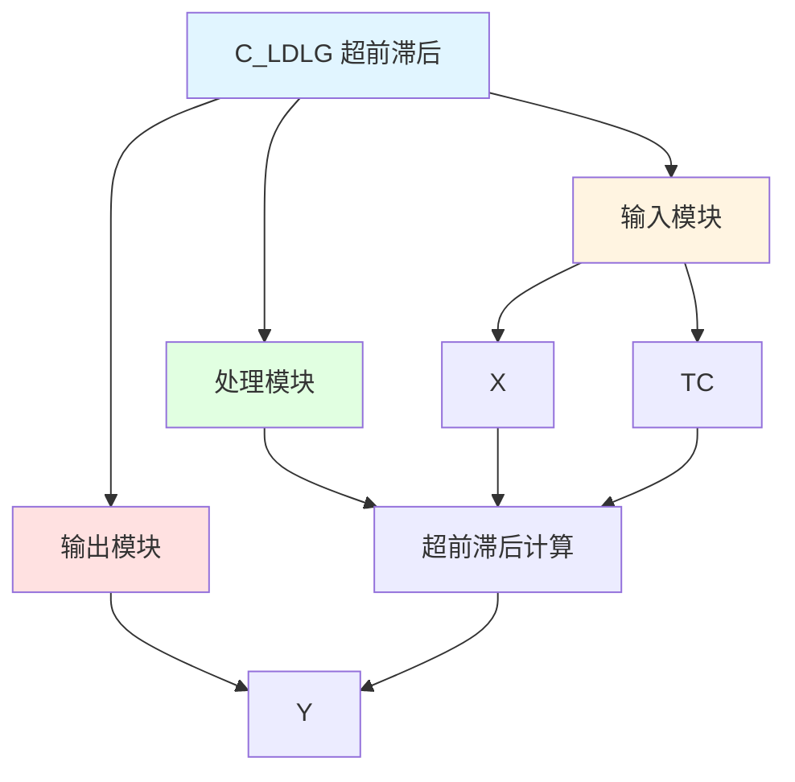

# C_LDLG 功能块分析报告

## 基本信息

| 项目 | 内容 |
|------|------|
| 功能块名称 | C_LDLG |
| 功能描述 | Lead/Lag Filter（超前/滞后滤波器） |
| 最后修改 | 2015.11.29 |
| 作者 | Shi Chun Liang |
| 页数 | 1页 |

## 功能概述

C_LDLG 是一个超前/滞后滤波器功能块，用于实现超前/滞后滤波控制功能。该功能块通过超前/滞后算法，对输入信号进行相位补偿和滤波处理。

## 思维导图

## 流程路径描述

### 超前滞后路径：
开始 → X → 超前滞后计算 → 输出Y
**功能**: 实现超前滞后控制

## 逐帧功能分析

### Rung 7: 超前滞后计算

**功能描述**: 计算超前滞后输出

**输入条件**:
| 信号名称 | 信号描述 | 信号类型 | 触发值 |
|----------|----------|----------|--------|
| X | 输入 | REAL | 数值 |
| TC | 时间常数 | REAL | 设定值 |

**输出功能**:
| 信号名称 | 信号描述 | 信号类型 |
|----------|----------|----------|
| Y | 输出 | REAL |

**触发逻辑**:
- Y = TC * X + (1 - TC) * Y

**功能实现**: 
使用MUL和ADD功能块，实现超前滞后功能。

## 触发条件总结

### 超前滞后条件
- **超前滞后计算**: X和TC都有值

## 实现功能总结

### 主要功能
1. **超前滞后功能**: 实现超前滞后控制功能

## 关键信号说明

| 信号名称 | 信号描述 | 信号类型 | 用途 |
|----------|----------|----------|------|
| X | 输入 | REAL | 输入值 |
| TC | 时间常数 | REAL | 时间常数 |
| Y | 输出 | REAL | 超前滞后输出值 |

## 调试技巧

### 调试步骤
1. 检查X值，确认输入正常
2. 检查TC值，确认时间常数设置
3. 监控Y值，观察超前滞后输出

### 常见问题
1. **超前滞后不工作**: 检查TC值设置
2. **输出不正确**: 检查X值和TC值

### 监控信号列表
- X（输入）
- TC（时间常数）
- Y（输出）
