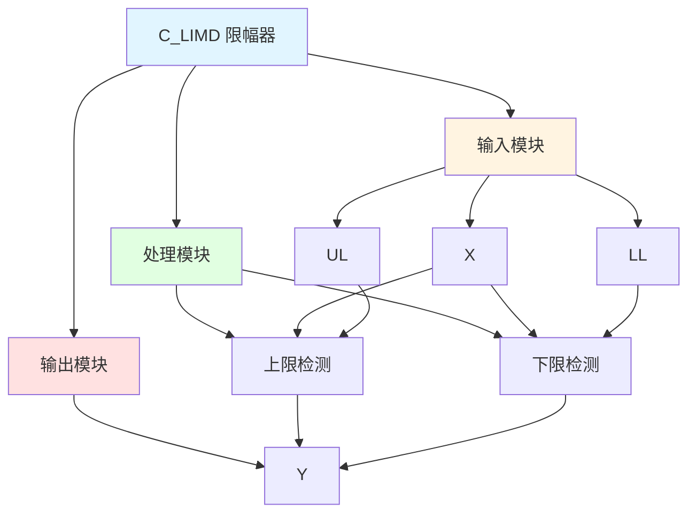

# C_LIMD 功能块分析报告

## 基本信息

| 项目 | 内容 |
|------|------|
| 功能块名称 | C_LIMD |
| 功能描述 | Limiter(DINT type)（限幅器，DINT类型） |
| 最后修改 | 2015.11.19 |
| 作者 | Shi Chun Liang |
| 页数 | 1页 |

## 功能概述

C_LIMD 是一个限幅器功能块，用于限制DINT类型输入值的范围。该功能块将输入值限制在上限和下限之间，当输入值超出范围时，输出相应的限幅值。

## 思维导图

## 流程路径描述

### 上限限幅路径：
开始 → X > UL → 输出UL
**功能**: 限制输入值不超过上限

### 下限限幅路径：
开始 → X < LL → 输出LL
**功能**: 限制输入值不低于下限

## 逐帧功能分析

### Rung 7: 上限检测

**功能描述**: 检测输入值是否超过上限

**输入条件**:
| 信号名称 | 信号描述 | 信号类型 | 触发值 |
|----------|----------|----------|--------|
| X | 输入 | DINT | 数值 |
| UL | 上限值 | DINT | 设定值 |

**输出功能**:
| 信号名称 | 信号描述 | 信号类型 |
|----------|----------|----------|
| UL1 | 上限值1 | DINT |

**触发逻辑**:
- IF X > UL THEN UL1 = UL

**功能实现**: 
使用GT功能块比较X和UL，当X大于UL时，输出上限值UL到UL1。

### Rung 7: 下限检测

**功能描述**: 检测输入值是否低于下限

**输入条件**:
| 信号名称 | 信号描述 | 信号类型 | 触发值 |
|----------|----------|----------|--------|
| X | 输入 | DINT | 数值 |
| LL | 下限值 | DINT | 设定值 |

**输出功能**:
| 信号名称 | 信号描述 | 信号类型 |
|----------|----------|----------|
| LL1 | 下限值1 | DINT |

**触发逻辑**:
- IF X < LL THEN LL1 = LL

**功能实现**: 
使用LT功能块比较X和LL，当X小于LL时，输出下限值LL到LL1。

### Rung 8: 输出

**功能描述**: 根据限幅条件输出相应值

**输入条件**:
| 信号名称 | 信号描述 | 信号类型 | 触发值 |
|----------|----------|----------|--------|
| X | 输入 | DINT | 数值 |
| UL1 | 上限值1 | DINT | 数值 |
| LL1 | 下限值1 | DINT | 数值 |

**输出功能**:
| 信号名称 | 信号描述 | 信号类型 |
|----------|----------|----------|
| Y | 输出 | DINT |

**触发逻辑**:
- IF X > UL THEN Y = UL
- IF X < LL THEN Y = LL
- ELSE Y = X

**功能实现**: 
根据上限和下限检测结果，输出相应的限幅值或输入值。

## 触发条件总结

### 限幅条件
- **上限限幅**: X > UL
- **下限限幅**: X < LL
- **正常输出**: LL <= X <= UL

## 实现功能总结

### 主要功能
1. **上限限幅**: 限制输入值不超过上限
2. **下限限幅**: 限制输入值不低于下限
3. **正常输出**: 输出正常范围内的输入值

## 关键信号说明

| 信号名称 | 信号描述 | 信号类型 | 用途 |
|----------|----------|----------|------|
| X | 输入 | DINT | 输入值 |
| UL | 上限值 | DINT | 上限设定值 |
| LL | 下限值 | DINT | 下限设定值 |
| Y | 输出 | DINT | 限幅输出值 |

## 调试技巧

### 调试步骤
1. 检查X值，确认输入正常
2. 检查UL和LL值，确认限幅范围设置正确
3. 监控Y值，观察限幅输出

### 常见问题
1. **限幅不工作**: 检查UL和LL值设置
2. **输出不正确**: 检查X值是否在限幅范围内

### 监控信号列表
- X（输入）
- UL、LL（限幅值）
- Y（输出）
