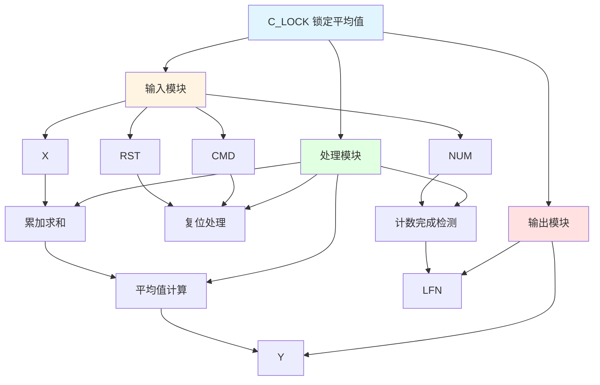

# C_LOCK 功能块分析报告

## 基本信息

| 项目 | 内容 |
|------|------|
| 功能块名称 | C_LOCK |
| 功能描述 | Lockon with Average（锁定平均值） |
| 最后修改 | 2015.11.28 |
| 作者 | Shi Chun Liang |
| 页数 | 1页 |

## 功能概述

C_LOCK 是一个锁定平均值功能块，用于在指定扫描次数内计算输入值的平均值，并在完成后锁定输出。该功能块在命令信号上升沿时复位，在达到指定扫描次数后完成锁定。

## 思维导图

## 流程路径描述

### 复位路径：
开始 → CMD上升沿 → 复位累加器和计数器
**功能**: 复位锁定功能

### 累加求和路径：
开始 → CMD有效 → 累加输入值 → 计数器递增
**功能**: 累加输入值

### 平均值计算路径：
开始 → 累加和 ÷ 计数器值 → 输出平均值
**功能**: 计算平均值

### 计数完成路径：
开始 → 计数器 >= NUM → 锁定完成标志
**功能**: 检测锁定完成

## 逐帧功能分析

### Rung 7-8: 复位处理

**功能描述**: 检测CMD上升沿并复位累加器和计数器

**输入条件**:
| 信号名称 | 信号描述 | 信号类型 | 触发值 |
|----------|----------|----------|--------|
| CMD | 命令信号 | BOOL | 上升沿 |

**输出功能**:
| 信号名称 | 信号描述 | 信号类型 |
|----------|----------|----------|
| SumInp | 输入累加和 | REAL |
| CNT | 计数器 | DINT |
| CntOvr | 计数完成标志 | BOOL |

**触发逻辑**:
- IF CMD上升沿 THEN SumInp = 0, CNT = 0, CntOvr = FALSE

**功能实现**: 
使用R_TRIG检测CMD信号的上升沿，当检测到上升沿时，复位累加器、计数器和计数完成标志。

### Rung 9-10: 累加求和与平均值计算

**功能描述**: 累加输入值并计算平均值

**输入条件**:
| 信号名称 | 信号描述 | 信号类型 | 触发值 |
|----------|----------|----------|--------|
| CMD | 命令信号 | BOOL | TRUE |
| CntOvr | 计数完成标志 | BOOL | FALSE |
| X | 输入值 | REAL | 数值 |
| NUM | 指定扫描次数 | INT | 设定值 |

**输出功能**:
| 信号名称 | 信号描述 | 信号类型 |
|----------|----------|----------|
| SumInp | 输入累加和 | REAL |
| CNT | 计数器 | DINT |
| Y | 输出平均值 | REAL |
| CntOvr | 计数完成标志 | BOOL |

**触发逻辑**:
- IF CMD = TRUE AND CntOvr = FALSE THEN SumInp = SumInp + X, CNT = CNT + 1
- Y = SumInp / CNT
- IF CNT >= NUM THEN CntOvr = TRUE

**功能实现**: 
当命令有效且未完成计数时，累加输入值并递增计数器。计算平均值并检测是否达到指定扫描次数。

### Rung 11: 锁定完成检测

**功能描述**: 检测锁定完成状态

**输入条件**:
| 信号名称 | 信号描述 | 信号类型 | 触发值 |
|----------|----------|----------|--------|
| CMD | 命令信号 | BOOL | TRUE |
| CntOvr | 计数完成标志 | BOOL | TRUE |

**输出功能**:
| 信号名称 | 信号描述 | 信号类型 |
|----------|----------|----------|
| LFN | 锁定完成 | BOOL |

**触发逻辑**:
- IF CMD = TRUE AND CntOvr = TRUE THEN LFN = TRUE

**功能实现**: 
当命令有效且计数完成时，输出锁定完成标志。

### Rung 12: 复位功能

**功能描述**: 复位锁定功能

**输入条件**:
| 信号名称 | 信号描述 | 信号类型 | 触发值 |
|----------|----------|----------|--------|
| RST | 复位信号 | BOOL | TRUE |

**输出功能**:
| 信号名称 | 信号描述 | 信号类型 |
|----------|----------|----------|
| SumInp | 输入累加和 | REAL |
| CntOvr | 计数完成标志 | BOOL |
| Y | 输出平均值 | REAL |
| CNT | 计数器 | DINT |

**触发逻辑**:
- IF RST = TRUE THEN SumInp = 0, CntOvr = FALSE, Y = 0, CNT = 0

**功能实现**: 
当复位信号有效时，复位所有内部变量和输出。

## 触发条件总结

### 控制条件
- **复位条件**: CMD上升沿 OR RST = TRUE
- **累加条件**: CMD = TRUE AND CntOvr = FALSE
- **完成条件**: CNT >= NUM

## 实现功能总结

### 主要功能
1. **累加求和**: 累加输入值
2. **平均值计算**: 计算输入值的平均值
3. **锁定完成**: 在达到指定扫描次数后锁定输出

## 关键信号说明

| 信号名称 | 信号描述 | 信号类型 | 用途 |
|----------|----------|----------|------|
| X | 输入值 | REAL | 输入信号 |
| CMD | 命令信号 | BOOL | 启动/复位命令 |
| NUM | 指定扫描次数 | INT | 扫描次数设定 |
| RST | 复位信号 | BOOL | 复位控制 |
| Y | 输出平均值 | REAL | 平均值输出 |
| LFN | 锁定完成 | BOOL | 锁定完成标志 |

## 调试技巧

### 调试步骤
1. 检查CMD信号，确认命令正常
2. 检查X值，确认输入正常
3. 检查NUM值，确认扫描次数设置
4. 监控Y值，观察平均值输出
5. 监控LFN信号，确认锁定完成

### 常见问题
1. **平均值不更新**: 检查CMD信号和CntOvr状态
2. **锁定不完成**: 检查NUM值设置
3. **复位不生效**: 检查RST信号

### 监控信号列表
- X（输入值）
- CMD、RST（控制信号）
- NUM（扫描次数）
- Y（平均值输出）
- LFN（锁定完成）
