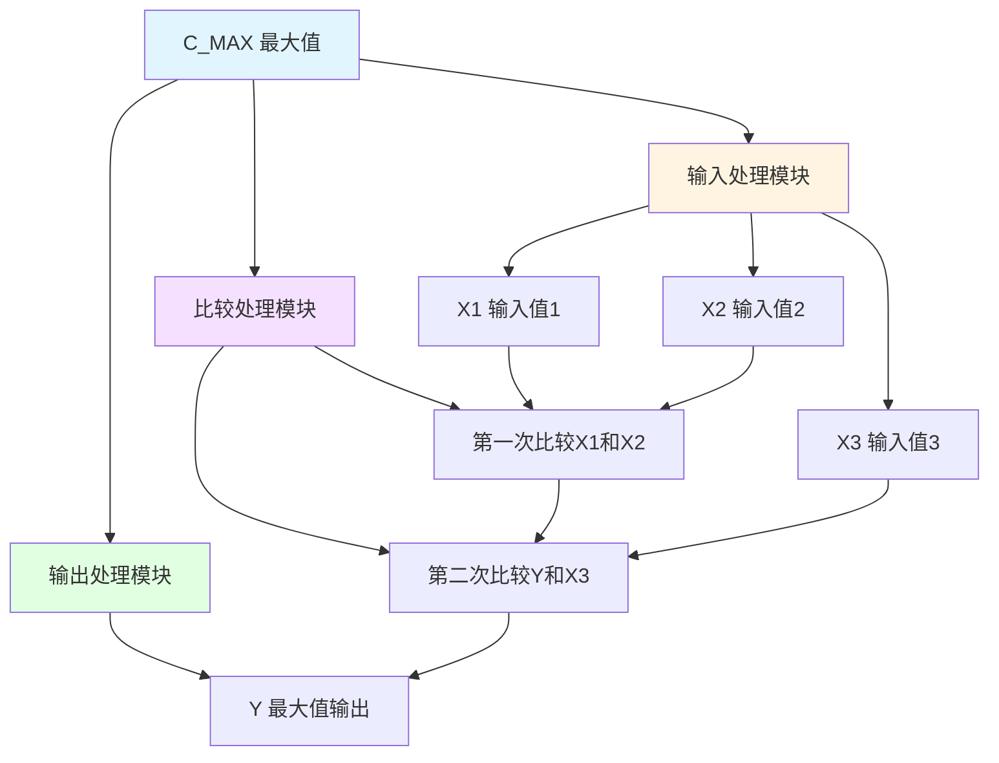

# C_MAX 功能块分析报告

## 基本信息

| 项目 | 内容 |
|------|------|
| 功能块名称 | C_MAX |
| 功能描述 | Maximum(3 Input, REAL type)（最大值-3输入REAL类型） |
| 最后修改 | 2017.07.24 |
| 作者 | ShiChunLiang |
| 页数 | 1页（2个程序段） |

## 功能概述

C_MAX是一个最大值功能块，用于从三个REAL类型输入值中选择最大值输出。该功能块通过比较运算实现多值最大值选择。

### 应用场景
- **限幅控制**：选择多个限幅值中的最大值
- **安全保护**：选择多个保护值中的最大值作为安全阈值
- **优化控制**：选择多个控制量中的最大值
- **数据筛选**：从多个数据中选择最大值

### 功能特点
1. **三输入比较**：支持三个输入值比较
2. **REAL类型**：支持实数类型运算
3. **级联比较**：先比较X1和X2，再与X3比较

## 思维导图



## 流程路径描述

### 第一次比较路径：
开始 → 比较X1和X2 → 选择较大值 → 输出到Y
**功能**: 比较X1和X2，选择较大值

### 第二次比较路径：
开始 → 比较Y和X3 → 选择较大值 → 输出到Y
**功能**: 比较当前最大值与X3，选择最终最大值

## 逐帧功能分析

### Rung 1: 第一次比较

**功能描述**: 比较X1和X2，选择较大值

**输入条件**:
| 信号名称 | 信号描述 | 信号类型 | 触发值 |
|----------|----------|----------|--------|
| X1 | 输入值1 | REAL | 数值 |
| X2 | 输入值2 | REAL | 数值 |

**输出功能**:
| 信号名称 | 信号描述 | 信号类型 |
|----------|----------|----------|
| Y | 中间结果 | REAL |

**触发逻辑**:
- IF X1 ≥ X2 THEN Y = X1
- IF X1 < X2 THEN Y = X2

**功能实现**: 
1. 使用CMP_REAL比较X1和X2
2. 如果X1 ≥ X2，使用MOVE_REAL将X1传送到Y
3. 如果X1 < X2，使用MOVE_REAL将X2传送到Y

### Rung 2: 第二次比较

**功能描述**: 比较Y和X3，选择最终最大值

**输入条件**:
| 信号名称 | 信号描述 | 信号类型 | 触发值 |
|----------|----------|----------|--------|
| Y | 中间结果 | REAL | 数值 |
| X3 | 输入值3 | REAL | 数值 |

**输出功能**:
| 信号名称 | 信号描述 | 信号类型 |
|----------|----------|----------|
| Y | 最大值输出 | REAL |

**触发逻辑**:
- IF Y ≥ X3 THEN Y = Y（保持不变）
- IF Y < X3 THEN Y = X3

**功能实现**: 
1. 使用CMP_REAL比较Y和X3
2. 如果Y < X3，使用MOVE_REAL将X3传送到Y

## 触发条件总结

### 第一次比较条件
- **X1 ≥ X2**: Y = X1
- **X1 < X2**: Y = X2

### 第二次比较条件
- **Y ≥ X3**: Y保持不变
- **Y < X3**: Y = X3

## 实现功能总结

### 主要功能
1. **三值比较**: 比较三个输入值
2. **最大值选择**: 输出三个值中的最大值

### 计算公式
```
Y = MAX(X1, X2, X3)
```

### 输入输出关系
| X1 | X2 | X3 | Y |
|----|----|----|----|
| 1.0 | 2.0 | 3.0 | 3.0 |
| 3.0 | 2.0 | 1.0 | 3.0 |
| 2.0 | 3.0 | 1.0 | 3.0 |

## 关键信号说明

| 信号名称 | 信号描述 | 信号类型 | 用途 |
|----------|----------|----------|------|
| X1 | 输入值1 | REAL | 第1个输入 |
| X2 | 输入值2 | REAL | 第2个输入 |
| X3 | 输入值3 | REAL | 第3个输入 |
| Y | 最大值输出 | REAL | 最大值结果 |

## 调试技巧

### 调试步骤
1. 检查X1、X2、X3输入值
2. 监控第一次比较结果
3. 验证最终输出是否为最大值

### 常见问题
1. **输出不正确**: 检查各输入值
2. **比较错误**: 检查CMP_REAL比较逻辑

### 监控信号列表
- X1/X2/X3（输入值）
- Y（输出值）
