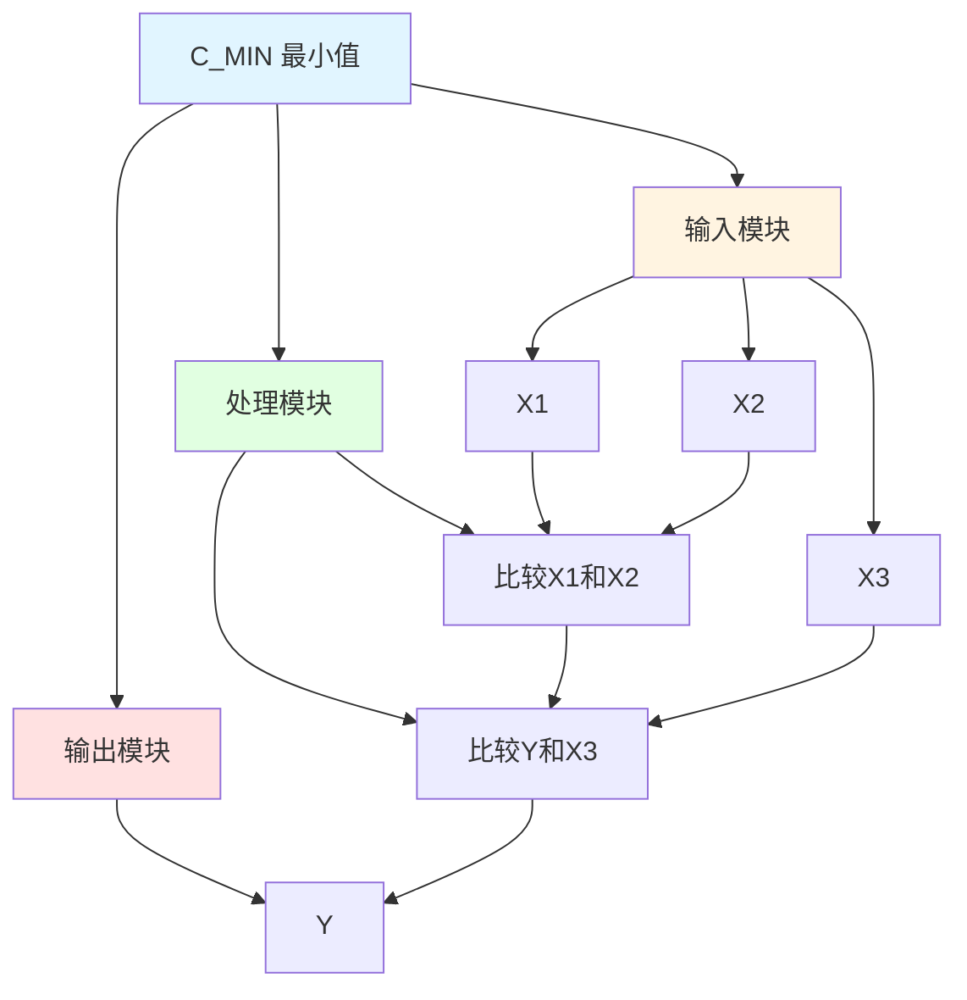

# C_MIN 功能块分析报告

## 基本信息

| 项目 | 内容 |
|------|------|
| 功能块名称 | C_MIN |
| 功能描述 | Minimum(3 Input, REAL type)（最小值，3输入，实数类型） |
| 最后修改 | 2017.07.24 |
| 作者 | Shi Chun Liang |
| 页数 | 1页 |

## 功能概述

C_MIN 是一个最小值计算功能块，用于计算三个实数类型输入值的最小值。该功能块通过比较三个输入值，输出其中的最小值。

## 思维导图

## 流程路径描述

### 最小值计算路径：
开始 → 比较X1和X2 → 选择较小值Y → 比较Y和X3 → 选择较小值 → 输出最小值
**功能**: 计算三个输入值的最小值

## 逐帧功能分析

### Rung 7: 比较X1和X2

**功能描述**: 比较输入值X1和X2，选择较小值

**输入条件**:
| 信号名称 | 信号描述 | 信号类型 | 触发值 |
|----------|----------|----------|--------|
| X1 | 输入1 | REAL | 数值 |
| X2 | 输入2 | REAL | 数值 |

**输出功能**:
| 信号名称 | 信号描述 | 信号类型 |
|----------|----------|----------|
| Y | 输出（最小值） | REAL |

**触发逻辑**:
- IF X1 < X2 THEN Y = X1
- IF X1 >= X2 THEN Y = X2

**功能实现**: 
使用CMP（比较）功能块比较X1和X2：
- 当X1 < X2时，输出X1到Y
- 当X1 >= X2时，输出X2到Y

### Rung 8: 比较Y和X3

**功能描述**: 比较Y和X3，选择较小值

**输入条件**:
| 信号名称 | 信号描述 | 信号类型 | 触发值 |
|----------|----------|----------|--------|
| Y | 输出（最小值） | REAL | 数值 |
| X3 | 输入3 | REAL | 数值 |

**输出功能**:
| 信号名称 | 信号描述 | 信号类型 |
|----------|----------|----------|
| Y | 输出（最小值） | REAL |

**触发逻辑**:
- IF Y < X3 THEN Y保持不变
- IF Y >= X3 THEN Y = X3

**功能实现**: 
使用CMP（比较）功能块比较Y和X3：
- 当Y < X3时，Y保持不变
- 当Y >= X3时，输出X3到Y

## 触发条件总结

### 比较条件
- **第一次比较**: X1和X2
- **第二次比较**: Y和X3

## 实现功能总结

### 主要功能
1. **最小值计算**: 计算三个输入值的最小值

## 关键信号说明

| 信号名称 | 信号描述 | 信号类型 | 用途 |
|----------|----------|----------|------|
| X1 | 输入1 | REAL | 输入值1 |
| X2 | 输入2 | REAL | 输入值2 |
| X3 | 输入3 | REAL | 输入值3 |
| Y | 输出（最小值） | REAL | 最小值输出 |

## 调试技巧

### 调试步骤
1. 检查X1、X2、X3值，确认输入正常
2. 监控Y值，观察最小值输出

### 常见问题
1. **最小值不正确**: 检查X1、X2、X3值是否正确

### 监控信号列表
- X1（输入1）
- X2（输入2）
- X3（输入3）
- Y（输出）
