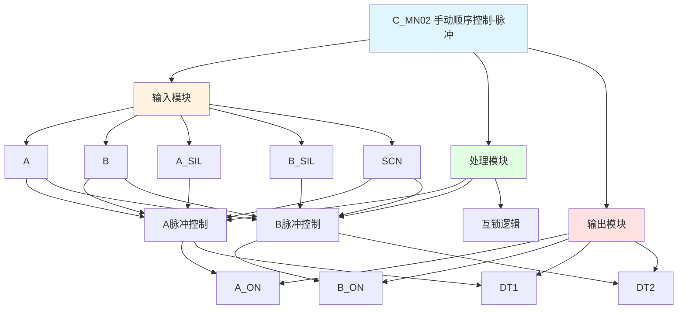

# C_MN02 功能块分析报告

## 基本信息

| 项目 | 内容 |
|------|------|
| 功能块名称 | C_MN02 |
| 功能描述 | Manual Sequence of SS-2P or DS-2P Solenoid Valve without STOP Operation Device（SS-2P或DS-2P电磁阀手动顺序控制，无停止操作装置，带脉冲输出） |
| 最后修改 | 2015.12.25 |
| 作者 | Gao Weidi |
| 页数 | 1页 |

## 功能概述

C_MN02 是一个带脉冲输出的双线圈电磁阀手动顺序控制功能块。与C_MN01相比，该功能块增加了单次触发定时器（SPDT），在命令有效时产生固定宽度的脉冲输出，适用于需要脉冲驱动的电磁阀。

**主要应用场景**：
- 需要脉冲驱动的双线圈电磁阀
- 防止线圈长时间通电
- 短时脉冲控制场合

**脉冲输出优势**：
- 减少线圈发热
- 节省能源
- 延长电磁阀寿命

## 思维导图

## 流程路径描述

### A脉冲控制路径：
开始 → A信号 AND NOT B AND A_SIL → SPDT脉冲 → A_ON输出（500ms脉冲）
**功能**: 产生A线圈脉冲输出

### B脉冲控制路径：
开始 → B信号 AND NOT A AND B_SIL → SPDT脉冲 → B_ON输出（500ms脉冲）
**功能**: 产生B线圈脉冲输出

## 逐帧功能分析

### Rung 7: A脉冲控制

**功能描述**: 产生A线圈脉冲输出

**输入条件**:
| 信号名称 | 信号描述 | 信号类型 | 触发值 |
|----------|----------|----------|--------|
| A | A命令 | BOOL | TRUE |
| B | B命令 | BOOL | FALSE |
| A_SIL | A联锁 | BOOL | TRUE |
| SCN | 扫描时间 | INT | 设定值 |

**输出功能**:
| 信号名称 | 信号描述 | 信号类型 |
|----------|----------|----------|
| A_ON | A线圈输出 | BOOL |
| DT1 | A脉冲定时器 | - |

**触发逻辑**:
- IF A = TRUE AND B = FALSE AND A_SIL = TRUE THEN A_ON = TRUE（持续500ms）

**功能实现**: 
使用C_SPDT单次触发定时器，在条件满足时产生500ms的脉冲输出。

### Rung 8: B脉冲控制

**功能描述**: 产生B线圈脉冲输出

**输入条件**:
| 信号名称 | 信号描述 | 信号类型 | 触发值 |
|----------|----------|----------|--------|
| B | B命令 | BOOL | TRUE |
| A | A命令 | BOOL | FALSE |
| B_SIL | B联锁 | BOOL | TRUE |
| SCN | 扫描时间 | INT | 设定值 |

**输出功能**:
| 信号名称 | 信号描述 | 信号类型 |
|----------|----------|----------|
| B_ON | B线圈输出 | BOOL |
| DT2 | B脉冲定时器 | - |

**触发逻辑**:
- IF B = TRUE AND A = FALSE AND B_SIL = TRUE THEN B_ON = TRUE（持续500ms）

**功能实现**: 
使用C_SPDT单次触发定时器，在条件满足时产生500ms的脉冲输出。

## 触发条件总结

### 控制条件
| 线圈 | 触发条件 | 输出持续时间 |
|------|----------|--------------|
| A_ON | A=TRUE AND B=FALSE AND A_SIL=TRUE | 500ms脉冲 |
| B_ON | B=TRUE AND A=FALSE AND B_SIL=TRUE | 500ms脉冲 |

### 脉冲参数
- 脉冲宽度: 500ms
- 脉冲类型: 单次触发

## 实现功能总结

### 主要功能
1. **A脉冲控制**: 产生A线圈脉冲输出
2. **B脉冲控制**: 产生B线圈脉冲输出
3. **互锁保护**: 确保A和B不会同时得电
4. **脉冲输出**: 固定500ms脉冲宽度

## 关键信号说明

| 信号名称 | 信号描述 | 信号类型 | 用途 |
|----------|----------|----------|------|
| A | A命令 | BOOL | A方向控制命令 |
| B | B命令 | BOOL | B方向控制命令 |
| A_SIL | A联锁 | BOOL | A方向联锁信号 |
| B_SIL | B联锁 | BOOL | B方向联锁信号 |
| SCN | 扫描时间 | INT | 扫描时间设定 |
| A_ON | A线圈输出 | BOOL | A线圈脉冲输出 |
| B_ON | B线圈输出 | BOOL | B线圈脉冲输出 |

## 调试技巧

### 调试步骤
1. 检查A和B信号，确认命令正常
2. 检查A_SIL和B_SIL信号，确认联锁条件满足
3. 检查SCN值，确认扫描时间设置
4. 监控A_ON和B_ON信号，观察脉冲输出

### 常见问题
1. **脉冲不输出**: 检查命令信号和联锁信号
2. **脉冲宽度不正确**: 检查SCN值设置

### 监控信号列表
- A、B（命令信号）
- A_SIL、B_SIL（联锁信号）
- A_ON、B_ON（脉冲输出）
