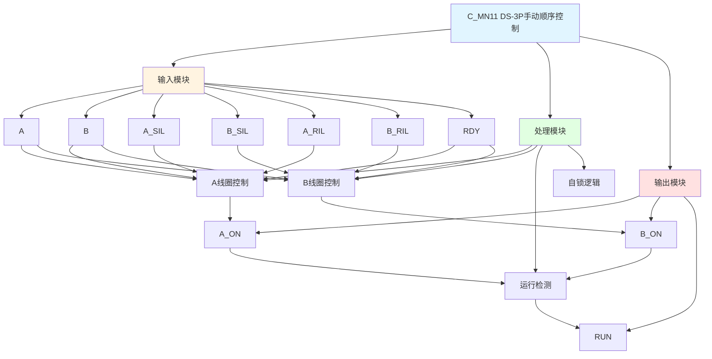

# C_MN11 功能块分析报告

## 基本信息

| 项目 | 内容 |
|------|------|
| 功能块名称 | C_MN11 |
| 功能描述 | Manual Sequence of DS-3P Solenoid Valve without STOP Operation Device（DS-3P电磁阀手动顺序控制，无停止操作装置） |
| 最后修改 | 2015.12.25 |
| 作者 | Gao Weidi |
| 页数 | 1页 |

## 功能概述

C_MN11 是一个DS-3P（双线圈三位置）电磁阀手动顺序控制功能块。该功能块用于控制双线圈三位置电磁阀，具有运行联锁和自锁功能，支持中间停止位置。

**主要应用场景**：
- 双线圈三位置电磁阀控制
- 需要中间停止位置的场合
- 液压缸三位控制

**电磁阀类型说明**：
- **DS-3P**: Double Solenoid 3 Position（双线圈三位置），具有A位、B位和中间停止位

## 思维导图

## 流程路径描述

### A线圈控制路径：
开始 → A信号 AND A_SIL AND NOT B AND A_RIL AND RDY → A_ON输出（自锁）
**功能**: 控制A线圈励磁并自锁

### B线圈控制路径：
开始 → B信号 AND B_SIL AND NOT A AND B_RIL AND RDY → B_ON输出（自锁）
**功能**: 控制B线圈励磁并自锁

### 运行检测路径：
开始 → A_ON OR B_ON → RUN输出
**功能**: 检测运行状态

## 逐帧功能分析

### Rung 7: A线圈控制

**功能描述**: 控制A线圈励磁并自锁

**输入条件**:
| 信号名称 | 信号描述 | 信号类型 | 触发值 |
|----------|----------|----------|--------|
| A | A命令 | BOOL | TRUE |
| A_SIL | A启动联锁 | BOOL | TRUE |
| B | B命令 | BOOL | FALSE |
| A_RIL | A运行联锁 | BOOL | TRUE |
| RDY | 准备就绪 | BOOL | TRUE |

**输出功能**:
| 信号名称 | 信号描述 | 信号类型 |
|----------|----------|----------|
| A_ON | A线圈输出 | BOOL |

**触发逻辑**:
- IF A = TRUE AND A_SIL = TRUE AND B = FALSE AND A_RIL = TRUE AND RDY = TRUE THEN A_ON = TRUE
- A_ON自锁，直到B命令有效

**功能实现**: 
当条件满足时A线圈得电并自锁，当B命令有效时A线圈失电。

### Rung 8: B线圈控制

**功能描述**: 控制B线圈励磁并自锁

**输入条件**:
| 信号名称 | 信号描述 | 信号类型 | 触发值 |
|----------|----------|----------|--------|
| B | B命令 | BOOL | TRUE |
| B_SIL | B启动联锁 | BOOL | TRUE |
| A | A命令 | BOOL | FALSE |
| B_RIL | B运行联锁 | BOOL | TRUE |
| RDY | 准备就绪 | BOOL | TRUE |

**输出功能**:
| 信号名称 | 信号描述 | 信号类型 |
|----------|----------|----------|
| B_ON | B线圈输出 | BOOL |

**触发逻辑**:
- IF B = TRUE AND B_SIL = TRUE AND A = FALSE AND B_RIL = TRUE AND RDY = TRUE THEN B_ON = TRUE
- B_ON自锁，直到A命令有效

**功能实现**: 
当条件满足时B线圈得电并自锁，当A命令有效时B线圈失电。

### Rung 9: 运行检测

**功能描述**: 检测运行状态

**输入条件**:
| 信号名称 | 信号描述 | 信号类型 | 触发值 |
|----------|----------|----------|--------|
| A_ON | A线圈输出 | BOOL | TRUE |
| B_ON | B线圈输出 | BOOL | TRUE |

**输出功能**:
| 信号名称 | 信号描述 | 信号类型 |
|----------|----------|----------|
| RUN | 运行状态 | BOOL |

**触发逻辑**:
- IF A_ON = TRUE OR B_ON = TRUE THEN RUN = TRUE

**功能实现**: 
当A或B任一线圈得电时，输出运行状态信号。

## 触发条件总结

### 控制条件
| 线圈 | 触发条件 | 复位条件 |
|------|----------|----------|
| A_ON | A=TRUE AND A_SIL=TRUE AND B=FALSE AND A_RIL=TRUE AND RDY=TRUE | B命令有效 |
| B_ON | B=TRUE AND B_SIL=TRUE AND A=FALSE AND B_RIL=TRUE AND RDY=TRUE | A命令有效 |

### 联锁类型
- **启动联锁(SIL)**: 启动时的联锁条件
- **运行联锁(RIL)**: 运行时的联锁条件

## 实现功能总结

### 主要功能
1. **A线圈控制**: 控制A线圈励磁并自锁
2. **B线圈控制**: 控制B线圈励磁并自锁
3. **运行检测**: 检测运行状态
4. **互锁保护**: A和B命令互锁
5. **自锁功能**: 线圈得电后自锁

## 关键信号说明

| 信号名称 | 信号描述 | 信号类型 | 用途 |
|----------|----------|----------|------|
| A | A命令 | BOOL | A方向控制命令 |
| B | B命令 | BOOL | B方向控制命令 |
| A_SIL | A启动联锁 | BOOL | A启动联锁信号 |
| B_SIL | B启动联锁 | BOOL | B启动联锁信号 |
| A_RIL | A运行联锁 | BOOL | A运行联锁信号 |
| B_RIL | B运行联锁 | BOOL | B运行联锁信号 |
| RDY | 准备就绪 | BOOL | 准备就绪信号 |
| A_ON | A线圈输出 | BOOL | A线圈励磁输出 |
| B_ON | B线圈输出 | BOOL | B线圈励磁输出 |
| RUN | 运行状态 | BOOL | 运行状态输出 |

## 调试技巧

### 调试步骤
1. 检查A和B信号，确认命令正常
2. 检查A_SIL、B_SIL、A_RIL、B_RIL信号，确认联锁条件满足
3. 检查RDY信号，确认准备就绪
4. 监控A_ON、B_ON、RUN信号，观察输出状态

### 常见问题
1. **线圈不励磁**: 检查命令信号和联锁信号
2. **自锁失效**: 检查复位条件
3. **互锁失效**: 检查A和B命令逻辑

### 监控信号列表
- A、B（命令信号）
- A_SIL、B_SIL、A_RIL、B_RIL（联锁信号）
- RDY（准备就绪）
- A_ON、B_ON、RUN（输出信号）
