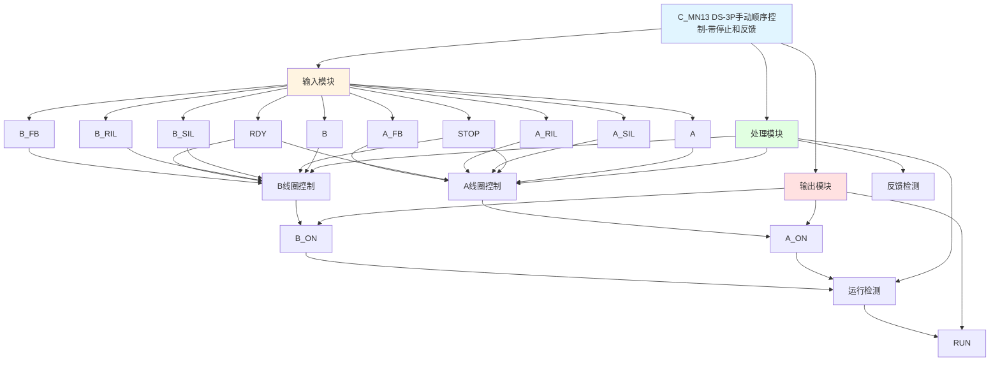

# C_MN13 功能块分析报告

## 基本信息

| 项目 | 内容 |
|------|------|
| 功能块名称 | C_MN13 |
| 功能描述 | Manual Sequence of DS-3P Solenoid Valve with STOP Operation and running feedback Device（DS-3P电磁阀手动顺序控制，带停止操作和运行反馈装置） |
| 最后修改 | 2015.12.25 |
| 作者 | Gao Weidi |
| 页数 | 1页 |

## 功能概述

C_MN13 是一个带停止操作和运行反馈装置的DS-3P（双线圈三位置）电磁阀手动顺序控制功能块。与C_MN12相比，该功能块增加了运行反馈信号输入，可以检测电磁阀是否真正动作，实现更可靠的控制。

**主要应用场景**：
- 需要运行反馈确认的双线圈三位置电磁阀
- 安全要求极高的液压控制系统
- 需要确认动作执行的执行机构控制

**与C_MN11/C_MN12的区别**：
- C_MN11: 无停止操作装置，无运行反馈
- C_MN12: 带停止操作装置，无运行反馈
- C_MN13: 带停止操作装置，带运行反馈

## 思维导图

## 流程路径描述

### A线圈控制路径：
开始 → A信号 AND A_SIL AND NOT B AND NOT STOP AND A_RIL AND RDY AND A_FB → A_ON输出
**功能**: 控制A线圈励磁，需要反馈确认

### B线圈控制路径：
开始 → B信号 AND B_SIL AND NOT A AND NOT STOP AND B_RIL AND RDY AND B_FB → B_ON输出
**功能**: 控制B线圈励磁，需要反馈确认

### 反馈检测路径：
开始 → A_ON AND NOT A_FB → 异常状态（反馈超时）
**功能**: 检测反馈信号是否正常

## 逐帧功能分析

### Rung 7: A线圈控制

**功能描述**: 控制A线圈励磁，带反馈检测

**输入条件**:
| 信号名称 | 信号描述 | 信号类型 | 触发值 |
|----------|----------|----------|--------|
| A | A命令 | BOOL | TRUE |
| A_SIL | A启动联锁 | BOOL | TRUE |
| B | B命令 | BOOL | FALSE |
| STOP | 停止命令 | BOOL | FALSE |
| A_RIL | A运行联锁 | BOOL | TRUE |
| RDY | 准备就绪 | BOOL | TRUE |
| A_FB | A运行反馈 | BOOL | TRUE |

**输出功能**:
| 信号名称 | 信号描述 | 信号类型 |
|----------|----------|----------|
| A_ON | A线圈输出 | BOOL |

**触发逻辑**:
- IF A = TRUE AND A_SIL = TRUE AND B = FALSE AND STOP = FALSE AND A_RIL = TRUE AND RDY = TRUE THEN A_ON = TRUE
- IF A_ON = TRUE AND A_FB = FALSE THEN A_ON复位（反馈超时保护）

**功能实现**: 
当所有条件满足时A线圈得电，如果反馈信号在一定时间内未到达，则自动复位。

### Rung 8: B线圈控制

**功能描述**: 控制B线圈励磁，带反馈检测

**输入条件**:
| 信号名称 | 信号描述 | 信号类型 | 触发值 |
|----------|----------|----------|--------|
| B | B命令 | BOOL | TRUE |
| B_SIL | B启动联锁 | BOOL | TRUE |
| A | A命令 | BOOL | FALSE |
| STOP | 停止命令 | BOOL | FALSE |
| B_RIL | B运行联锁 | BOOL | TRUE |
| RDY | 准备就绪 | BOOL | TRUE |
| B_FB | B运行反馈 | BOOL | TRUE |

**输出功能**:
| 信号名称 | 信号描述 | 信号类型 |
|----------|----------|----------|
| B_ON | B线圈输出 | BOOL |

**触发逻辑**:
- IF B = TRUE AND B_SIL = TRUE AND A = FALSE AND STOP = FALSE AND B_RIL = TRUE AND RDY = TRUE THEN B_ON = TRUE
- IF B_ON = TRUE AND B_FB = FALSE THEN B_ON复位（反馈超时保护）

**功能实现**: 
当所有条件满足时B线圈得电，如果反馈信号在一定时间内未到达，则自动复位。

### Rung 9: 运行检测

**功能描述**: 检测运行状态

**输入条件**:
| 信号名称 | 信号描述 | 信号类型 | 触发值 |
|----------|----------|----------|--------|
| A_ON | A线圈输出 | BOOL | TRUE |
| B_ON | B线圈输出 | BOOL | TRUE |

**输出功能**:
| 信号名称 | 信号描述 | 信号类型 |
|----------|----------|----------|
| RUN | 运行状态 | BOOL |

**触发逻辑**:
- IF A_ON = TRUE OR B_ON = TRUE THEN RUN = TRUE

**功能实现**: 
当A或B任一线圈得电时，输出运行状态信号。

## 触发条件总结

### 控制条件
| 线圈 | 触发条件 | 复位条件 |
|------|----------|----------|
| A_ON | A=TRUE AND A_SIL=TRUE AND B=FALSE AND STOP=FALSE AND A_RIL=TRUE AND RDY=TRUE | STOP=TRUE 或 B命令有效 或 反馈超时 |
| B_ON | B=TRUE AND B_SIL=TRUE AND A=FALSE AND STOP=FALSE AND B_RIL=TRUE AND RDY=TRUE | STOP=TRUE 或 A命令有效 或 反馈超时 |

### 反馈保护
- **反馈超时保护**: 当输出有效但反馈信号未到达时，自动复位输出

## 实现功能总结

### 主要功能
1. **A线圈控制**: 控制A线圈励磁
2. **B线圈控制**: 控制B线圈励磁
3. **停止功能**: 支持紧急停止
4. **运行检测**: 检测运行状态
5. **互锁保护**: A和B命令互锁
6. **反馈保护**: 反馈超时自动复位

## 关键信号说明

| 信号名称 | 信号描述 | 信号类型 | 用途 |
|----------|----------|----------|------|
| A | A命令 | BOOL | A方向控制命令 |
| B | B命令 | BOOL | B方向控制命令 |
| STOP | 停止命令 | BOOL | 紧急停止信号 |
| A_SIL | A启动联锁 | BOOL | A启动联锁信号 |
| B_SIL | B启动联锁 | BOOL | B启动联锁信号 |
| A_RIL | A运行联锁 | BOOL | A运行联锁信号 |
| B_RIL | B运行联锁 | BOOL | B运行联锁信号 |
| RDY | 准备就绪 | BOOL | 准备就绪信号 |
| A_FB | A运行反馈 | BOOL | A方向运行反馈信号 |
| B_FB | B运行反馈 | BOOL | B方向运行反馈信号 |
| A_ON | A线圈输出 | BOOL | A线圈励磁输出 |
| B_ON | B线圈输出 | BOOL | B线圈励磁输出 |
| RUN | 运行状态 | BOOL | 运行状态输出 |

## 调试技巧

### 调试步骤
1. 检查A和B信号，确认命令正常
2. 检查STOP信号，确认停止功能正常
3. 检查联锁信号，确认联锁条件满足
4. 检查RDY信号，确认准备就绪
5. 检查A_FB和B_FB信号，确认反馈正常
6. 监控A_ON、B_ON、RUN信号，观察输出状态

### 常见问题
1. **线圈不励磁**: 检查命令信号和联锁信号
2. **停止不生效**: 检查STOP信号
3. **反馈超时**: 检查反馈信号是否正常
4. **互锁失效**: 检查A和B命令逻辑

### 监控信号列表
- A、B、STOP（命令信号）
- A_SIL、B_SIL、A_RIL、B_RIL（联锁信号）
- RDY（准备就绪）
- A_FB、B_FB（反馈信号）
- A_ON、B_ON、RUN（输出信号）
